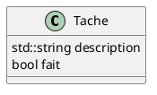

# Laboratoire 02

## Objectif

Débuter l'intégration du concept de base de la programmation orientée objet en créant nos premières classes et les utiliser dans notre code comme objet.

## Pourquoi les classes ?

Si nous regardons les deux derniers laboratoires, nous avons fait une petite application qui gère une liste de tâches. Une tâche est défini par sa description et par sa complétion (ou non). On pourrait donc dire qu'une tâche possède deux variables : `description` et `fait`. Si nous voulons gérer plus d'une tâche, nous allons donc utiliser deux tableau : `taches` qui contient les description et `tacheCompletee` qui contient la completion. Regardons ensemble les prototypes de nos fonction du laboratoire #1 :

```cpp
void afficherListe(std::string taches[], bool tacheCompletee[], int nombreTaches);
void ajouterTache(std::string taches[], int nombreTaches);
int demanderNumeroTache(std::string texte, int nombreTaches);
void marquerFaite(std::string taches[], bool tacheCompletee[], int nombreTaches);
void echangerTaches(std::string taches[], bool tacheCompletee[], int nombreTaches);
void supprimerTache(std::string taches[], bool tacheCompletee[], int& nombreTaches);
```

On voit que la gestion des tâches à travers nos fonctions alourdie quand considérablement nos paramètres. Mais on peut facilement réaliser qu'une tâche pourrait avoir une date de création, un date limite, un titre (plus cours que la description), un niveau (bas, moyen, important), etc. A quoi ressemblerait nos prototypes et combien de tableaux serait nécessaires :

```cpp
void afficherListe(std::string taches[], bool tacheCompletee[], std::string dateCree[], std::string dateLimite[], std::string titre[], int niveau[], int nombreTaches);
```

Cela commence à faire beaucoup !

> NOTE - On devrait essayer de limiter le nombre de paramètres à 4 dans un prototype, si possible.

De plus, on doit gérer les tâches en bloc parce qu'on manipule les tableaux, ce qui aura inévitablement l'effet d'augmenter le risque d'erreur, de bogues. Serait-il agréable d'avoir une manière de définir une tâche avec toutes les informations qui la représente et manipuler la tâche ? C'est ce que les classes permettent de faire.

## Création d'une classe `Tache`

Nous savons qu'une `Tache` se définit par sa `description` et par sa `completion`. On pourrait donc représenter graphiquement cette **entité** tel que :



En C++, on peut décrire cette structure dans une classe. On va créer un fichier `tache.h` et créer la définition de notre classe.

```cpp
#ifndef TACHE_H
#define TACHE_H

#include <string>

class Tache {
public:
    std::string description;
    bool fait;
};

#endif
```

Ignorer pour l'instant les lignes 1, 2 et la dernière lignes, elles font a peu près la même chose que `#pragma once`. Notre classe commence à la ligne 6 et ce termine avant le `#endif`. Remarquer que la définition d'une classe doit avoir un `;`.

Nous avons deux variables qui représente notre tâche. Dans le contexte d'une classe, une variable se nomme **un attribut**. Pour l'instant, le terme `public` signifie que l'on peut manipuler les attributs définie en-dessous.

Utilisons notre classe dans une tel que décrit dans ce `main` :

```cpp
#include <iostream>

#include "tache.h"

int main () {
    std::locale::global(std::locale{ "" });

    Tache maTache;
    maTache.description = "Compléter le laboratoire 2"
    maTache.fait = false;

    std::cout << "[" << (maTache.fait ? 'X' : ' ') << "] " << maTache.description << std::endl;

    return 0;
}