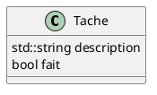
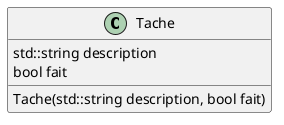

# Laboratoire 02

## Objectif

Débuter l'intégration du concept de base de la programmation orientée objet en créant nos premières classes et les utiliser dans notre code comme objet.

## Pourquoi les classes ?

Si nous regardons les deux derniers laboratoires, nous avons fait une petite application qui gère une liste de tâches. Une tâche est défini par sa description et par sa complétion (ou non). On pourrait donc dire qu'une tâche possède deux variables : `description` et `fait`. Si nous voulons gérer plus d'une tâche, nous allons donc utiliser deux tableau : `taches` qui contient les description et `tacheCompletee` qui contient la completion. Regardons ensemble les prototypes de nos fonction du laboratoire #1 :

```cpp
void afficherListe(std::string taches[], bool tacheCompletee[], int nombreTaches);
void ajouterTache(std::string taches[], int nombreTaches);
int demanderNumeroTache(std::string texte, int nombreTaches);
void marquerFaite(std::string taches[], bool tacheCompletee[], int nombreTaches);
void echangerTaches(std::string taches[], bool tacheCompletee[], int nombreTaches);
void supprimerTache(std::string taches[], bool tacheCompletee[], int& nombreTaches);
```

On voit que la gestion des tâches à travers nos fonctions alourdie quand considérablement nos paramètres. Mais on peut facilement réaliser qu'une tâche pourrait avoir une date de création, un date limite, un titre (plus cours que la description), un niveau (bas, moyen, important), etc. A quoi ressemblerait nos prototypes et combien de tableaux serait nécessaires :

```cpp
void afficherListe(std::string taches[], bool tacheCompletee[], std::string dateCree[], std::string dateLimite[], std::string titre[], int niveau[], int nombreTaches);
```

Cela commence à faire beaucoup !

> NOTE - On devrait essayer de limiter le nombre de paramètres à 4 dans un prototype, si possible.

De plus, on doit gérer les tâches en bloc parce qu'on manipule les tableaux, ce qui aura inévitablement l'effet d'augmenter le risque d'erreur, de bogues. Serait-il agréable d'avoir une manière de définir une tâche avec toutes les informations qui la représente et manipuler la tâche ? C'est ce que les classes permettent de faire.

## Création d'une classe `Tache`

Nous savons qu'une `Tache` se définit par sa `description` et par sa `completion`. On pourrait donc représenter graphiquement cette **entité** tel que :



En C++, on peut décrire cette structure dans une classe. On va créer un fichier `tache.h` et créer la définition de notre classe.

```cpp
#ifndef TACHE_H
#define TACHE_H

#include <string>

class Tache {
public:
    std::string description;
    bool fait;
};

#endif
```

Ignorer pour l'instant les lignes 1, 2 et la dernière lignes, elles font a peu près la même chose que `#pragma once`. Notre classe commence à la ligne 6 et ce termine avant le `#endif`. Remarquer que la définition d'une classe doit avoir un `;`.

Nous avons deux variables qui représente notre tâche. Dans le contexte d'une classe, une variable se nomme **un attribut**. Pour l'instant, le terme `public` signifie que l'on peut manipuler les attributs définie en-dessous.

Utilisons notre classe dans une tel que décrit dans ce `main` :

```cpp
#include <iostream>

#include "tache.h"

int main () {
    std::locale::global(std::locale{ "" });

    Tache maTache;
    maTache.description = "Compléter le laboratoire 2";
    maTache.fait = false;

    std::cout << "[" << (maTache.fait ? 'X' : ' ') << "] " << maTache.description << std::endl;

    return 0;
}
```

Ici, `maTache` est un **objet** de la classe `Tache`, et elle peut être conceptualisé comme une variable qui contient des variables liées entre elles. On peut également faire un tableau. Ce tableau aura l'avantage de remplacer nos deux tableaux `taches` et `tacheCompletee`.

```cpp
#include <iostream>

#include "tache.h"

int main () {
    std::locale::global(std::locale{ "" });

    Tache taches[100];

    int quantite = 0;
    bool terminee = false;

    std::string description;
    std::string reponseFait;

    do {
        std::cout << "Décrire votre tâche : ";
        std::getline(std::cin, taches[quantite].description);
        std::cout << std::endl;
        std::cout << "Est-ce terminée ? [O|N] ";
        std::getline(std::cin, reponseFait);
        taches[quantite].fait = reponseFait.compare("O") == 0;

        std::cout << "Voulez vous continuez ? [O|N] ";
        std::getline(std::cin, reponseFait);
        terminee = reponseFait.compare("O") != 0;
        quantite++;

    } while(quantite < 100 && !terminee);

    for (int i = 0; i < quantite; i++) {
        std::cout << "[" << (taches[i].fait ? 'X' : ' ') << "] " << taches[i].description << std::endl;
    }

    return 0;
}
```

Ainsi nous pourrions changer le laboratoire #1 avec ces prototypes :

```cpp
void afficherListe(Tache taches[], int nombreTaches);
void ajouterTache(Tache taches[], int nombreTaches);
int demanderNumeroTache(std::string texte, int nombreTaches);
void marquerFaite(Tache taches[], int nombreTaches);
void echangerTaches(Tache taches[], int nombreTaches);
void supprimerTache(Tache taches[], int& nombreTaches);
```

Quelles sont les avantages ? On réduit le nombre de paramètres à passé, un seul tableau au lieu de deux. Si on veut ajouter des attibuts a notre classe tache, **nous n'avons pas besoins de changer nos prototypes**.

## Peut-on créer une tâche d'un coup ?

Donc regardons encore comment nous avons instancier notre classe et initialiser ses attributs :

```cpp
    Tache maTache;
    maTache.description = "Compléter le laboratoire 2";
    maTache.fait = false;
```

C'est agréable, mais si nous avons plusieurs attributs, ça pourrait être un peu fatiguant de faire toutes les assignations une par une. Heureusement pour nous, il existe le concept de **constructeur** qui nous permet de constuire à l'initialisation notre objet.

On retourne dans notre fichier `tache.h` et on ajoute notre constructeur :

```cpp
#ifndef TACHE_H
#define TACHE_H

#include <string>

class Tache {
public:
    std::string description;
    bool fait;

    Tache(std::string description, bool fait);
};

#endif
```

Le constructeur **doit** toujours être le même nom que la classe. Il s'agit d'une fonction spéciale qui est appeler lors de l'instantiation d'un objet de notre classe. Toutefois dans notre en-tête `.h` nous n'avons que définit le constructeur, nous avons besoins d'écrire le code pour initialiser notre objet. Il faut donc créer une fichier `tache.cpp` avec le code suivant :

```cpp
#include "tache.h"

Tache::Tache(std::string description, bool fait) {
    this->description = description;
    this->fait = fait;
}

```

Nous allons donc parler du concept derrière `this` et de son importance dans le concept de la programmation orienté objet. Comme nous l'avons déjà dit, la classe est une description : si je n'instancie aucun objet de cette classe dans mon code, ce code ne sera jamais exécuté. Mais si j'instancie deux instances, comment faire la distinction entre les deux ? Voici un exemple :

```cpp
int main () {
    std::locale::global(std::locale{ "" });

    Tache premier("Comprendre les classes", false);
    Tache seconde("Comprendre les constructeurs", false);

    return 0;
}
```

En plus de voir comment initialiser notre tâche d'un coup, il faut comprendre que chacun des objets (`premier` et `seconde`) sont dans deux espaces mémoires distinctes, et qu'ils ont leurs propres instance de `description` et `fait`. Toutefois, on ne peut pas connaitre d'avance le nom de toute les instances de notre classes. C++ nous offre donc `this`, qui un pointeur vers l'instance en cours. Donc quand je suis dans le constructeur de `seconde`, `this` pointe à la même case mémoire que `seconde` et peut donc accéder au attributs `description` et `fait` de celui-ci !

Pour vous convaincre que `this` est un pointeur, on peut réécrire notre constructeur de cette façon :

```cpp
```cpp
#include "tache.h"

Tache::Tache(std::string description, bool fait) {
    *this.description = description;
    *this.fait = fait;
}

```

Ici, on utilise le déréférencement (`*this`) et on obtient donc un objet de l'instance `Tache`. On peut donc utiliser le `.` au lieu du `->`.

Voici un *schéma de classe* qui représente notre `Tache` :



Vous remarquerez que le constructeur est placé dans une autre section que cette contenant les attributs. Sachez également que tous les éléments présents dans une classe, que se soit des attributs, des constructeurs, ou autres éléments à venir, sont des **membres** de la classe.

