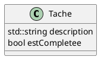
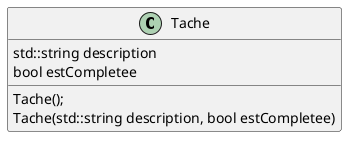
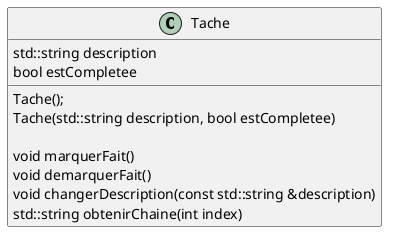
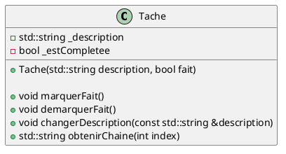
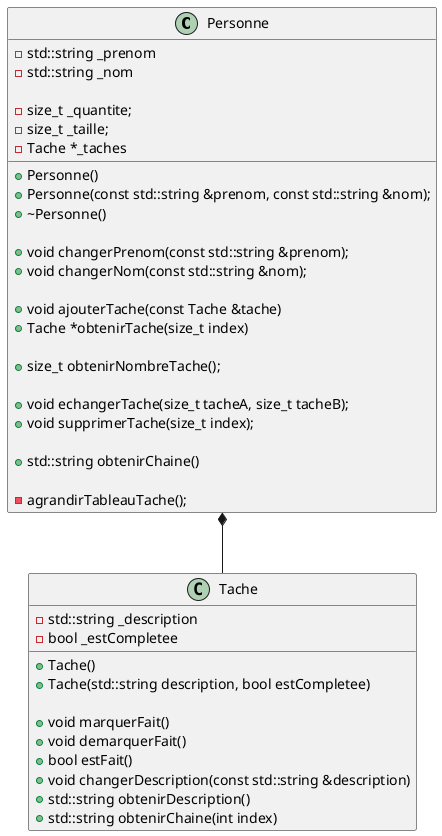
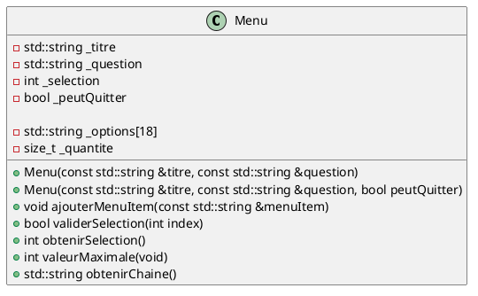

# Laboratoire 02

## Objectif

Débuter l'intégration des concepts de base de la programmation orientée objet en créant nos premières classes pour ensuite les utiliser dans notre code.

## Pourquoi les classes ?

Si nous regardons les deux derniers laboratoires, nous avons codé une petite application qui gère une liste de tâches. Une tâche est définie par sa description et par sa complétion (est-ce que la tâche a été complétée ou non). On pourrait donc dire qu'une tâche possède deux variables : `description` et `fait`. Si nous voulons gérer plus d'une tâche, nous allons donc utiliser deux tableau : `taches` qui contient les description et `tacheCompletee` qui contient la completion. Regardons ensemble les prototypes de nos fonction du laboratoire #1 :

```cpp
void afficherMenu();
int demanderChoix(int max);
void afficherListe(std::string taches[], bool tacheCompletee[], int nombreTaches);
void ajouterTache(std::string taches[], int nombreTaches);
int demanderNumeroTache(std::string texte, int nombreTaches);
void marquerFaite(std::string taches[], bool tacheCompletee[], int nombreTaches);
void echangerTaches(std::string taches[], bool tacheCompletee[], int nombreTaches);
void supprimerTache(std::string taches[], bool tacheCompletee[], int &nombreTaches);
void sauvegarderListe(std::string taches[], bool tacheCompletee[], int nombreTaches);
void chargerListe(std::string taches[], bool tacheCompletee[], int& nombreTaches);
```

Le fait d'avoir deux tableaux à gérer alourdit déjà considérablement les paramètres de nos fonctions. Imaginez maintenant si on voulait qu'une tâche ait en plus une date de création, une date limite, un titre (plus cours que la description) et un niveau (bas, moyen, important). Voici à quoi ressembleraient nos prototypes:

```cpp
void afficherListe(std::string taches[], bool tacheCompletee[], std::string dateCree[], std::string dateLimite[], std::string titre[], int niveau[], int nombreTaches);
```

Cela commence à faire beaucoup !

> NOTE - On devrait essayer de limiter le nombre de paramètres à 4 dans un prototype, si possible.

Cette méthodologie de gérer une *tâche* peut probablement être accomplie avec deux ou trois *attributs*, mais elle ne sera pas *scalable*

> *Scalable/Scale*: Imaginons un système informatique qui est présentement en mesure de fournir 1000 requête par seconde, et qui soudainement reçoit 10000 requête par seconde. Ce système sera *scalable* si les ressources humaines nécessaires pour garder le système fonctionnel est significativement inférieur à la demande. Donc ici, si une compagnie a bien gérer cette aspect en employant un employé de plus que d'ordinaire *préalablement* à la hausse de demande, et que le système à répondu sans interruption, on dira que le système est *scalable*. Même concept peut s'appliquer à une méthodologie : plus on va ajouter de tableau pour gérer les attributs d'une tâche, et considérant qu'une application peut gérer plus qu'une *entité* - par exemple, `Tache` et `Personne` - et qu'en plus les fonctionnalités vont s'ajouter, le nombre de personne pour programmer le tout *à la même vitesse* devra augmenter.

Existe-t-il une méthode plus adéquate pour gérer cette situation? Eh oui, il s'agit bien entendu de la **Programmation orientée objet**!

## Création d'une classe `Tache`

Créez un nouveau projet contenant seulement un `main` vide. Suivez ensuite les étapes suivantes pour créer et utiliser votre première classe dans ce projet.

Nous savons qu'une `Tache` se définit par sa `description` et par sa complétion (`estCompletee`). On pourrait donc représenter graphiquement cette **entité** de cette façon:



En C++, on peut décrire cette entité à l'aide d'une **classe**. Créez un fichier `tache.h` et ajoutez-y la définition de la classe:

```cpp
#ifndef TACHE_H
#define TACHE_H

#include <string>

class Tache {
public:
    std::string description;
    bool estCompletee;
};

#endif
```

> Ignorez pour l'instant les lignes 1, 2 et la dernière ligne, elles font à peu près la même chose que `#pragma once`. Notre classe commence à la ligne 6 et se termine avant le `#endif`. Remarquez que la définition d'une classe doit se terminer par un `;`.

Nous avons deux variables qui représentent notre tâche. Dans le contexte d'une classe, une variable se nomme **un attribut**. Pour l'instant, le terme `public` signifie que l'on peut manipuler les attributs définis en-dessous.

Utilisez maintenant votre nouvelle classe dans le `main` :

```cpp
#include <iostream>

#include "tache.h"

int main () {
    std::locale::global(std::locale{ "" });

    Tache maTache;
    maTache.description = "Compléter le laboratoire 2";
    maTache.estCompletee = false;

    std::cout << "[" << (maTache.estCompletee ? 'X' : ' ') << "] " << maTache.description << std::endl;

    return 0;
}
```

Ici, `maTache` est un **objet** qui est une **instance** de la classe `Tache`, et il peut être conceptualisé comme une variable qui contient des variables liées entre elles.

On peut également créer un tableau d'objets de la classe `Tache`. Ce tableau aura l'avantage de remplacer les deux tableaux `taches` et `tacheCompletee`. Modifiez votre `main` de cette façon:

```cpp
#include <iostream>

#include "tache.h"

int main () {
    std::locale::global(std::locale{ "" });

    Tache taches[100];

    int quantite = 0;
    bool terminee = false;

    std::string description;
    std::string reponseFait;

    do {
        std::cout << "Décrivez votre tâche : ";
        std::getline(std::cin, taches[quantite].description);
        std::cout << std::endl;
        std::cout << "Est-elle complétée ? [O|N] ";
        std::getline(std::cin, reponseFait);
        taches[quantite].estCompletee = reponseFait.compare("O") == 0;

        std::cout << "Voulez vous continuez ? [O|N] ";
        std::getline(std::cin, reponseFait);
        terminee = reponseFait.compare("O") != 0;
        quantite++;

    } while(quantite < 100 && !terminee);

    for (int i = 0; i < quantite; i++) {
        std::cout << "[" << (taches[i].estCompletee ? 'X' : ' ') << "] " << taches[i].description << std::endl;
    }

    return 0;
}
```

Ainsi, nous pourrions remplacer les prototypes de fonctions du laboratoire 1 avec ceux-ci (**Ne le faites pas, il s'agit d'un exemple**) :

```cpp
void afficherMenu();
int demanderChoix(int max);
void ajouterTache(Tache taches[], int nombreTaches);
int demanderNumeroTache(std::string texte, int nombreTaches);
void marquerFaite(Tache taches[], int nombreTaches);
void echangerTaches(Tache taches[], int nombreTaches);
void supprimerTache(Tache taches[], int &nombreTaches);
void sauvegarderListe(Tache taches[], int nombreTaches);
void chargerListe(Tache taches[], int& nombreTaches);
```

Dans le contexte du laboratoire 1, on peut voir deux avantages à utiliser les objets:

- On peut utiliser un seul tableau au lieu de deux.
- Si on doit ajouter plus tard d'autres attibuts à notre classe `Tache`, **nous n'aurons pas besoin de changer nos prototypes**.

### Peut-on créer une tâche d'un seul coup ?

Regardons comment nous avons instancié notre classe et initialisé les attributs de notre objet :

```cpp
    Tache maTache;
    maTache.description = "Compléter le laboratoire 2";
    maTache.estCompletee = false;
```

C'est agréable, mais si nous ajoutions plusieurs autres attributs, il pourrait devenir un peu fastidieux de faire toutes les assignations une par une. Heureusement pour nous, il existe le concept de **constructeur** qui nous permet d'initialiser nos attributs à la déclaration de l'objet

Retournons dans notre fichier `tache.h` et ajoutons-y deux constructeurs : un constructeur par défaut et un constructeur qui, dans notre présent cas, recevra les paramètres `description` et `estCompletee`.

```cpp
#ifndef TACHE_H
#define TACHE_H

#include <string>

class Tache {
public:
    std::string description;
    bool estCompletee;

    Tache();
    Tache(std::string description, bool estCompletee);
};

#endif
```

Un constructeur **doit** toujours avoir le même nom que la classe. Il s'agit d'une méthode spéciale qui est appelée lors de l'instanciation d'un objet de notre classe. Dans notre cas, nous avons deux constructeurs : un constructeur par défaut (sans paramètre) et un constructeur qui nous permet d'initialiser tous les attributs de notre instance. Toutefois, dans notre fichier d'en-tête `.h`, nous avons seulement ajouté les prototypes des constructeurs. Il nous reste maintenant à les implémenter (c'est-à-dire, écrire le code de nos constructeurs) pour initialiser notre objet. 

Créez un fichier `tache.cpp` avec le code suivant :

```cpp
#include "tache.h"

Tache::Tache() {
    this->description = "";
    this->estCompletee = false;
}

Tache::Tache(std::string description, bool estCompletee) {
    this->description = description;
    this->estCompletee = estCompletee;
}

```

> Concept : `this` - Comme nous l'avons déjà dit, la classe est une description : si je n'instancie pas d'objet de cette classe dans mon code, ce code ne sera jamais exécuté. Mais si j'instancie deux instances, comment faire la distinction entre les deux ? Voici un exemple :
> ```cpp
> int main () {
>     std::locale::global(std::locale{ "" });
> 
>     Tache premier("Comprendre les classes", false);
>     Tache seconde("Comprendre les constructeurs", false);
> 
>     return 0;
> }
> ```
> En plus d'initialiser notre tâche d'un coup, il faut comprendre que chacun des objets (`premier` et `seconde`) est dans un espace mémoire distinct, et qu'ils a ses propres valeurs de `description` et `estComplette`. Toutefois, on ne peut pas connaître d'avance le nom de toutes les instances de notre classe. C++ nous offre donc `this`, qui est **un pointeur** vers l'instance en cours. Donc, quand je suis dans le constructeur de `seconde`, `this` pointe à la même case mémoire que `seconde` et peut donc accéder aux attributs `description` et `estCompletee` de celui-ci!

> Pour vous convaincre que `this` est un pointeur, sachez qu'on peut réécrire notre constructeur de cette façon :
> ```cpp
> #include "tache.h"
> 
> Tache::Tache(std::string description, bool estCompletee) {
>     *this.description = description;
>     *this.estCompletee = estCompletee;
> }
> 
> ```
> Ici, on utilise le déréférencement (`*this`) et on obtient donc un objet de l'instance `Tache`. On peut donc utiliser le `.` au lieu de `->`.

Voici un *schéma de classe* qui représente notre `Tache` :



### Les méthodes

Donc, maintenant que nous avons une classe qui contient des attributs (variables) liés entre eux - une sorte de contenant qui définit une **entité** -, qu'est-ce que la **Programmation orientée objet** nous offre pour nous aider ? Elle nous offre entre autres le concept de **méthode**.

Pour comprendre ce qu'est une **méthode**, il faut se poser la question suivante : quelles sont les actions que je veux poser sur une instance de ma classe considérant ses attributs ? Par exemple, un objet de classe `Tache` pourrait posséder les actions suivantes :

* marquer comme complétée (« cocher ») ;
* démarquer comme complétée (« décocher ») ;
* changer la description (et valider que la longueur est au maximum 32 caractères) ;
* afficher la tâche à l'utilisateur (selon notre modèle `numéro [X] description`).

Comme ce sont des actions que l'on peut faire sur une tâche, on va vouloir créer des fonctions dans la classe : on les appelle les **méthodes**. Nous allons donc représenter chacune des ces *actions* par une *fonction de classe*.

Modifiez le code de votre fichier `tache.h` de cette façon:

```cpp
#ifndef TACHE_H
#define TACHE_H

#include <string>

#define DESCRIPTION_CARACTERE_LIMITE 32

class Tache {
public:
    std::string description;
    bool estCompletee;
    Tache() : Tache("", false) { };
    Tache(std::string description, bool estCompletee);

    void marquerFait();
    void demarquerFait();
    void changerDescription(const std::string &);
    std::string obtenirChaine(int index);
};

#endif
```

> Remarquez que notre constructeur par défaut utilise maintenant le second constructeur, ce qui réduit le code et le potentiel d'erreurs.

Donc notre classe `Tache` se conceptualise comme ceci :



On doit maintenant implémenter nos méthodes dans le fichier `tache.cpp`. Remplacez le contenu de ce fichier par celui-ci:


```cpp
#include "tache.h"

#include <sstream>

Tache::Tache(std::string description, bool estCompletee) {
    this->description = description;
    this->estCompletee = estCompletee;
}

void Tache::marquerFait() {
    this->estCompletee = true;
}

void Tache::demarquerFait() {
    this->estCompletee = false;
}

void Tache::changerDescription(const std::string &description) {
    // On s'assure que la chaine ne sera pas trop longue
    if (description.length() < DESCRIPTION_CARACTERE_LIMITE) {
        this->description = description;
    } else {
        this->description = description.substr(0, DESCRIPTION_CARACTERE_LIMITE);
    }
}

std::string Tache::obtenirChaine(int index) {
    std::ostringstream flux;

    flux << index << " [" << (this->estCompletee ? 'X' : ' ') << "] " << this->description;

    return flux.str();
}

```

Modifiez ensuite le contenu de votre `main` de cette façon.

```cpp
int main () {
    std::locale::global(std::locale{ "" });

    Tache *taches;
    taches = new Tache[100];

    int quantite = 0;
    bool terminee = false;

    std::string description;
    std::string reponseFait;
    bool estCompletee;

    do {
        std::cout << "Décrivez votre tâche : ";
        std::getline(std::cin, description);
        std::cout << std::endl;
        std::cout << "Est-elle complétée ? [O|N] ";
        std::getline(std::cin, reponseFait);
        estCompletee = reponseFait.compare("O") == 0;

        Tache courante(description, estCompletee);
        taches[quantite] = courante;

        std::cout << "Voulez vous continuez ? [O|N] ";
        std::getline(std::cin, reponseFait);
        terminee = reponseFait.compare("O") != 0;
        quantite++;

    } while(quantite < 100 && !terminee);

    for (int i = 0; i < quantite; i++) {
        std::cout << taches[i].obtenirChaine(i + 1) << std::endl;
    }

    delete [] taches;

    return 0;
}
```

Donc alors qu'avant nous avions des fonctions qui recevait un ou des objets en paramètres, l'objet lui-même sera **responsable** de faire ses actions car la classe est le **propriétaire de ses attributs**.

> Il y a, dans notre classe `Tache`, une incongruité concernant la limite de 32 caractères. Avec ce code, il y a deux manière de changer la `description` et mettre plus de 32 caractères dedans. Pouvez-vous les identifier ?

### On veut protéger nos données

Parlons maintenant du mot clé `public` que nous avons laisser un peu à lui-même et qui fait que tout ce qui se trouve en-dessous est accessible dans tous le code. Il s'agit d'un problème si on veut s'assurer que les programmeurs utilise la bonne méthode pour mettre à jour `description` et ne pas mettre plus de 32 caractères à l'intérieur. Nous avons besoins d'une manière pour cacher, ou rendre *privée*, nos attributs.

C++ nous offre un mot clé pour cela, `private`, qui nous permet de cacher (**encapsuler**) nos attributs pour que seules les méthodes publiques puissent les manipuler, et ainsi s'assurer que nos *validations* soient toujours prise en compte. Regardons maintenant à quoi ressemble notre fichier `tache.h`.

```cpp
class Tache {
private:
    std::string _description;
    bool _estCompletee;
public:
    Tache(std::string description, bool estCompletee);

    void marquerFait();
    void demarquerFait();
    void changerDescription(const std::string &)
    std::string obtenirChaine(int index);
};

#endif
```

> Le mot clé `private` va cacher les variables et seul les méthodes de la classe pourront les modifier. Notez que dans le livre, les attributs privées ont un préfixe `m_` alors qu'ici, nous utilisons uniquement le `_`. Sachez qu'il s'agit d'une convention et qu'elle peut différer d'un projet à l'autre, d'une entreprise à l'autre. Nous pourrions également rien mettre comme préfix. On vous demande cependant, dans le cadre du cours, de suivre la nomenclature décrite dans le standard de programmation sur la page *Moodle*.

Regardons maintenant notre nouveau `tache.cpp`:

```cpp
#include "tache.h"

#include <sstream>

Tache::Tache(std::string description, bool estCompletee) {
    this->_description = description;
    this->_estCompletee = estCompletee;
}

void Tache::marquerFait() {
    this->_estCompletee = true;
}

void Tache::demarquerFait() {
    this->_estCompletee = false;
}

void Tache::changerDescription(const std::string &description) {
    if (description.length < DESCRIPTION_CARACTERE_LIMITE) {
        this->_description = description;
    } else {
        this->_description = description.substr(0, DESCRIPTION_CARACTERE_LIMITE);
    }
}

std::string Tache::obtenirChaine(int index) {
    std::ostringstream flux;

    flux << index << " [" << (this->_estCompletee ? 'X' : ' ') << "] " << this->_description;

    return flux.str();
}

```

**Rien a changé**, à l'exception de la *refactorisation* de notre code avec les nouveaux noms d'attributs, ces méthodes ont accès a nos attributs privées. Regardons ce qui ce passe dans notre fonction `main` quand on veut compiler le code suivant :

```cpp
#include <iostream>

#include "task.h"

int main () {
    std::locale::global(std::locale{ "" });

    Task maTache;
    maTache._description = "Compléter le laboratoire 2";
    maTache._estCompletee = false;

    std::cout << "[" << (maTache._estCompletee ? 'X' : ' ') << "] " << maTache._description << std::endl;

    return 0;
}
```

Si nous essayons de compiler ceci, nous allons l'erreur :

```bash
main.cpp:10:13: error: ‘std::string Tache::_description’ is private within this context
   10 |     maTache._description = "Compléter le laboratoire 2";
```

Il y a de bonne chance que votre IDE ne vous permette même pas de compiler ce code. Voici à quoi `Tache` ressemble dans un schéma de classe en tenant compte des modificateurs d'accès `private` et `public`.



Félicitation, nous avons maintenant une classe `Tache` solide qui cache ses attributs afin de gérer et valider le contenue qu'on lui assigne - donc **encapsuler** nos attributs. Nous sommes en mesure de créer une tâche vide, mais également de créer une tâche en spécifiant chaque attributs, et nous avons 4 méthodes qui manipule nos attributs ou les utilises.

## Création d'une classe Personne

Donc maintenant, nous voulons avoir le concept d'une personne qui possède un prénom, un nom et une liste de tâche à faire. Vu qu'on ne sait pas combien de tâches notre personne aura, on va donc utiliser un tableau dynamique à l'aide d'un pointeur. Nous allons voir que cela va apporter son lots de défi par la nature allocation de mémoire (`new`) et désallocation de mémoire (`delete`).

Voici un schéma de classe qui représente notre `Personne`.



Donc on voit notre classe `Tache` liée à notre classe `Personne`. Le losange noir signifie que la relation entre les deux est une de composition : on dit que la `Personne` est composée (au moins) d'une `Tache`. Pour ceux qui on l'oeil du Lynx, vous remarquerez qu'un drôle de "constructeur" avec une `~` a été ajouté. On va regarder tout ça de près.

### Étape 1 - Créer la classe Personne

Dans cette étape, il faut créer une classe `Personne` avec seulement :

* les attributs `_nom` et `_prenom`
* les deux constructeurs
* les méthodes `changerPrenom`, `changerNom`, `obtenirNomComplet` et `obtenirChaine`
  * `obtenirChaine` doit retourner *Liste de tâches de `prénom nom` :*, sans saut de ligne.

Tester votre classe dans le `main`.

### Étape 2 - Le destructeur

Nous avons vu au laboratoire #1 que les pointeurs sont important mais un peu dangereux. Si on ne fait pas attention, on peut essayer d'accéder a de la mémoire qui n'est pas valide, ou pire encore perdre l'accès a une zone mémoire complète. Lorsqu'on mélange les classes et les pointeurs, le potentiel d'erreur similaire augmente rapidement. En d'autres mots, il faut être très consciencieux concernant les pointeurs dans une classe.

Reprenons notre classe et ajoutons notre attributs privées `_taches`. On se rend rapidement compte que nous allons avoir besoins d'instancier cet attribut. Il semble évident que les constructeurs seront l'endroit logique pour cette tâche.

Notre fichier `personne.h`:
```cpp
#ifndef __PERSONNE_H
#define __PERSONNE_H

#include <string>
#include <stddef.h>

#include "Tache.h"

#define TAILLE_LISTE_TACHE_INC 10

class Personne {
private:
    std::string _prenom;
    std::string _nom;
    Tache *_taches;
    
    size_t _taille;
    size_t _quantite;
    
public:
    Personne() : Personne("", "") { }
    Personne(std::string prenom, std::string nom);

}

#endif
```

Notre fichier `personne.cpp`:

```cpp
#include "personne.h"

Personne::Personne(std::string prenom, std::string nom) {
    this->_prenom = prenom;
    this->_nom = nom;
    
    this->_quantite = 0;
    this->_taille = TAILLE_LISTE_TACHE_INC;
    this->_taches = new Tache[this->_taille];
}
```

Maintenant, nous arrivons a une situation ambigue : a quel moment allons-nous pouvoir désaloué notre mémoire ? C++ nous offre une solution, en plus d'avoir la possitilité de faire un constructeur, on peut également faire des destructeurs. Ceux-ci sont appeler automatiquement lorsque la fonction dans laquelle l'instance de notre objet ce trouve. Voici notre destructeur pour notre classe `Personne`:

Dans notre `.h`, dans la partie `public`, on ajoute : `~Personne()`.

Dans notre `.cpp`, on ajoute :

```cpp
Personne::~Personne() {
    if (this->_taches != nullptr) {
        delete [] this->_taches;
    }
}
```

On remarque que le destructeur porte le même nom que la classe avec un tilde (`~`). Le destructeur n'aura jamais de paramètres et devrait généralement s'acquiter de tâches de libérations de ressource, tel désalouer un pointeur, fermer un fichier, etc.

### Étape 3 - Gérer les tâches

Implémenter la méthode `ajouterTache` afin de pouvoir avoir des tâches à notre `Personne`. Pour l'instant, s'assurer que nous sommes en mesure d'en ajouter le nombre définit par `#TAILLE_LISTE_TACHE_INC`. Assurez-vous de tester votre code avant de passer à l'étape suivante.

### Étape 4 - Agrandir la liste des tâches

Implémenter la méthode `agrandirTableauTache` selon la règle suivante : chaque agrandissement ce fait par incrément `#TAILLE_LISTE_TACHE_INC`. Utiliser cette méthode pour qu'`ajouterTache` l'utilise adéquatement. Assurez-vous de tester votre code avant de passer à l'étape suivante.

> Pourquoi avons-nous mis cette méthode *privée* ?

### Étape 5 - Obtenir la `Tache`

Implémenter la méthode `obtenirTache` qui permet de recevoir une tâche selon son index. Si l'index spécifié n'est pas valide, cette méthode doit retourner `nullptr`, sinon elle retourne un pointeur à la `Tache` spécifiée. Assurez-vous de tester votre code avant de passer à l'étape suivante. Une technique a prendre est d'essayer, dans votre `main`, d'appeler `marquerFait` dans votre instance reçu.

### Étape 6 - Obtenir la chaine

Implémenter la méthode `obtenirChaine` qui affichera la `Personne` suivant ce modèle : 

```
Tâches de André Jacques

1 [ ] Terminer le laboratoire 5
2 [X] Boire de l'eau
3 [ ] Faire la vaiselle
```

Assurez-vous de tester votre code avant et faire valider par l'enseignant. Une technique a prendre est d'essayer, dans votre `main`, d'appeler `marquerFait` dans votre instance reçu.

## Création d'une classe menu

Voici un schéma présentant un défi pour la création d'une classe `Menu` qui sera utiliser en continuation au laboratoire #1.



### Étape 1 - Implémenter la classe `Menu`

* Les constructeurs doivent initialiser `_titre`, `_question` et `_peutQuitter` selon les paramètres reçu (le premier constructeur considère `_peutQuitter` a `false`). Réfléchissez à `_selection` et `_quantite`.
* `ajouterMenuItem` doit ajouter un item au menu et ne doit pas dépasser 18 (ce n'est pas un un tableau dynamique)
* `validerSelection` doit regarder l'`index` reçu et s'assurer que c'est une option valide. Retourne `true` si valide, `false` sinon. N'oubliez-pas que la taille du tableau ne sera pas la bonne valeur si `_peutQuitter` est `true`.
* `obtenirSelection` retourne `-1` si pas de sélection valide, sinon retourne le dernier `index` reçu par `validerSelection`.
* `valeurMaximale` retourne la valeur maximal d'options possible.
* `obtenirChaine` reproduire le menu avec le titre, les items avec numéro, ainsi que la question **sans saut de ligne**.

### Étape 2 - Modifier le laboratoire #1

Changer toutes les fonctions de tel sorte que les prototypes dans `fonctions.h` soient :

```cpp
Menu construireMenuPrincipal(void);
void afficherMenu(Menu &);
int demanderChoix(Menu &menu);
void afficherListe(Personne &);
void ajouterTache(Personne &);
int demanderNumeroTache(std::string, Personne &);
void marquerFaite(Personne &);
void echangerTaches(Personne &);
void sauvegarderListe(Personne &);
void chargerListe(Personne &);
void supprimerTache(Personne &);
```

Remarquer qu'une nouvelle fonction, `construireMenuPrincipal()`, doit être implémenter. Celle-ci doit créer un objet `Menu` avec le même menu qu'au laboratoire #1.
