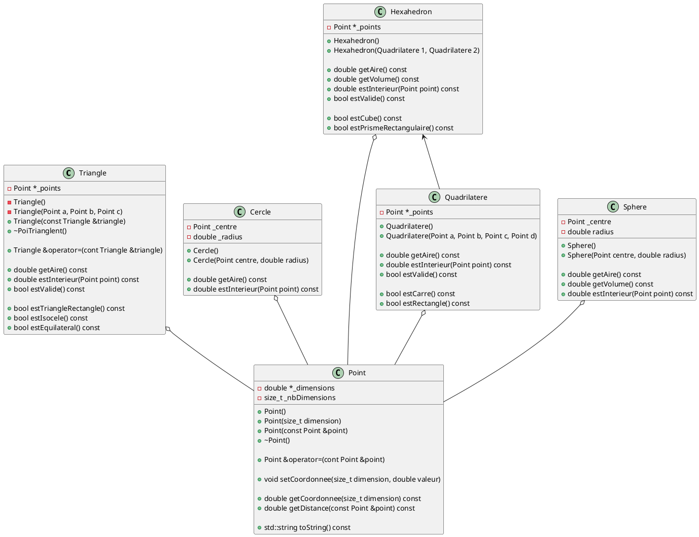

# Laboratoire 03

## Objectif

Approfondir les notions de POO avec les concepts d'accesseurs et mutateurs, constructeur de copie et opérateur d'assignation. Nous allons également comprendre les concepts d'agrégations et de compositions. On vous encourage a faire valider chacune des parties.

## Partie 1 - La table périodique des éléments

Implémentez les classes présentées ci-dessous. En plus des membres définit ici, vous devez également fournir **les accesseurs et mutateurs pour chaque attributs privées**. N'oubliez pas du requis pour être en mesure de créer un tableau d'objets d'une instance donnée.


> Prenez note que `uint8_t` est un type de données fournit par la librairie <cstdint> qui permet de s'assurer de la taille en bit de notre entier. `u`spécifie `unsigned` (non signée), `int` signifie entier et le 8 définit combien de bit nous avons et `t` pour `type`. 8 bit nous permet de représenter 256 valeurs de 0 à 255. Il existe `uint16_t`, `uint32_t` et `uint64_t`. Il y a les versions sans le `u`, comme `int8_t` pour les versions signée. 8 bit signé couvre une page de -128 à 127.

Dans votre fonction `main`, instanciez un tableau d'éléments pour les 6 premiers éléments en vous assurant d'y inscrire les valeurs appropriées, et assurez-vous d'avoir au minimum un isotope par élément. Puis, générer la sortie suivante :

```
---------------
| He       18 |
| Helium      |
|             |
| 9         2 |
---------------
```

`He` est le symbol, `18` est le groupe, `Helium` est le nom, `9` est le nombre d'isotope, et `2` le nombre de particules chargée (2 protons, 2 électrons).

## Partie 2 - Le plan cartésien à N dimension

Nous allons développer une série de classes qui a pour but d'aider à la représentation informatique de `Point` et de `Forme`. On appelle un ensemble de fonction et/ou de classe sans exécutable une librairie.

> Dans le cadre du cours, nous n'allons pas créer de manière formelle la libraire, toutefois *Visual Studio* permet la création de projet de type librarie (bibliothèque) alors que d'autres IDE nécessite probablement la configuration adéquate du projet. Cela ne sera pas obligatoire dans le présent cours.

L'objectif est de créer l'ensemble de ces classes-ci pour le chapitre 3, 4 et 5, c'est-à-dire que nous allons développer ses classes dans le prochain mois. Pour le présent laboratoire, on se concentre sur `Point` et sur `Triangle`.



### Classe Point

La classe `Point` doit permettre la création d'un point sur *N-dimension*. Chaque point `P` est décrit tel que :

$$
\begin{equation}
    P = \{{x_i} | x_i \in \mathbb{R}^N, i \in {0, 1, \dots N}\}
\end{equation}
$$

En d'autres mots, 

$$
\begin{equation}
    P = (x_0, x_1, \dots, x_N)
\end{equation}
$$

Voici les directives pour l'implémentation de votre classe `Point` :

* définir le nombre de dimension à la construction.
  * le constructeur par défaut défini le nombre de dimension à 2.
  * chaque dimension est initialisé à 0.0.
* configurer chaque valeur scalaire par dimension via `setDimension`.
* **ne pas faire** le constructeur avec un `Point` comme paramètre
* **ne pas faire** la ligne avec `operator=`
* faire les accesseurs `getCoordonnee` et `getDistance`
* méthode `toString` doit retourner `(x_0, x_1, ..., x_N)` sans saut de ligne.

Pour le calcul de la distance, nous avons deux instances `Point` définit tel que

$$
    P_0 = (x_{00}, x_{01}, \dots, x_{0N}) \\
    P_1 = (x_{10}, x_{11}, \dots, x_{1N})
$$

On calcul la distance selon :

$$
    D = \sqrt{\sum_{i=0}^N(x_{1i} - x_{0i})^2}
$$


#### Scénario 1 - Instantier un Point avec un Point

1. Dans votre `main`, instantier un objet de la classe Point (`ancientPoint`) avec 3 comme nombre de dimensions.
2. Changer les valeurs de chaque dimension pour des valeurs différentes et non-nulle.
3. Instantier un nouveau Point tel que `Point nouveauPoint(ancientPoint);`.
4. Modifier la première dimension de votre `nouveauPoint` avec une valeur différente
5. Afficher les points `ancientPoint` et `nouveauPoint` dans votre `main`.

Avons-nous un problème ?

Nous n'avons pas défini de constructeur de copie. Celui-ci est définit par défaut et fait un *shalow copy* de notre objet, c'est-à-dire qu'il copie chaque attributs, même les pointeurs et leurs internes. On doit donc définir un constructeur de copie.

```
Point::Point(const Point &point) {
    // On mets les _nbDimension de this et point égaux

    // On aloue _nbDimensions cases pour _coordonnee

    // On copie les coordonnees de point dans this
}
```

Retester les mêmes étapes du scénario 1

#### Scénario 2 - Assigner un Point à un Point

1. Dans votre `main`, instantier un objet de la classe Point (`ancientPoint`) avec 3 comme nombre de dimensions.
2. Changer les valeurs de chaque dimension pour des valeurs différentes et non-nulle.
3. Instantier un nouveau Point `nouveauPoint` avec 2 dimensions.
3. Changer les valeurs de `nouveauPoint` - doit avoir tous des valeurs différentes
3. Assigner `nouveauPoint` a `ancienPoint`
4. Modifier la première dimension de votre `nouveauPoint` avec une valeur différente
5. Afficher les points `ancientPoint` et `nouveauPoint` dans votre `main`.

Avons-nous un problème ?

L'assignation s'effectue via l'opérateur d'assignation `=`. Lorsque nous ne définissons pas son comportement, C++ en définie un par défaut. Cela pose problème car il va, de manière *stupide*, copier l'adresse du pointeur. Nos deux classes possède le même pointeur de dimensions. Pour définir le bon comportement, nous devons faire :

```
Point &Point::&operator=(const Point &point) {
    // Si les this et point pointe a la même place, retourner *this

    // Si les nbDimension de this et point sont égaux

    // alors on copie les coordonne de point dans this

    // sinon

    // on doit désalouer les coordonner de this

    // assigner le nombre de dimension de point à this

    // alouer un nouveau tableau de double avec la bonne quantité de case

    // copier les coordonner de point dans this

    // fin si

    // retourner this
}
```

Retester les mêmes étapes du scénario 2.

> Question ? Pourquoi l'`operator=` retourne une référence à lui-même ?

Vous avez maintenant l'ensemble de tous les outils requis pour gérer efficacement une classe qui utilise des pointeurs. En effet, pour chaque classe avec des pointeurs, vous devez **obligatoirement** définir :

* Un constructeur de copie ;
* L'opérateur d'assignation ;
* Un destructeur.

La stabilité de votre application C++ va grandement en dépendre.

### Forme à deux dimension

#### Triangle

Voici les lignes directrices concernant l'implémentation de la classe `Triangle`.

* Vos constructeurs doivent s'assurer d'alouer 3 instances de Point
* Vos constructeurs doivent s'assurer que les Point sont seulement en 2D
* Assurez de désaloué vos pointeur dans le destructeurs
* Assurez vous que le constructeur de copie ne fasse pas de *shalow copy*
* Assurez vous que l'opérateur d'assignation ne fasse pas de *shalow copy*
* Calculer l'aire de votre triangle

Soit trois points `P_0`, `P_1` et `P_2` définit comme ceci :

$$
    P_0 = (x_{00}, x_{01}) \\
    P_1 = (x_{10}, x_{11}) \\
    P_2 = (x_{20}, x_{21})
$$

L'aire de notre triangle ce calcul selon l'expression suivante :

$$
A = 0.5 (|x_{00}(x_{11} - x_{21}) + x_{10}(x_{21} - x_{01}) + x_{20}(x_{01} - x_{11})|)
$$

> Observation : si la parenthèse est 0, l'aire est 0.

> Note : Si l'aire est 0, le triangle n'est pas valide.

* Tester si le triangle est valide ou non
* Tester si un point est à l'intérieur du Triangle

Soit trois points `P_0`, `P_1` et `P_2` tel que définit précédement et un point `p` définit :

$$
p = (x_0, x_1)
$$

On doit faire le produit croisée des toutes les combinaisons de vecteurs créer par P_0 et P_1 sur P_0 et p, P_1 et P_2 sur sur P_1 et p, etc.

$$ 
C_0(P_0, P_1, p) = (x_{10} - x_{00})(x_1 - x_{01}) - (x_{11} - x_{01})(x_0 - x_{00})
C_1(P_1, P_2, p) = (x_{20} - x_{10})(x_1 - x_{11}) - (x_{21} - x_{11})(x_0 - x_{10})
C_2(P_2, P_0, p) = (x_{00} - x_{20})(x_1 - x_{21}) - (x_{01} - x_{21})(x_0 - x_{20})
$$ 

> Observation : Il est tout à fait possible de ce créer une méthode privée pour ce calcul.

Une fois les produits croisés complétés, il faut s'assurer qu'ils ont tous le même signe (tous négatif ou tous positif) pour que le point soit à l'intérieur.

* Tester si le triangle est un triangle rectangle

On prends la définition de trois points `P_0`, `P_1` et `P_2` mentionné précédemment. On définit des vecteurs `A`, `B` et `C` suivant :

$$
    \vec{A} = (x_{10} - x_{00}, x_{11} - x_{01}) \\
    \vec{B} = (x_{20} - x_{10}, x_{21} - x_{11}) \\
    \vec{C} = (x_{00} - x_{20}, x_{01} - x_{21})
$$

> Observation : Nous pourrions probablement avoir une méthode quelque part pour ça ? Où ? Que retourne-t-elle ?

Par la suite on veut faire le produit croisée `AC`, `BC` et `AB` tel que :

$$
    \vec{A} \cdot \vec{C} = (x_{10} - x_{00})(x_{00} - x_{20}) + (x_{11} - x_{01})(x_{01} - x_{21}) \\
    \vec{A} \cdot \vec{B} = (x_{10} - x_{00})(x_{20} - x_{10}) + (x_{11} - x_{01})(x_{21} - x_{11}) \\
    \vec{B} \cdot \vec{C} = (x_{20} - x_{10})(x_{00} - x_{20}) + (x_{21} - x_{11})(x_{01} - x_{21})
$$

## Partie 3 - Retour sur la table périodique des éléments

Maintenant que vous avez vu les requis nécessaire à suivre lorsqu'une classe à un pointeur, assurez-vous de respecter les obligations qu'un pointeur requiert dans une classe.