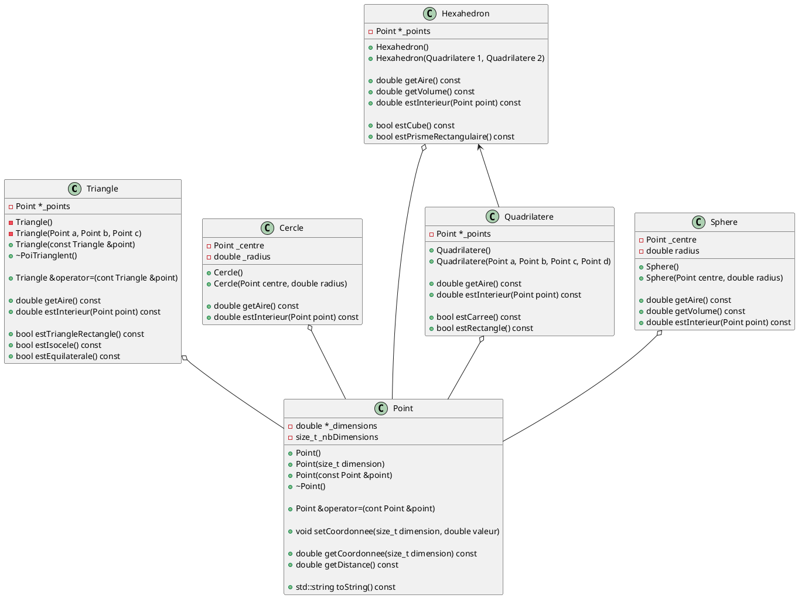
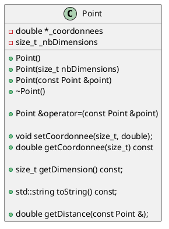
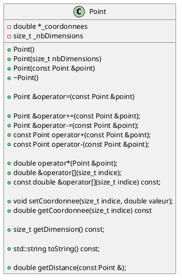
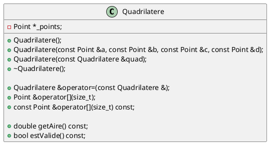

# Laboratoire 04

## Objectif

Approfondir les notions de POO avec les concepts de surcharge d'opérateur, fonction amie et référence constante.

## Note sur les valeurs à virgule flottante (`float` et `double`)

Les nombres à virgule flottante posent un risque lorsque utilisés de manière inadéquate. Deux problèmes importants doivent être considérés en tout temps.

### Problème numéro 1 - Erreur d'arrondi en virgule flottante : 

Tentons une petite expérience dans un nouveau projet Visual Studio.

Exécutez le code suivant:

```cpp
    int main() {
        double a = 0.1;
        double b = 0.2;
        double c = a + b;

        if (c == 0.3) {
            std::cout << "Yeah";
        } else {
            std::cout << "Doh";
        }

        std::cout << std::endl;
    }
```

Étrangement, notre résultat est "Doh", ce qui n'a pas de sens mathématiquement. Cependant, il est important de comprendre qu'en raison de la représentation en mémoire des nombres à virgule, qu'ils soient sur 32 bits (float) ou sur 64 bits (double), il y aura toujours des imprécisions. Une solution possible consiste à utiliser une valeur proche de 0 (par exemple, `1e-9`) et à s'assurer que la différence entre notre réponse et la valeur souhaitée soit inférieure à cette valeur. Ainsi, nous pouvons réécrire :

```cpp
    #define EPSILON 1e-9

    int main() {
        double a = 0.1;
        double b = 0.2;
        double c = a + b;

        if (abs(0.3 - c) < EPSILON) {
            std::cout << "Yeah";
        } else {
            std::cout << "Doh";
        }

        std::cout << std::endl;
    }
```

Maintenant tout fonctionne.

### Problème numéro 2 - Perte d'importance (*significance*)

Les valeurs d'un nombre à virgule flottante ne sont pas toujours comparables lorsque l'**ordre de grandeur** change. Par exemple, imaginons que nous voulons atteindre un objet à 150 000 000 000 000 m de distance de la terre. Disons que nous avons un vaiseau qui se déplace vers cet objet à une vitesse d'un mètre par seconde et met à jour la distance restante toutes les milisecondes (déplacement de 1 mm soit 0.001 m):

```cpp
    int main () {
        double distance = 1.5e14;
        double decrement = 1e-3;

        std::cout << std::scientific << std::setprecision(10);
        std::cout << "Avant de partir : " << distance << " meters" << std::endl;

        for (int i = 0; i < 10000000000lu; i++) {  
            distance -= decrement;
        }
        
        std::cout << "Après 10000000000 ms : " << distance << " meters" << std::endl;

        return 0;
    }
```

> Note: Pour cet exemple et pour d'autres exemples dans les laboratoires, il vous arrivera parfois d'obtenir une erreur à la compilation disant qu'une fonction (ou autre) est introuvable (`std::setprecision` dans ce cas-ci). À vous de faire appel à votre ami Internet pour trouver quelle bibliothèque inclure pour avoir accès à cette fonction!

> Note 2: **« Dans quelle librairie C++ se trouve la fonction std::setprecision ? »** est une bonne question à poser à une intelligence artificielle générative (ex: ChatGPT).

Si vous patientez le temps des ~20 secondes nécessaires pour exécuter ce code, vous verrez que les deux valeurs (distance de départ et distance de fin) sont identiques. Il y a plusieurs méthodes pour gérer cette situation. Une méthode simple est celle-ci:

```cpp

    // Retourne la plus petite valeur possible pouvant être
    // additionnée ou soustraite à x pour que la valeur
    // de celui-ci change
    double valeurMinimalePossible(double x) {
        return std::nextafter(x, x + x) - x;
    }

    int main () {    
        double distance = 1.5e14;
        double valeurMinimale = valeurMinimalePossible(distance);
        double decrement = 1e-3;

        std::cout << std::scientific << std::setprecision(10);
        std::cout << "Avant de partir : " << distance << " meters" << std::endl;

        double accumulator = 0.0;
        for (uint64_t i = 0; i < 10000000000lu; i++) {  
            accumulator += decrement;
            
            if (accumulator > valeurMinimale) {
                distance -= accumulator;
                accumulator = 0.0;
            }
        }
        
        std::cout << "Après 10000000000 ms : " << distance << " meters" << std::endl;

        return 0;
    }

```

Vous devriez avoir un résultat différent après la boucle. Nous n'allons pas aborder le fonctionnement en détail  de la fonction `nextafter` dans le cadre du cours.

## Le plan cartésien à N dimensions

Nous allons continuer à implémenter notre série de classes qui a pour but d'aider à la représentation informatique de points et de formes. Nous allons apporter des modifications à `Point` et `Triangle`, et implémenter `Quadrilatere`.



### Classe Point

Notre classe `Point` devrait ressembler à ceci :



#### Notre première surchage d'opérateur (si on ignore l'opérateur d'assignation)

En ce moment, chaque fois que l'on veut changer une coordonnée de notre `Point`, nous devons faire :

```cpp
    Point monPoint;
    monPoint.setCoordonnee(0, 1.39);
    monPoint.setCoordonnee(1, 2.17);
```

Serait-il agréable de pouvoir faire plutôt ceci?

```cpp
    Point monPoint;
    monPoint[0] = 1.39;
    monPoint[1] = 2.17;
```

Pour y parvenir, nous devons surcharger l'opérateur `[]`, comme ceci :

```cpp
    double &operator[](size_t indice) {
        if (indice < this->_nbDimensions) {
            return this->_coordonnees[indice];
        } else {
            throw std::out_of_range("Dépassement de la capacité du tableau");
        }
    }
```

> On profite de cette occasion pour introduire le concept d'`Exception`. Il existe plusieurs types d'exceptions et elles sont définies dans `<stdexcept>`. Pour l'instant, lorsqu'on est dans une situation d'erreur, nous allons `throw` notre exception et notre application va se terminer à ce moment. Voici une liste non-exhaustive des exceptions disponibles:

> * `logic_error` est utilisé lors de la détection d'une erreur de logique
> * `invalid_argument` est utilisé lorsqu'un paramètre n'est pas valide
> * `length_error` est utilisé dans un contexte d'erreur de longueur
> * `out_of_range` est utilisé si une valeur est en dehors de la plage permise
> * `runtime_errer` est utilisé lorsqu'une erreur est survenue durant l'exécution du programme
> * `range_error` est utilisé pour tout autre type d'erreur lié à une plage de valeurs
> * `overflow_error` est utilisé si une variable a dépassé sa valeur maximale
> * `underflow_error` est utilisé si une variable a dépassé sa valeur minimale (en soustraction)
>
> Il est important d'ajouter un message pertinent à l'erreur.

Dans votre `main`, copiez ce code qui servira à tester votre classe `Point`.

```cpp
#include <iostream>

#include "point.h"
#include "triangle.h"

int main () {
    Point a;
    a[0] = 5.45;
    a[1] = 3.22;

    std::cout << a.toString() << std::endl;
    return 0;
}
```

Que se passe-t-il si nous ajoutons cette ligne?

```cpp
#include <iostream>

#include "point.h"
#include "triangle.h"

int main () {
    Point a;
    a[0] = 5.45;
    a[1] = 3.22;

    Point b(a);

    std::cout << a.toString() << std::endl;
    std::cout << b.toString() << std::endl;
    return 0;
}
```

Tout devrait fonctionner. Toutefois, nous aurons un problème avec les méthodes constantes. En effet, notre opérateur permet l'obtention et la modification d'une référence à notre `double`, et ainsi nous ne pourrions pas utiliser cette méthode telle quelle.

1. Ajoutez une méthode **constante** nommée `testConstant` qui retourne un `int`
2. À l'intérieur de cette méthode, ajoutez le code suivant :

```cpp
    // contenue de votre méthode testContant
    int a = (int)(*this)[0];
    return a;
```

Maintenant, essayer de compiler. Votre IDE ne devrait pas être content car la méthode constante s'attend à ce qu'on ne fasse rien qui pourrait changer l'état de notre objet, mais le compilateur ne peut pas être certain que l'opérateur `[]`, non constant, ne vas pas faire un changement (n'est pas assez intelligent).

Comment règle-t-on ce problème ? Nous allons devoir **ignorer** le concept **DRY** (*Don't repeat yourself*) et répéter du code :

```cpp
    double &operator[](size_t indice) {
        if (indice < this->_nbDimensions) {
            return this->_coordonnees[indice];
        } else {
            throw std::out_of_range("Dépassement de la capacité du tableau");
        }
    }

    const double &operator[](size_t indice) const {
        if (indice < this->_nbDimensions) {
            return this->_coordonnees[indice];
        } else {
            throw std::out_of_range("Dépassement de la capacité du tableau");
        }
    }
```

La surcharge d'opérateur est un outil puissant qui donne accès à une panoplie de règles pré-établies, par exemple la priorité d'opération avec les opérateurs arithmétiques, et des raccourcis pour les opérateurs `[]` et `<<`, toutefois il faut prendre le temps de bien réfléchir à la pertinence et aux effets possibles d'utiliser ces outils. Dans le cas présent, un point à *N-dimension* bénéficie grandement de ces opérateurs, ce ne sera pas toujours le cas.

#### Implémenter l'addition et la soustraction

L'addition de deux points retourne un point dont les coordonnées ont été additionnées, tel que :

$$
    P_0 = (x_{00}, x_{01}, \dots, x_{0n-1}) \\
    P_1 = (x_{10}, x_{11}, \dots, x_{1n-1})
$$

Donc 

$$
    p = P_0 + P_1 = \left(\sum_{i=0}^{n-1}{x_{i0}}, \sum_{i=0}^{n-1}{x_{i1}}, \dots, \sum_{i=1}^{n-1}{x_{in-1}}\right)
$$

> Astuce: implémentez le `+=` en premier, puis faites le `+` qui utilise le `+=` de manière efficace, tel que vu dans les diapositives. Implémentez également `-=` et `-`.

Voici un exemple d'algorithme pour le `+=` et un pour le `+` suivant cette astuce :

```cpp

Point &Point::operator+=(const Point &point) {
    // Si les nombres de dimensions sont les mêmes alors
    //    Pour chaque dimension
    //      Coordonnée i de this += coordonnée i de point
    //    Fin pour
    // Fin si
    // On retourne la référence de this
}

const Point Point::operator+(const Point &point) {
    // Instancie un nouveau point (nommé resultat) qui sera égale à this
    // resultat += point
    // retourne le résultat
}

```

#### Implémenter l'opérateur de produit scalaire

Nous allons utiliser l'opérateur `*` pour représenter l'opération d'un produit scalaires, c'est-à-dire :

$$
    P_0 \cdot P_1 = \sum_{i=0}^{n-1}{x_{0i}x_{1i}}
$$

Implémenter cette surcharge d'opérateur, en vous assurant du bon type de données de retour.

#### Les fonctions amies et l'opérateur `<<`

Depuis le début de l'introduction de la surcharge d'opérateur, nous avons toujours eu des opérateurs qui avait le même type de chaque côté. Par exemple :

```cpp
    Point &operator=(const Point &);

    Point &operator+=(const Point &);
    Point &operator-=(const Point &);
    const Point operator+(const Point &);
    const Point operator-(const Point &);

    double operator*(Point &);
    double &operator[](size_t);
    const double &operator[](size_t) const;
```

Quand nous utilisons un opérateur comme ceci :

```cpp
    Point a, b;
    // ...
    Point c = a + b;
```

nous pouvons imaginer quelque chose comme ceci :

```cpp
    Point a, b;
    // ...
    // Code C++ non valide
    Point c.operator=(a.operator+(b));
```

Ainsi, `a` sera le `this` lors du `+` et `c` le `this` lors du `=`. Maintenant, regardons ensemble un exemple d'utilisation d'un `cout` avec l'opérateur `<<`

```cpp
    // ...
    std::cout << maChaine << "." << std::endl;
```

Ici, on peut conceptualiser que nous avons fait :

```cpp
    // ...
    // code C++ non valide
    std::cout.operator<<(maChaine.operator<<(".".operator<<(std::endl)));
```

Cela devient plus compliquer quand nous avons différents types de données, comme par exemple des entiers, des nombres à virgules flotante, etc: cela requiert que cette opérateur puisse recevoir n'importe qu'elle type de données, incluant nos classes. Et un problème survient.

L'objet `std::cout` est une instance de la classe `std::ostream`. Notre problème est que nous ne pouvons pas modifier cette classe : elle est fournie par la librarie standard, et elle diffère selon notre système d'exploitation. On ne peux donc pas ajouter dans cette classe notre opérateur qui reçoit un `Point`. Calmez-vous, nous avons une solution : les fonctions amies.

Une fonction amie est une fonction (**pas une méthode**) que notre classe va permettre l'accès a nos membres privées. On la définit dans notre classe pour que le compilateur soit en mesure de trouver cette fonction et accéder à nos membres privées.

```cpp
class Point {
private:
    double *_coordonnee;
    size_t _nbDimensions;
public:
    // ...

    friend std::ostream &operator<<(std::ostream&, const Point &);
};
```

Ici, on réalise que nous avons deux paramètres. Le premier correspond à notre instance `std::ostream` (tel `std::cout`) et le second est notre point. Reprenons ce code-ci :

```cpp
    // ...
    std::cout << maChaine << "." << std::endl;
```

Avec les fonctions amies, nous avons quelques chose qui ressemble plus à :

```cpp
    // ...
    // code C++ non-valide
    operator<<(operator<<(operator<<(std::cout, maChaine), "."), std::endl);
```

Ainsi il est possible de surcharger l'opérateur `<<` en utilisant les fonctions amies.

> Il est possible de faire la même chose sans utiliser une fonction amie. Laquelle ?

Pour notre point, nous pouvons simplement copier le contenue de `toString()` à l'intérieur, en remplaçant le `flux` par notre paramètre `std::ostream`.

#### Exemple

Ici, nous avons un extrait du code dans le `main` qui ressemblait à ceci : 

```cpp
    Point a(3), b(3), c(3);
    Point wow(4);

    a.setCoordonnee(0, 2.5);
    a.setCoordonnee(1, 2.8);
    a.setCoordonnee(2, 2.95);

    b.setCoordonnee(0, 3.5);
    b.setCoordonnee(1, 3.8);
    b.setCoordonnee(2, 3.98);

    c.setCoordonnee(0, 4.5);
    c.setCoordonnee(1, 4.8);
    c.setCoordonnee(2, 4.98);

    wow.setCoordonnee(0, 0.5);
    wow.setCoordonnee(1, 0.8);
    wow.setCoordonnee(2, 0.98);
    wow.setCoordonnee(3, 1.16);

    std::cout << "a: " << a.toString() << std::endl;
    std::cout << "b: " << b.toString() << std::endl;
    std::cout << "c: " << c.toString() << std::endl;
    std::cout << "wow: " << wow.toString() << std::endl;
```

que l'on peut remplacer par ceci : 

```cpp
    Point a(3), b(3), c(3);
    Point wow(4);

    a[0] = 2.5;
    a[1] = 2.8;
    a[2] = 2.95;

    b[0] = 3.5;
    b[1] = 3.8;
    b[2] = 3.98;

    c[0] = 4.5;
    c[1] = 4.8;
    c[2] = 4.98;

    wow[0] = 0.5;
    wow[1] = 0.8;
    wow[2] = 0.98;
    wow[3] = 1.16;

    std::cout << "a: " << a << std::endl;
    std::cout << "b: " << b << std::endl;
    std::cout << "c: " << c << std::endl;
    std::cout << "wow: " << wow << std::endl;
```

Voici donc notre classe après l'ajout de nos opérateurs.



### Classe Triangle

* Modifier `Triangle` pour utiliser l'opérateur `[]` de point.
* Ajouter l'opérateur `[]` pour la classe Triangle qui retournera le bon point sélectionner. N'oubliez pas que cela requiert souvent de ne pas être *DRY*.

### Classe Quadrilatere

* Implémenter la classe quadrilatère suivant le schéma suivant :



Équation pour calculer l'aire (peu importe le nombre de point). Cette algorithme est l'algorithme du lacet (*showlace*) et permet de calculer l'air de n'importe quel forme avec un nombre arbitraire de point en autant qu'il n'y a pas de croisement. Nous n'allons pas gérer les croisements.

Soit un nombre de Point 2D arbitraire `k` :

$$
    A = \frac{1}{2} \sum_{i = 0}^{k - 1}{y_i(x_{i-1} - x_{i+1})}
$$

ou $(x_i, y_i)$ représente $(P_{i0}, P_{i1})$. Pour l'instant, si l'air est égale à 0, alors la figure est invalide (mais ce n'est pas vraiment le cas).
