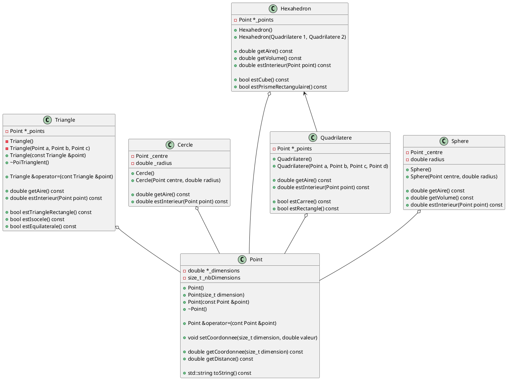
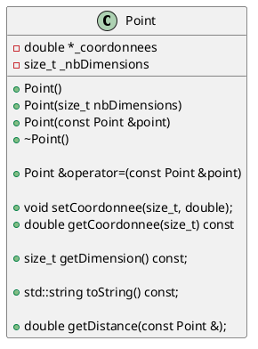

# Laboratoire 04

## Objectif

Approfondir les notions de POO avec les concepts de surcharges d'opérateur, fonctions amies et référence constante.

## Le plan cartésien à N dimension

Nous allons continuer notre série de classes qui a pour but d'aider à la représentation informatique de `Point` et de `Forme`. Nous allons apporter des modifications à `Point`, `Triangle` et implémenter `Quadrilatere`.



### Classe Point

Notre classe point devrait ressembler à ceci :



#### Notre première surchage d'opérateur (si on néglige l'opérateur d'assignation)

En ce moment, à chaque fois que l'on veut changer une coordonnée de notre `Point`, nous devons faire :

```cpp
    Point monPoint;
    monPoint.setCoordonnee(0, 1.39);
    monPoint.setCoordonnee(1, 2.17);
```

Serait-il agréable de pouvoir faire ceci :

```cpp
    Point monPoint;
    monPoint[0] = 1.39;
    monPoint[1] = 2.17;
```

Pour y parvenir, nous devons surcharger l'opérateur `[]`, comme ceci :

```cpp
    double &operator[](size_t indice) {
        if (indice < this->_nbDimensions) {
            return this->_coordonnees[indice];
        } else {
            throw std::out_of_range("Dépassement de la capacité du tableau");
        }
    }
```

> On profite de cette occasion pour introduire le concept d'`Exception`. Il existe plusieurs types d'exception et elles sont définies dans `<stdexcept>`. Pour l'instant, lorsqu'on est dans une situation d'erreur, nous allons `throw` notre exception et notre application va se terminer à ce moment. Voici une liste non-exhaustive des exceptions disponibles
> * `logic_error` est utilisé lors de la détection d'une erreur de logique
> * `invalid_argumet` est utilisé lorsqu'un paramètre n'est pas valide
> * `length_error` est utilisé dans un contexte d'erreur de longueur
> * `out_of_range` est utilisé si une valeur est en dehors de la plage permise
> * `runtime_errer` est utilisé lorsqu'un erreur est survenue durant l'exécution du programme
> * `range_error` est utilisé pour tout autre type d'erreur lié à une plage de valeur
> * `overflow_error` est utilisé si une variable a dépassé sa valeur maximale
> * `underflow_error` est utilisé si une variable a dépassé sa valeur minimale (en soustraction)
>
> Important d'ajouter un message pertinent à l'erreur.

Dans votre `main`, copier ce code qu'y servira pour tester notre code.

```cpp
#include <iostream>

#include "point.h"
#include "triangle.h"

int main () {
    Point a;
    a[0] = 5.45;
    a[1] = 3.22;

    std::cout << a.toString() << std::endl;
    return 0;
}
```

Que ce passe-t-il si nous ajoutons cette ligne :

```cpp
#include <iostream>

#include "point.h"
#include "triangle.h"

int main () {
    Point a;
    a[0] = 5.45;
    a[1] = 3.22;

    Point b(a);

    std::cout << a.toString() << std::endl;
    std::cout << b.toString() << std::endl;
    return 0;
}
```

Tout devrait fonctionner. Toutefois, nous aurons un problème avec les méthodes constantes. En effet, notre opérateur permet l'obtention et la modification d'un référence à notre `double`, et ainsi nous ne pourrions pas utiliser cette méthode tel quelle.

1. Ajouter une méthode constante nommé `testConstant` qui retourne un int
2. À l'intérieur de cette méthode, ajouter le code suivant :

```cpp
    // contenue de votre méthode testContant
    int a = (int)(*this)[0];
    return a;
```

Maintenant, essayer de compiler. Votre IDE ne devrait pas être contente car la méthode constante s'attends à ce qu'on ne fasse rien qui pourrait changer l'état de notre objet, mais le compilateur ne peut pas être certain que l'opérateur `[]` ne vas pas faire un changement (n'est pas assez intelligent).

Comment s'y prend-t-on ? Nous allons devoir **ignorer** le concept **DRY** (*Don't repeat yourself*) et répéter du code :

```cpp
    double &operator[](size_t indice) {
        if (indice < this->_nbDimensions) {
            return this->_coordonnees[indice];
        } else {
            throw std::out_of_range("Dépassement de la capacité du tableau");
        }
    }

    const double &operator[](size_t indice) const {
        if (indice < this->_nbDimensions) {
            return this->_coordonnees[indice];
        } else {
            throw std::out_of_range("Dépassement de la capacité du tableau");
        }
    }
```

La surcharge d'opérateur est un outil puissant qui donne accès a une panoplie de règle pré-établis, par exemple la priorité d'opération avec les opérateurs arithmétiques, et des *shortcut* pour les opérateur `[]` et `<<`, toutefois il faut prendre le temps de bien réfléchir à la pertinence et aux effets possible d'utiliser ses outils. Dans le présent cas, un point à *N-dimension* bénéficie grandement de ces opérateurs, ce ne sera pas toujours le cas.

#### Implémenter l'addition et la soustraction

L'addition de deux points retourne un point dont chaque coordonnée ont été additionné entre elle, tel que :

$$
    P_0 = (x_{00}, x_{01}, \dots, x_{0n-1}) \\
    P_1 = (x_{10}, x_{11}, \dots, x_{1n-1})
$$

Donc 

$$
    p = P_0 + P_1 = \left(\sum_{i=0}^{n-1}{x_{i0}}, \sum_{i=0}^{n-1}{x_{i1}}, \dots, \sum_{i=1}^{n-1}{x_{in-1}}\right)
$$

> Astuce - implémentez le `+=` en premier, puis faire le `+` qui utilise le `+=` de manière efficace. Faire également `-=` et `-`.

Voici un exemple d'algorithme pour le `+=` et un pour le `+` suivant cette astuce :

```cpp

Point &Point::operator+=(const Point &point) {
    // Si les dimensions sont les mêmes alors
    //    Pour chaque dimension
    //      Coordonné i de this += coordonné i de point
    //    Fin pour
    // Fin si
    // On retourne la référence de this
}

const Point Point::operator+(const Point &point) {
    // Instancie un nouveau point (nommé resultat) qui sera égale à this
    // resultat += point
    // retourne le résultat
}

```

#### Implémenter l'opérateur de produit scalaire

Nous allons utiliser l'opérateur `*` pour représenter l'opération d'un produit scalaires, c'est-à-dire :

$$
    P_0 \cdot P_1 = \sum_{i=0}^{n-1}{x_{0i}x_{1i}}
$$

Implémenter cette surcharge d'opérateur, en vous assurant du bon type de données de retour.

#### Les fonctions amies et l'opérateur `<<`

Depuis le début de l'introduction de la surcharge d'opérateur, nous avons toujours eu des opérateurs qui avait le même type de chaque côté. Par exemple :

```cpp
    Point &operator=(const Point &);

    Point &operator+=(const Point &);
    Point &operator-=(const Point &);
    const Point operator+(const Point &);
    const Point operator-(const Point &);

    double operator*(Point &);
    double &operator[](size_t);
    const double &operator[](size_t) const;
```

Quand nous utilisons un opérateur comme ceci :

```cpp
    Point a, b;
    // ...
    Point c = a + b;
```

nous pouvons imaginer quelque chose comme ceci :

```cpp
    Point a, b;
    // ...
    // Code C++ non valide
    Point c.operator=(a.operator+(b));
```

Ainsi, `a` sera le `this` lors du `+` et `c` le `this` lors du `=`. Maintenant, regardons ensemble un exemple d'utilisation d'un `cout` avec l'opérateur `<<`

```cpp
    // ...
    std::cout << maChaine << "." << std::endl;
```

Ici, on peut conceptualiser que nous avons fait :

```cpp
    // ...
    // code C++ non valide
    std::cout.operator<<(maChaine.operator<<(".").operator<<(std::endl));
```

Cela devient plus compliquer quand nous avons différents types de données, comme par exemple des entiers, des nombres à virgules flotante, etc: cela requiert que cette opérateur puisse recevoir n'importe qu'elle type de données, incluant nos classes. Et un problème survient.

L'objet `std::cout` est une instance de la classe `std::ostream`. Notre problème est que nous ne pouvons pas modifier cette classe : elle est fournie par la librarie standard, et elle diffère selon notre système d'opération. On ne peux donc pas ajouter dans cette classe notre opérateur qui reçoit un `Point`. Calmez-vous, nous avons une solution : les fonctions amies.

Une fonction amie est une fonction (pas une méthode de notre classe `Point`) que notre classe va permettre l'accès a nos membres privées. On la définit dans notre classe pour que le compilateur soit en mesure de trouver cette fonction et accéder à nos membres privées.

```cpp
class Point {
private:
    double *_coordonnee;
    size_t _nbDimensions;
public:
    // ...

    friend std::ostream &operator<<(std::ostream&, const Point &);
};
```

Ici, on réalise que nous avons deux paramètres. Le premier correspond à notre instance `std::ostream` (tel `std::cout`) et le second est notre point. On peut donc conceptualiser 

