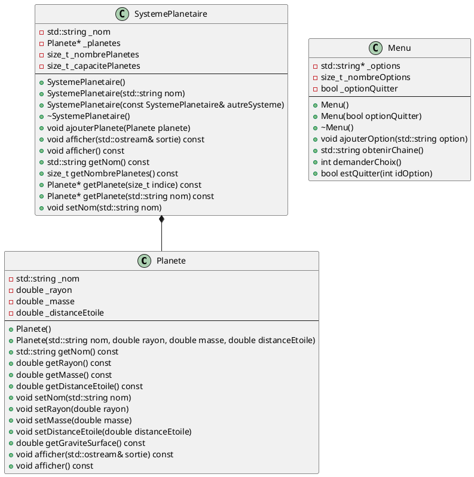

# Laboratoire 04

## Objectif

Mettre en pratique les notions suivantes:

* Toutes les notions des trois chapitres précédents
* Le passage et le retour d'objets par référence constante
* Les surcharges d'opérateurs
* Les fonctions amies

## Parties

Ce laboratoire comprend trois parties:

* **Laboratoire 04-A**: Amélioration du programme du système solaire
* **Laboratoire 04-B**: La gestion du temps avec les classes `Time`, `Duration`, `Date` et `DateTime`
* **Laboratoire 04-C**: Le retour de la liste de températures

## Laboratoire 04-A - Amélioration du programme du système solaire

Pour cette partie, reprenez votre programme du Laboratoire 03-A avec les classes `Planete`, `SystemePlanetaire` et `Menu`. Pour rappel, voici le diagramme de classes de ce programme:



### Étape 1

Commençons par revoir la classe `Menu`. Celle-ci alloue de la mémoire via son pointeur `_options`. C'est pourquoi elle définit un destructeur.

Au chapitre précédent, nous avons vu que le compilateur définit automatiquement un **constructeur de copie** pour toutes les classes. Celui-ci copie tous les attributs de l'objet source vers l'objet cible. Cela n'est habituellement pas un problème, sauf lorsque la classe contient des pointeurs, puisque le constructeur de copie par défaut copie uniquement les adresses des objets pointés, et non les objets eux-mêmes. Il faut donc redéfinir le constructeur de copie pour rectifier ce comportement.

Le constructeur de copie de la classe `Menu` est présentement absent. Implémentez-le. Testez-le bien dans votre `main` avant de poursuivre.

### Étape 2

Les classes ont un autre membre qui est défini automatiquement par le compilateur, et qui pose le même problème que le constructeur de copie lorsque la classe contient des pointeurs: il s'agit de l'**opérateur d'affectation** (`operator=`). Il faut donc également implémenter cet opérateur lorsqu'une classe contient des pointeurs.

**En résumé, toute classe qui gère de la mémoire en allocation dynamique doit obligatoirement implémenter les trois membres suivants:**

* **Le destructeur**
* **Le constructeur de copie (copieur)**
* **L'opérateur d'affectation (affectateur)**

Il faut donc surcharger l'opérateur d'affectation dans la classe `Menu`. Voici l'implémentation à utiliser:

```cpp
Menu& Menu::operator=(const Menu &autreMenu) {
    if (this != &autreMenu) {
        delete[] this->_options;

        this->_nombreOptions = autreMenu._nombreOptions;
        this->_optionQuitter = autreMenu._optionQuitter;
        this->_options = new std::string[this->_nombreOptions];
        for (size_t i = 0; i < this->_nombreOptions; i++) {
            this->_options[i] = autreMenu._options[i];
        }
    }
    return *this;
}
```

Remarquez que cette implémentation ressemble beaucoup à celle du constructeur de copie. Elle contient cependant quelques éléments supplémentaires:

* Elle vérifie si on essaie d'assigner l'objet à lui-même (d'où la condition `this != &autreMenu`), auquel cas elle ne fait rien.
* Elle désalloue le tableau d'options. Cela est nécessaire, car contrairement au constructeur de copie, l'affectation se fait dans un objet existant. Voilà d'ailleurs pourquoi il est important de détecter le cas où on essaie d'assigner l'objet à lui-même: la désallocation aurait alors pour effet de « briser » notre objet!
* Elle retourne l'objet courant (`*this`). Cela est nécessaire pour permettre le chaînage d'opérateurs, comme ceci:

```cpp
Menu menu1, menu2, menu3;
menu1 = menu2 = menu3;
```

Lorsqu'on exécute ce code, la ligne avec les `=` est en fait remplacée par ceci:

```cpp
menu1.operator=(menu2.operator=(menu3));
```

Puisque `menu1.operator=` s'attend à recevoir un `Menu` en paramètre, on peut déduire que `menu2.operator=(menu3)` doit lui-même retourner un `Menu` (d'où le type de retour `Menu&` de la surcharge d'opérateur). Le `Menu` à retourner dans ce cas-ci, c'est `menu2`, donc `*this` du point de vue de la méthode.

Testez l'opérateur `=` dans votre `main` avant de poursuivre.

### Étape 3

Et si on ajoutait maintenant quelques surcharges d'opérateurs à la classe `Planete` ?

Commençons par l'opérateur d'égalité (`==`). Quelle devrait être la signature de sa surcharge? Observons un appel de cet opérateur:

```cpp
if (planete1 == planete2) {
    // ...
}
```

Cela est équivalent à:

```cpp
if (planete1.operator==(planete2)) {
    // ...
}
```

Donc clairement, le paramètre est de type `Planete`. De plus, on peut supposer que cet opérateur ne doit modifier ni `planete1`, ni `planete2`. La signature ressemblera donc à:

```cpp
<type de retour> operator==(const Planete& autrePlanete) const;
```

Qu'en est-il du type de retour maintenant? 🤔 Eh bien, puisque l'opérateur `==` s'utilise dans une condition, il doit nécessairement retourner un booléen!

```cpp
bool operator==(const Planete& autrePlanete) const;
```

Vous avez maintenant tout ce qui faut pour implémenter cette surcharge d'opérateur. Celle-ci doit retourner `true` **si tous les attributs des deux planètes sont égaux**.

Testez l'opérateur `==` dans le `main` avant de poursuivre.

### Étape 4

Ajoutons maintenant l'opérateur d'inégalité (`!=`). Puisque celui-ci est l'inverse de l'opérateur d'égalité (`==`) qu'on vient d'implémenter, on peut facilement faire de la..


Dans cette optique, je vous propose l'implémentation suivante:

```cpp
bool Planete::operator!=(const Planete &autrePlanete) const {
    return !(*this == autrePlanete);
}
```

Assurez-vous de comprendre ce code avant de poursuivre.

### Étape 5

Ne serait-il pas pratique de pouvoir afficher une planète en faisant `std::cout << planete` ? Mais quelle serait donc la signature de cette surcharge? 🤔

```cpp
std::cout << planete;

// devient
std::cout.operator<<(planete);
```

Hmmm... on a comme un problème là. `std::cout` étant du type `std::ostream`, on dirait bien qu'`operator<<` est une méthode de `std::ostream` et non de `Planete` !

Alors voici le formulaire de contact de l'organisme de standardisation du langage C++ pour leur demander d'ajouter le support de votre classe `Planete` à `std::ostream`:

https://isocpp.org/about/contact

Mais non, c'est une blague!

On va plutôt utiliser un tour de passe-passe qui consiste à définir l'opérateur comme une fonction qui prend deux paramètres (un `std::ostream` et un `Planete`):

```cpp
std::ostream& operator<<(std::ostream &sortie, const Planete &planete);
```

**Il s'agit bien d'une fonction, et non d'une méthode de la classe `Planete`.** Vous ne devez donc PAS ajouter son prototype entre les accolades de votre `class`, mais plutôt APRÈS la définition de la classe, toujours dans votre fichier `Planete.h`.

Voici l'implémentation à ajouter dans `Planete.cpp`:

```cpp
std::ostream& operator<<(std::ostream &sortie, const Planete &planete) {
    planete.afficher(sortie);
    return sortie;
}
```

Ici, par chance, on a déjà une méthode `afficher`, alors il suffit de l'appeler. Remarquez que l'opérateur retourne le `std::ostream`. C'est ce qui rend possible le chaînage de cet opérateur, comme ceci:

```cpp
std::cout << "Ma planète: " << planete << std::endl;

// devient
operator<<(
    operator<<(
        operator<<(
            std::cout,
            std::endl
        ),
        planete
    ),
    "Ma planète: "
)
```

Remarquez aussi que l'implémentation ne contient pas de `Planete::`, puisqu'il s'agit d'une fonction, et non d'une méthode de la classe `Planete`.

Pour vérifier que l'opérateur fonctionne, modifiez la méthode `afficher` de la classe `SystemePlanetaire` pour utiliser `sortie << this->_planetes[i]` dans votre boucle d'affichage au lieu de `this->_planetes[i].afficher(sortie)`.

### Étape 6

La classe `SystemePlanetaire` gère de la mémoire dynamique comme `Menu`. Il faut donc lui ajouter l'opérateur d'affectation (`=`) comme pour `Menu` ! Effectuez donc cet ajout, et assurez-vous qu'il fonctionne avant de poursuivre.

### Étape 7

La classe `SystemePlanetaire` a toutes les apparences d'un **conteneur**: son rôle est principalement de contenir des `Planete` en nombre variable.

Il arrive qu'un conteneur implémente l'opérateur `+=` pour fournir une syntaxe plus courte permettant d'ajouter des éléments. Par exemple dans notre cas, nous pourrions remplacer une partie du code actuel du `main` par:

```cpp
SystemePlanetaire systemeSolaire("Système solaire");

systemeSolaire += Planete("Mercure", 2439000, 3.301e23, 5.79e7);
systemeSolaire += Planete("Vénus", 6052000, 4.867e24, 1.082e8);
systemeSolaire += Planete("Terre", 6371000, 5.972e24, 1.496e8);
systemeSolaire += Planete("Mars", 3390000, 6.39e23, 2.279e8);
systemeSolaire += Planete("Jupiter", 69911000, 1.898e27, 7.785e8);
systemeSolaire += Planete("Saturne", 58232000, 5.683e26, 1.433e9);
systemeSolaire += Planete("Uranus", 25362000, 8.681e25, 2.877e9);
systemeSolaire += Planete("Neptune", 24622000, 1.024e26, 4.503e9);
```

L'opérateur `+=` deviendrait donc une alternative à la méthode `ajouterPlanete`.

Pour que cela soit possible, il faut bien sûr surcharger cet opérateur. Ci-dessus, on peut voir que le paramètre à utiliser est de type `Planete`. De plus, puisque cet opérateur supporte le chaînage (comme `=`), il doit retourner `*this`. Voici donc la signature de cette surcharge:

```cpp
SystemePlanetaire& SystemePlanetaire::operator+=(const Planete &planete);
```

L'implémentation doit simplement appeler la méthode `ajouterPlanete`, puis retourner `*this`. Utilisez le code ci-dessus pour tester.

### Étape 8

Nous avons présentement deux versions de `getPlanete` qui retournent toutes les deux l'**adresse** de la planète demandée. **Cela n'est pas une bonne pratique**, puisqu'elle brise l'encapsulation: rien n'empêche l'utilisateur de la méthode `getPlanete` d'ensuite modifier directement la mémoire à l'adresse retournée, de même qu'accéder au reste du tableau. Nous avons surtout codé nos méthodes de cette façon afin de pouvoir retourner `nullptr` pour exprimer que la planète demandée n'existe pas. Il existe cependant d'autres façons de faire cela.

Par ailleurs, ne serait-il pas intéressant de pouvoir utiliser l'opérateur `[]` pour accéder à une planète du système planétaire, plutôt que devoir appeler une méthode `getPlanete` ? Nous allons donc surcharger cet opérateur.

Commencez par retirer les deux versions de la méthode `getPlanete` dans `SystemePlanetaire.h` et `SystemePlanetaire.cpp`. Votre `main` ne compilera plus, mais ne vous en préoccupez pas pour le moment.

Ajoutons deux versions de l'opérateur `[]` pour remplacer les deux versions de la méthode `getPlanete`. Voici les implémentations à utiliser:

```cpp
Planete& SystemePlanetaire::operator[](size_t indice) {
    if (indice >= this->_nombrePlanetes) {
        throw std::out_of_range("Dépassement de la taille du tableau");
    }
    return this->_planetes[indice];
}

Planete& SystemePlanetaire::operator[](std::string nom) {
    for (size_t i = 0; i < this->_nombrePlanetes; i++) {
        if (this->_planetes[i].getNom() == nom) {
            return this->_planetes[i];
        }
    }
    throw std::invalid_argument("Planète non trouvée");
}
```

Ces deux implémentations permettent respectivement d'utiliser l'opérateur `[]` avec un indice et avec un nom de planète:

```cpp
Planete mercure = systemePlanetaire[0];
Planete saturne = systemePlanetaire["Saturne"];
```

Remarquez d'abord le type de retour: on retourne maintenant une **référence** vers la planète plutôt qu'un **pointeur**. Cela est plus sécuritaire, car une référence ne permet pas de manipuler la mémoire directement. Une référence ne peut cependant pas prendre la valeur `nullptr`. Nous avons donc besoin d'une autre façon d'exprimer que l'indice ou le nom reçu en paramètre n'existe pas dans ce système planétaire.

C'est là qu'entre en jeu le concept d'**exception**. Une exception indique au programmeur qu'une erreur est survenue. Par défaut, elle fait planter le programme. On utilise le mot-clé `throw` pour lancer une exception. Il existe plusieurs types d'exceptions, définis dans la librairie `stdexcept` (elle-même incluse dans `iostream`). Voici quelques-uns des types d'exceptions disponibles:

* `logic_error` est utilisé lors de la détection d'une erreur de logique
* `invalid_argument` est utilisé lorsqu'un paramètre n'est pas valide
* `length_error` est utilisé dans un contexte d'erreur de longueur
* `out_of_range` est utilisé si une valeur est en dehors de la plage permise
* `range_error` est utilisé pour tout autre type d'erreur lié à une plage de valeurs
* `overflow_error` est utilisé si une variable a dépassé sa valeur maximale
* `underflow_error` est utilisé si une variable a dépassé sa valeur minimale (en soustraction)
* `runtime_error` est utilisé lorsqu'une erreur est survenue durant l'exécution du programme

Les exceptions sont par ailleurs très utiles pour implémenter des validations dans les mutateurs (ce que nous n'avons pas fait dans le laboratoire 03).

Dans le `main`, remplacez vos appels à `getPlanete` par l'utilisation de l'opérateur `[]`. **Attention: vous ne pourrez plus stocker le résultat dans un pointeur!** De plus, retirez pour l'instant vos conditions qui détectent que la planète demandée n'existe pas (avec `nullptr`).

Testez que votre programme fonctionne toujours. Observez ce qui se passe si vous entrez un numéro ou un nom de planète invalide. Le programme plantera en affichant le message passé à l'exception. Cela n'est bien entendu pas idéal. Heureusement, il existe une manière d'intercepter les exceptions pour gérer les erreurs au lieu de faire planter le programme. Il faut pour cela utiliser un `try-catch`:

```cpp
std::cout << "Entrer le numéro de la planète: ";
std::cin >> numeroPlanete;
try {
    planete = systemeSolaire[numeroPlanete - 1];
    std::cout << planete << std::endl;
} catch (const std::exception& e) {
    std::cout << "Numéro de planète invalide. " << std::endl;
}
```

Lorsqu'on utilise une méthode ou un opérateur susceptible de lancer une exception, on peut englober le code dans un `try`. Si une exception est lancée, la séquence d'instructions est interrompue, et le contenu du `catch` est exécuté.

Adaptez le code de votre `main` en ajoutant des `try-catch` aux bons endroits. Testez bien votre programme avant de continuer.

### Étape 9

Observez plus attentivement les signatures des surcharges d'opérateur `[]` que nous venons d'implémenter:

```cpp
Planete& operator[](size_t indice);
Planete& operator[](std::string nom);
```

Ce sont des **méthodes non constantes**, et ils retournent les `Planete` par **référence non constante** également. Cela signifie que des opérations de ce genre sont maintenant permises:

```cpp
/* On peut modifier la planète puisqu'elle est retournée par référence non constante */
systemeSolaire[0].setNom("Mercury");

/* On peut même réaffecter l'objet! Cela appelle l'opérateur = de la classe Planete. */
systemePlanetaire[0] = Planete("Bye bye Mercure mwahahahaha!", 0, 0, 0);

/* Sans doute un coup de Pluton, encore amère d'avoir été exclue du club des planètes en 2006. */
```

Cela peut être tout à fait acceptable et pratique. Cependant, le fait que l'opérateur `[]` soit non constant peut parfois poser problème. Essayez par exemple d'ajouter la méthode suivante à la classe `SystemePlanetaire`:

Coup de théâtre! Ça ne compile plus! C'est parce qu'**une méthode constante n'a pas le droit d'appeler une méthode non-constante**, autrement le compilateur ne peut pas garantir que l'objet n'est pas modifié.

La solution est simple, mais un peu « plate »: il faut dupliquer nos surcharges d'opérateurs pour offrir une version constante contenant exactement le même code:

```cpp
// Version non-constante de l'opérateur [] avec un indice
Planete& SystemePlanetaire::operator[](size_t indice) {
    if (indice >= this->_nombrePlanetes) {
        throw std::out_of_range("Dépassement de la taille du tableau");
    }
    return this->_planetes[indice];
}

// Version constante de l'opérateur [] avec un indice
const Planete& SystemePlanetaire::operator[](size_t indice) const {
    if (indice >= this->_nombrePlanetes) {
        throw std::out_of_range("Dépassement de la taille du tableau");
    }
    return this->_planetes[indice];
}

// Version non-constante de l'opérateur [] avec un nom de planète
Planete& SystemePlanetaire::operator[](std::string nom) {
    for (size_t i = 0; i < this->_nombrePlanetes; i++) {
        if (this->_planetes[i].getNom() == nom) {
            return this->_planetes[i];
        }
    }
    throw std::invalid_argument("Planète non trouvée");
}

// Version constante de l'opérateur [] avec un nom de planète
const Planete& SystemePlanetaire::operator[](std::string nom) const {
    for (size_t i = 0; i < this->_nombrePlanetes; i++) {
        if (this->_planetes[i].getNom() == nom) {
            return this->_planetes[i];
        }
    }
    throw std::invalid_argument("Planète non trouvée");
}
```

Il n'y a malheureusement pas de meilleure façon de faire. Eh non, pas de réutilisation possible ici!


### Étape 10

Il reste à surcharger l'opérateur `<<` pour `SystemePlanetaire`. Inspirez-vous de ce qui a été fait plus haut pour `Planete`, cette fois-ci en ajoutant le prototype de la fonction sous votre classe dans `SystemePlanetaire.h` et son implémentation dans `SystemePlanetaire.cpp`. Remplacez ensuite la ligne `systemeSolaire.afficher()` du `main` pour vérifier que la surcharge fonctionne.

## Laboratoire 04-B

À venir

## Laboratoire 04-C

À venir
