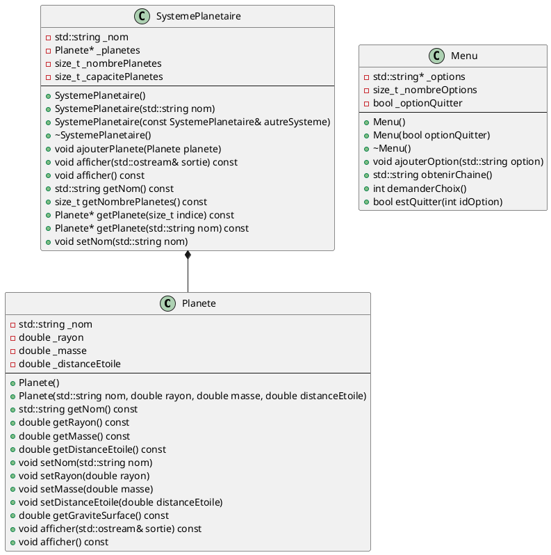
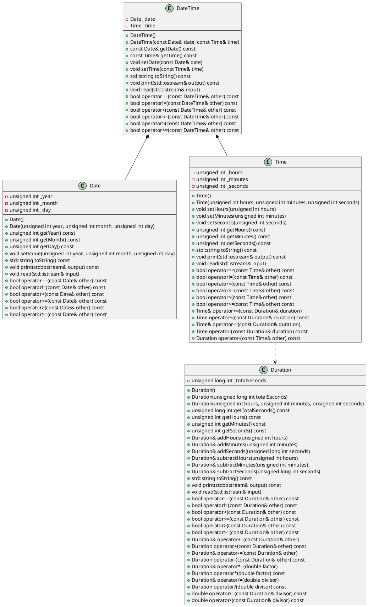
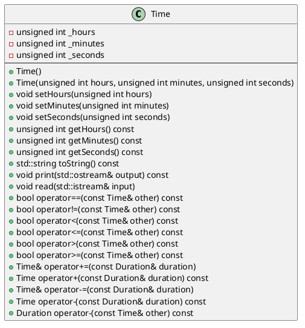
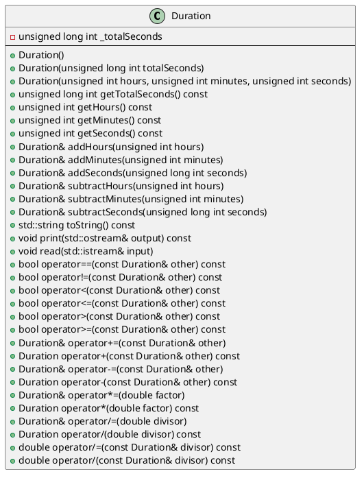
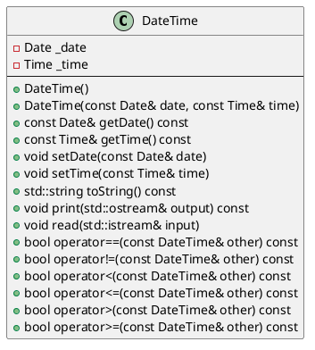

# Laboratoire 04

## Objectif

Mettre en pratique les notions suivantes:

* Toutes les notions des trois chapitres précédents
* Le passage et le retour d'objets par référence constante
* Les surcharges d'opérateurs
* Les fonctions amies

## Parties

Ce laboratoire comprend trois parties:

* **Laboratoire 04-A**: Amélioration du programme du système solaire
* **Laboratoire 04-B**: La gestion du temps avec les classes `Time`, `Duration`, `Date` et `DateTime`
* **Laboratoire 04-C**: Le retour de la liste de températures

## Laboratoire 04-A - Amélioration du programme du système solaire

Pour cette partie, reprenez votre programme du Laboratoire 03-A avec les classes `Planete`, `SystemePlanetaire` et `Menu`. Pour rappel, voici le diagramme de classes de ce programme:



### Étape 1

Commençons par revoir la classe `Menu`. Celle-ci alloue de la mémoire via son pointeur `_options`. C'est pourquoi elle définit un destructeur.

Au chapitre précédent, nous avons vu que le compilateur définit automatiquement un **constructeur de copie** pour toutes les classes. Celui-ci copie tous les attributs de l'objet source vers l'objet cible. Cela n'est habituellement pas un problème, sauf lorsque la classe contient des pointeurs, puisque le constructeur de copie par défaut copie uniquement les adresses des objets pointés, et non les objets eux-mêmes. Il faut donc redéfinir le constructeur de copie pour rectifier ce comportement.

Le constructeur de copie de la classe `Menu` est présentement absent. Implémentez-le. Testez-le bien dans votre `main` avant de poursuivre.

### Étape 2

Les classes ont un autre membre qui est défini automatiquement par le compilateur, et qui pose le même problème que le constructeur de copie lorsque la classe contient des pointeurs: il s'agit de l'**opérateur d'affectation** (`operator=`). Il faut donc également implémenter cet opérateur lorsqu'une classe contient des pointeurs.

**En résumé, toute classe qui gère de la mémoire en allocation dynamique doit obligatoirement implémenter les trois membres suivants:**

* **Le destructeur**
* **Le constructeur de copie (copieur)**
* **L'opérateur d'affectation (affectateur)**

Il faut donc surcharger l'opérateur d'affectation dans la classe `Menu`. Voici l'implémentation à utiliser:

```cpp
Menu& Menu::operator=(const Menu &autreMenu) {
    if (this != &autreMenu) {
        delete[] this->_options;

        this->_nombreOptions = autreMenu._nombreOptions;
        this->_optionQuitter = autreMenu._optionQuitter;
        this->_options = new std::string[this->_nombreOptions];
        for (size_t i = 0; i < this->_nombreOptions; i++) {
            this->_options[i] = autreMenu._options[i];
        }
    }
    return *this;
}
```

Remarquez que cette implémentation ressemble beaucoup à celle du constructeur de copie. Elle contient cependant quelques éléments supplémentaires:

* Elle vérifie si on essaie d'assigner l'objet à lui-même (d'où la condition `this != &autreMenu`), auquel cas elle ne fait rien.
* Elle désalloue le tableau d'options. Cela est nécessaire, car contrairement au constructeur de copie, l'affectation se fait dans un objet existant. Voilà d'ailleurs pourquoi il est important de détecter le cas où on essaie d'assigner l'objet à lui-même: la désallocation aurait alors pour effet de « briser » notre objet!
* Elle retourne l'objet courant (`*this`). Cela est nécessaire pour permettre le chaînage d'opérateurs, comme ceci:

```cpp
Menu menu1, menu2, menu3;
menu1 = menu2 = menu3;
```

Lorsqu'on exécute ce code, la ligne avec les `=` est en fait remplacée par ceci:

```cpp
menu1.operator=(menu2.operator=(menu3));
```

Puisque `menu1.operator=` s'attend à recevoir un `Menu` en paramètre, on peut déduire que `menu2.operator=(menu3)` doit lui-même retourner un `Menu` (d'où le type de retour `Menu&` de la surcharge d'opérateur). Le `Menu` à retourner dans ce cas-ci, c'est `menu2`, donc `*this` du point de vue de la méthode.

Testez l'opérateur `=` dans votre `main` avant de poursuivre.

### Étape 3

Et si on ajoutait maintenant quelques surcharges d'opérateurs à la classe `Planete` ?

Commençons par l'opérateur d'égalité (`==`). Quelle devrait être la signature de sa surcharge? Observons un appel de cet opérateur:

```cpp
if (planete1 == planete2) {
    // ...
}
```

Cela est équivalent à:

```cpp
if (planete1.operator==(planete2)) {
    // ...
}
```

Donc clairement, le paramètre est de type `Planete`. De plus, on peut supposer que cet opérateur ne doit modifier ni `planete1`, ni `planete2`. La signature ressemblera donc à:

```cpp
<type de retour> operator==(const Planete& autrePlanete) const;
```

Qu'en est-il du type de retour maintenant? 🤔 Eh bien, puisque l'opérateur `==` s'utilise dans une condition, il doit nécessairement retourner un booléen!

```cpp
bool operator==(const Planete& autrePlanete) const;
```

Vous avez maintenant tout ce qui faut pour implémenter cette surcharge d'opérateur. Celle-ci doit retourner `true` **si tous les attributs des deux planètes sont égaux**.

Testez l'opérateur `==` dans le `main` avant de poursuivre.

### Étape 4

Ajoutons maintenant l'opérateur d'inégalité (`!=`). Puisque celui-ci est l'inverse de l'opérateur d'égalité (`==`) qu'on vient d'implémenter, on peut facilement faire de la..


Dans cette optique, je vous propose l'implémentation suivante:

```cpp
bool Planete::operator!=(const Planete &autrePlanete) const {
    return !(*this == autrePlanete);
}
```

Assurez-vous de comprendre ce code avant de poursuivre.

### Étape 5

Ne serait-il pas pratique de pouvoir afficher une planète en faisant `std::cout << planete` ? Mais quelle serait donc la signature de cette surcharge? 🤔

```cpp
std::cout << planete;

// devient
std::cout.operator<<(planete);
```

Hmmm... on a comme un problème là. `std::cout` étant du type `std::ostream`, on dirait bien qu'`operator<<` est une méthode de `std::ostream` et non de `Planete` !

Alors voici le formulaire de contact de l'organisme de standardisation du langage C++ pour leur demander d'ajouter le support de votre classe `Planete` à `std::ostream`:

[https://isocpp.org/about/contact](https://tinyurl.com/3u5tvf53)

Mais non, c'est une blague!

On va plutôt utiliser un tour de passe-passe qui consiste à définir l'opérateur comme une fonction qui prend deux paramètres (un `std::ostream` et un `Planete`):

```cpp
std::ostream& operator<<(std::ostream &sortie, const Planete &planete);
```

**Il s'agit bien d'une fonction, et non d'une méthode de la classe `Planete`.** Vous ne devez donc PAS ajouter son prototype entre les accolades de votre `class`, mais plutôt APRÈS la définition de la classe, toujours dans votre fichier `Planete.h`.

Voici l'implémentation à ajouter dans `Planete.cpp`:

```cpp
std::ostream& operator<<(std::ostream &sortie, const Planete &planete) {
    planete.afficher(sortie);
    return sortie;
}
```

Ici, par chance, on a déjà une méthode `afficher`, alors il suffit de l'appeler. Remarquez que l'opérateur retourne le `std::ostream`. C'est ce qui rend possible le chaînage de cet opérateur, comme ceci:

```cpp
std::cout << "Ma planète: " << planete << std::endl;

// devient
operator<<(
    operator<<(
        operator<<(
            std::cout,
            std::endl
        ),
        planete
    ),
    "Ma planète: "
)
```

Remarquez aussi que l'implémentation ne contient pas de `Planete::`, puisqu'il s'agit d'une fonction, et non d'une méthode de la classe `Planete`.

Pour vérifier que l'opérateur fonctionne, modifiez la méthode `afficher` de la classe `SystemePlanetaire` pour utiliser `sortie << this->_planetes[i]` dans votre boucle d'affichage au lieu de `this->_planetes[i].afficher(sortie)`.

### Étape 6

La classe `SystemePlanetaire` gère de la mémoire dynamique comme `Menu`. Il faut donc lui ajouter l'opérateur d'affectation (`=`) comme pour `Menu` ! Effectuez donc cet ajout, et assurez-vous qu'il fonctionne avant de poursuivre.

### Étape 7

La classe `SystemePlanetaire` a toutes les apparences d'un **conteneur**: son rôle est principalement de contenir des `Planete` en nombre variable.

Il arrive qu'un conteneur implémente l'opérateur `+=` pour fournir une syntaxe plus courte permettant d'ajouter des éléments. Par exemple dans notre cas, nous pourrions remplacer une partie du code actuel du `main` par:

```cpp
SystemePlanetaire systemeSolaire("Système solaire");

systemeSolaire += Planete("Mercure", 2439000, 3.301e23, 5.79e7);
systemeSolaire += Planete("Vénus", 6052000, 4.867e24, 1.082e8);
systemeSolaire += Planete("Terre", 6371000, 5.972e24, 1.496e8);
systemeSolaire += Planete("Mars", 3390000, 6.39e23, 2.279e8);
systemeSolaire += Planete("Jupiter", 69911000, 1.898e27, 7.785e8);
systemeSolaire += Planete("Saturne", 58232000, 5.683e26, 1.433e9);
systemeSolaire += Planete("Uranus", 25362000, 8.681e25, 2.877e9);
systemeSolaire += Planete("Neptune", 24622000, 1.024e26, 4.503e9);
```

L'opérateur `+=` deviendrait donc une alternative à la méthode `ajouterPlanete`.

Pour que cela soit possible, il faut bien sûr surcharger cet opérateur. Ci-dessus, on peut voir que le paramètre à utiliser est de type `Planete`. De plus, puisque cet opérateur supporte le chaînage (comme `=`), il doit retourner `*this`. Voici donc la signature de cette surcharge:

```cpp
SystemePlanetaire& SystemePlanetaire::operator+=(const Planete &planete);
```

L'implémentation doit simplement appeler la méthode `ajouterPlanete`, puis retourner `*this`. Utilisez le code ci-dessus pour tester.

### Étape 8

Nous avons présentement deux versions de `getPlanete` qui retournent toutes les deux l'**adresse** de la planète demandée. **Cela n'est pas une bonne pratique**, puisqu'elle brise l'encapsulation: rien n'empêche l'utilisateur de la méthode `getPlanete` d'ensuite modifier directement la mémoire à l'adresse retournée, de même qu'accéder au reste du tableau. Nous avons surtout codé nos méthodes de cette façon afin de pouvoir retourner `nullptr` pour exprimer que la planète demandée n'existe pas. Il existe cependant d'autres façons de faire cela.

Par ailleurs, ne serait-il pas intéressant de pouvoir utiliser l'opérateur `[]` pour accéder à une planète du système planétaire, plutôt que devoir appeler une méthode `getPlanete` ? Nous allons donc surcharger cet opérateur.

Commencez par retirer les deux versions de la méthode `getPlanete` dans `SystemePlanetaire.h` et `SystemePlanetaire.cpp`. Votre `main` ne compilera plus, mais ne vous en préoccupez pas pour le moment.

Ajoutons deux versions de l'opérateur `[]` pour remplacer les deux versions de la méthode `getPlanete`. Voici les implémentations à utiliser:

```cpp
Planete& SystemePlanetaire::operator[](size_t indice) {
    if (indice >= this->_nombrePlanetes) {
        throw std::out_of_range("Dépassement de la taille du tableau");
    }
    return this->_planetes[indice];
}

Planete& SystemePlanetaire::operator[](std::string nom) {
    for (size_t i = 0; i < this->_nombrePlanetes; i++) {
        if (this->_planetes[i].getNom() == nom) {
            return this->_planetes[i];
        }
    }
    throw std::invalid_argument("Planète non trouvée");
}
```

Ces deux implémentations permettent respectivement d'utiliser l'opérateur `[]` avec un indice et avec un nom de planète:

```cpp
Planete mercure = systemePlanetaire[0];
Planete saturne = systemePlanetaire["Saturne"];
```

Remarquez d'abord le type de retour: on retourne maintenant une **référence** vers la planète plutôt qu'un **pointeur**. Cela est plus sécuritaire, car une référence ne permet pas de manipuler la mémoire directement. Une référence ne peut cependant pas prendre la valeur `nullptr`. Nous avons donc besoin d'une autre façon d'exprimer que l'indice ou le nom reçu en paramètre n'existe pas dans ce système planétaire.

C'est là qu'entre en jeu le concept d'**exception**. Une exception indique au programmeur qu'une erreur est survenue. Par défaut, elle fait planter le programme. On utilise le mot-clé `throw` pour lancer une exception. Il existe plusieurs types d'exceptions, définis dans la librairie `stdexcept` (elle-même incluse dans `iostream`). Voici quelques-uns des types d'exceptions disponibles:

* `logic_error` est utilisé lors de la détection d'une erreur de logique
* `invalid_argument` est utilisé lorsqu'un paramètre n'est pas valide
* `length_error` est utilisé dans un contexte d'erreur de longueur
* `out_of_range` est utilisé si une valeur est en dehors de la plage permise
* `range_error` est utilisé pour tout autre type d'erreur lié à une plage de valeurs
* `overflow_error` est utilisé si une variable a dépassé sa valeur maximale
* `underflow_error` est utilisé si une variable a dépassé sa valeur minimale (en soustraction)
* `runtime_error` est utilisé lorsqu'une erreur est survenue durant l'exécution du programme

Les exceptions sont par ailleurs très utiles pour implémenter des validations dans les mutateurs (ce que nous n'avons pas fait dans le laboratoire 03).

Dans le `main`, remplacez vos appels à `getPlanete` par l'utilisation de l'opérateur `[]`. **Attention: vous ne pourrez plus stocker le résultat dans un pointeur!** De plus, retirez pour l'instant vos conditions qui détectent que la planète demandée n'existe pas (avec `nullptr`).

Testez que votre programme fonctionne toujours. Observez ce qui se passe si vous entrez un numéro ou un nom de planète invalide. Le programme plantera en affichant le message passé à l'exception. Cela n'est bien entendu pas idéal. Heureusement, il existe une manière d'intercepter les exceptions pour gérer les erreurs au lieu de faire planter le programme. Il faut pour cela utiliser un `try-catch`:

```cpp
std::cout << "Entrer le numéro de la planète: ";
std::cin >> numeroPlanete;
try {
    planete = systemeSolaire[numeroPlanete - 1];
    std::cout << planete << std::endl;
} catch (const std::exception& e) {
    std::cout << "Numéro de planète invalide. " << std::endl;
}
```

Lorsqu'on utilise une méthode ou un opérateur susceptible de lancer une exception, on peut englober le code dans un `try`. Si une exception est lancée, la séquence d'instructions est interrompue, et le contenu du `catch` est exécuté.

Adaptez le code de votre `main` en ajoutant des `try-catch` aux bons endroits. Testez bien votre programme avant de continuer.

### Étape 9

Observez plus attentivement les signatures des surcharges d'opérateur `[]` que nous venons d'implémenter:

```cpp
Planete& operator[](size_t indice);
Planete& operator[](std::string nom);
```

Ce sont des **méthodes non constantes**, et ils retournent les `Planete` par **référence non constante** également. Cela signifie que des opérations de ce genre sont maintenant permises:

```cpp
/* On peut modifier la planète puisqu'elle est retournée par référence non constante */
systemeSolaire[0].setNom("Mercury");

/* On peut même réaffecter l'objet! Cela appelle l'opérateur = de la classe Planete. */
systemePlanetaire[0] = Planete("Bye bye Mercure mwahahahaha!", 0, 0, 0);

/* Sans doute un coup de Pluton, encore amère d'avoir été exclue du club des planètes en 2006. */
```

Cela peut être tout à fait acceptable et pratique. Cependant, le fait que l'opérateur `[]` soit non constant peut parfois poser problème. Essayez par exemple d'ajouter la méthode suivante à la classe `SystemePlanetaire`:

```cpp
bool SystemePlanetaire::testConstant() const {
    return (*this)[0].getNom() == "Mercure";
}
```

Coup de théâtre! Ça ne compile plus! C'est parce qu'**une méthode constante n'a pas le droit d'appeler une méthode non-constante**, autrement le compilateur ne peut pas garantir que l'objet n'est pas modifié.

La solution est simple, mais un peu « plate »: il faut dupliquer nos surcharges d'opérateurs pour offrir une version constante contenant exactement le même code:

```cpp
// Version non-constante de l'opérateur [] avec un indice
Planete& SystemePlanetaire::operator[](size_t indice) {
    if (indice >= this->_nombrePlanetes) {
        throw std::out_of_range("Dépassement de la taille du tableau");
    }
    return this->_planetes[indice];
}

// Version constante de l'opérateur [] avec un indice
const Planete& SystemePlanetaire::operator[](size_t indice) const {
    if (indice >= this->_nombrePlanetes) {
        throw std::out_of_range("Dépassement de la taille du tableau");
    }
    return this->_planetes[indice];
}

// Version non-constante de l'opérateur [] avec un nom de planète
Planete& SystemePlanetaire::operator[](std::string nom) {
    for (size_t i = 0; i < this->_nombrePlanetes; i++) {
        if (this->_planetes[i].getNom() == nom) {
            return this->_planetes[i];
        }
    }
    throw std::invalid_argument("Planète non trouvée");
}

// Version constante de l'opérateur [] avec un nom de planète
const Planete& SystemePlanetaire::operator[](std::string nom) const {
    for (size_t i = 0; i < this->_nombrePlanetes; i++) {
        if (this->_planetes[i].getNom() == nom) {
            return this->_planetes[i];
        }
    }
    throw std::invalid_argument("Planète non trouvée");
}
```

Il n'y a malheureusement pas de meilleure façon de faire. Eh non, pas de réutilisation possible ici!


### Étape 10

Il reste à surcharger l'opérateur `<<` pour `SystemePlanetaire`. Inspirez-vous de ce qui a été fait plus haut pour `Planete`, cette fois-ci en ajoutant le prototype de la fonction sous votre classe dans `SystemePlanetaire.h` et son implémentation dans `SystemePlanetaire.cpp`. Remplacez ensuite la ligne `systemeSolaire.afficher()` du `main` pour vérifier que la surcharge fonctionne.

**⚠️ Faites valider votre laboratoire 04-A par l'enseignant.**

## Laboratoire 04-B - La gestion du temps

Prenez *le temps* de regarder le diagramme de classes ci-dessous:



Les classes de ce diagramme représentent des concepts en lien avec le temps.

* `Date` représente une date, et est donc composée d'une année, un mois et un jour. Les années négatives ne sont pas supportées, et ce pour se simplifier la vie lors d'un laboratoire ultérieur (eh oui, *spoiler* !).
* `Time` représente une heure entre `00:00:00` et `23:59:59`.
* `Duration` représente une durée. La différence entre une durée et une heure est qu'une durée n'a pas de valeur maximale (en fait si, mais nous y reviendrons).
* `DateTime` représente une combinaison d'une date et d'une heure, elle permet donc de définir un moment exact dans le temps.

### Étape 1

Commencez par définir la classe `Date` avec ses attributs privés en vous basant sur le diagramme de classes. N'ajoutez pas tout de suite les constructeurs.

Vous pouvez voir dans le diagramme qu'il n'y a pas de mutateurs (*setters*) individuels pour les attributs `_year`, `_month` et `_date`. C'est parce qu'implémenter des validations dans de tels mutateurs serait complexe, puisqu'il est impossible de savoir si un jour est valide avant de connaître le mois (puisque le nombre de jours n'est pas le même dans chaque mois) ou même l'année (à cause des années bissextiles). En d'autres mots, il faut connaître la date au complet pour être en mesure de la valider correctement. Nous allons donc faire un seul mutateur combiné. Voici sa signature:

```cpp
void setValue(unsigned int year, unsigned int month, unsigned int day);
```

Ce mutateur doit d'abord valider que:

* le mois a une valeur valide
* le jour a une valeur valide en fonction du mois
* si la date est un 29 février, l'année est divisible par 4 **mais PAS** par 100, ou l'année est divisible par 400

Si au moins une de ces conditions n'est pas respectée, il faut lancer une exception `std::out_of_range`, **et il ne faut modifier aucun attribut**.

> **À ce stade-ci, vous devriez avoir pris l'habitude de tester les membres de vos classes au fur et à mesure que vous les implémentez.** À partir de maintenant, il n'y aura plus de rappels de tester vos méthodes à chaque étape.

### Étape 2

Définissez maintenant le **constructeur avec paramètres**, qui appelle `setValue`.

Pour ce qui est du **constructeur sans paramètre**, ajoutez simplement cette définition dans votre fichier `Date.h`:

```cpp
Date(): Date(0, 1, 1) {}
```

Vous avez maintenant un **constructeur sans paramètre** qui appelle le **constructeur avec paramètres**, soit le contraire de ce que nous faisions jusqu'à maintenant. Comme vous pouvez voir, il initialise la date au 1er janvier de l'an 0. Puisqu'il n'y a rien à faire dans le corps du constructeur, on peut mettre une paire d'accolades (`{}`) pour faire l'implémentation vide directement dans le fichier `.h`. Il n'y a donc rien à faire dans le fichier `.cpp` pour ce constructeur.

Utiliser le **constructeur avec paramètres** pour implémenter le **constructeur sans paramètre**, c'est bien sûr un excellent exemple de...


### Étape 3

Implémentez maintenant les trois accesseurs:

* `getYear`
* `getMonth`
* `getDay`

### Étape 4

*Le temps* est maintenant venu d'implémenter la méthode `toString`, qui retourne la date sous forme de chaîne de caractères au [format ISO](https://fr.wikipedia.org/wiki/ISO_8601), soit `AAAA-MM-JJ`. Par exemple, le **3 février 2026** s'écrit `2026-02-03`. Attention à bien ajouter des 0 devant les mois et jours inférieurs à 10, de même que les années inférieures à 1000.

> **Remarque importante:** bien que cette méthode retourne un `std::string`, donc un objet, il ne faut absolument PAS le retourner par référence. C'est parce que cet objet **est créé localement par la méthode**, et ce en allocation statique. Il est donc automatiquement détruit par le compilateur lorsque l'exécution de la méthode se termine. Ainsi, si on le retournait par référence, on aurait une référence à un objet qui n'existe plus! On peut donc se donner la règle suivante: **on retourne un objet par référence, sauf lorsqu'il s'agit d'un nouvel objet alloué statiquement dans la fonction**.

### Étape 5

Implémentez maintenant la méthode `print`, qui est équivalente à la méthode `afficher` des laboratoires précédents.

### Étape 6

Implémentez maintenant la méthode `read`. Celle-ci prend en paramètre un `std::istream` (tel que `std::cin`) et permet donc par exemple de lire une date saisie au clavier, toujours au format `AAAA-MM-JJ`.

Pensez à comment vous feriez pour lire une date dans ce format avec `std::cin`. Vous découperiez sans doute le problème en plus petites étapes comme celles-ci:

1. Lire l'année dans un `int`
2. Lire le séparateur `-` dans un `char`
3. Lire le mois dans un `int`
4. Lire le séparateur `-` dans un `char`
5. Lire le jour dans un `int`

Alors vous devez faire la même chose, mais avec le `std::istream` reçu en paramètre.

### Étape 7

En vous inspirant de ce que vous avez fait au Laboratoire 04-A, surchargez maintenant les opérateurs `<<` et `>>`, qui doivent appeler respectivement vos méthodes `print` et  `read`.

### Étape 8

Implémentez les 6 opérateurs de comparaison:

* `==`
* `!=`
* `<`
* `<=`
* `>`
* `>=`

Prenez *le temps* de penser aux racourcis que vous pourriez prendre pour implémenter certains de ces opérateurs en faisant de la...


de vos autres opérateurs.

**⚠️ Faites valider votre classe `Date` par l'enseignant avant de continuer.**

### Étape 9

Attaquons-nous maintenant à la classe `Time`.



Définissez la classe et implémentez ses membres suivants dans un ordre qui vous paraît logique:

* Les deux constructeurs
* `setHours`
* `setMinutes`
* `setSeconds`
* `getHours`
* `getMinutes`
* `getSeconds`
* `toString`
* `print`
* `read`
* L'opérateur `<<`
* L'opérateur `>>`
* L'opérateur `==`
* L'opérateur `!=`
* L'opérateur `<`
* L'opérateur `<=`
* L'opérateur `>`
* L'opérateur `>=`

N'implémentez pas tout de suite les autres surcharges d'opérateurs, nous y reviendrons *plus tard*.

Une heure est comprise entre `00:00:00` et `23:59:59`. Un objet `Time` doit valider que les valeurs qu'on tente de lui donner pour les heures, minutes et secondes sont valides. Autrement, il doit lancer une exception `std::out_of_range`.

Comme pour `Date`, un objet `Time` doit s'afficher au format ISO, soit `HH:MM:SS`. N'oubliez pas d'ajouter des zéros lorsque nécessaire!

### Étape 10

Mettons de côté la classe `Time` et attaquons-nous maintenant à la classe `Duration`.



Contairement à la classe `Time` qui possède des attributs distincts pour les heures, les minutes et les secondes, la classe `Duration` ne stocke en mémoire que le nombre total de secondes correspondant à la durée (`_totalSeconds`). Par exemple, une durée de `30:10:05` correspond à $30 \times 3600 + 10 \times 60 + 5$ secondes, soit une valeur de `108605` pour l'attribut  `_totalSeconds`. Bien entendu, lorsqu'on affichera la durée, on voudra bel et bien afficher `30:10:05`. Il y a donc, pour cette classe, une distinction entre la représentation des données par **l'interface** de la classe, et la façon dont elles sont représentées dans l'**état interne** de l'objet. Cette façon de faire présente l'avantage de simplifier grandement certains calculs: il est par exemple beaucoup plus facile d'additionner ou soustraire deux durées exprimées en secondes que deux durées décomposées en nombres d'heures, minutes et secondes.

> Pourquoi utiliser le type `unsigned long int` pour l'attribut `_totalSeconds`? Un `unsigned int` en C++ est le plus souvent représenté sur 32 bits (quoique cela dépend ultimement du compilateur et du système). Sa valeur maximale est donc de $2^{32} - 1$, soit environ 4,3 milliards. Cela correspondrait à une durée maximale d'environ 136 ans dans le cas qui nous intéresse. Dépendamment de l'application à développer, une telle durée maximale pourrait être largement insuffisante (imaginez qu'on essaie de représenter l'âge de l'univers, ou ne serait-ce que l'âge de la ville de Sherbrooke, fondée en 1802). En comparaison, un `unsigned long int` est le plus souvent représenté sur 64 bits, ce qui nous donne une valeur maximale de $2^{64} - 1$, soit environ $1,8 \times 10^{19}$. Appliquée à un nombre de secondes, cette valeur correspond à environ 585 milliards d'années, soit 42 fois l'âge de l'univers, ce qui devrait être largement suffisant pour la plupart des applications. Tout ça pour un maigre 4 octets de plus!

Définissez la classe et implémentez ses membres suivants dans un ordre qui vous paraît logique:

* Les trois constructeurs
* `getTotalSeconds`
* `getHours`
* `getMinutes`
* `getSeconds`
* `addHours`
* `addMinutes`
* `addSeconds`
* `subtractHours`
* `subtractMinutes`
* `subtractSeconds`
* `toString`
* `print`
* `read`
* L'opérateur `<<`
* L'opérateur `>>`
* L'opérateur `==`
* L'opérateur `!=`
* L'opérateur `<`
* L'opérateur `<=`
* L'opérateur `>`
* L'opérateur `>=`

La distinction entre `getTotalSeconds` et `getSeconds` est que `getTotalSeconds` retourne la valeur de `_totalSeconds` directement, tandis que `getSeconds` retourne le nombre de secondes restant (entre 0 et 59) une fois qu'on a décomposé la durée en nombre d'heures et de minutes.

Plutôt que des mutateurs `setHours`, `setMinutes` et `setSeconds`, vous implémenterez des méthodes `addHours`, `addMinutes` et `addSeconds` qui ajouteront du temps à la durée actuelle. Il n'y a aucune validation particulière à faire dans ces méthodes (si l'utilisateur veut ajouter 600 minutes plutôt que 10 heures, grand bien lui fasse). Ces méthodes doivent retourner `*this`, ce qui permettra de chaîner les appels de cette façon:

```cpp
Time time;
// Ajouter 13 heures, 35 minutes et 17 secondes
time.addHours(13).addMinutes(35).addSeconds(17);
```

Les méthodes `subtractHours`, `subtractMinutes` et `subtractSeconds` fonctionnent sensiblement de la même façon, mais doivent en plus valider que la valeur à soustraire n'est pas supérieure à la valeur actuelle (auquel cas il faut lancer un `std::underflow_error` sans modifier l'objet).

L'affichage d'un objet `Duration` utilise le même format qu'un objet `Time`.

### Étape 11

*Le moment* est venu de parler des opérateurs arithmétiques.

On veut notamment pouvoir additionner deux durées ensemble. Deux opérateurs permettent de faire cela, soit `+` et `+=`. Commençons par voir comment implémenter `+=`:

```cpp
Duration& Duration::operator+=(const Duration& other) {
    return this->addSeconds(other._totalSeconds);
}
```

L'opérateur `+=` doit toujours retourner `*this` pour permettre le chaînage d'opérateurs. Dans notre cas, puisque `this->addSeconds` retourne déjà `*this`, il n'y a rien de plus à faire. On aurait aussi pu écrire le code de cette façon:

```cpp
Duration& Duration::operator+=(const Duration& other) {
    this->addSeconds(other._totalSeconds);
    return *this;
}
```

Une fois que l'opérateur `+=` est implémenté, on peut facilement implémenter `+` en faisant de la... (*wait for it*)


L'opérateur `+` présente une différence importante par rapport à `+=`: il ne retourne pas `*this`, mais plutôt un nouvel objet `Duration` correspondant à la somme de `*this` et `other`. Je vous propose de créer d'abord une copie de `*this`, puis de lui additionner `other` via l'opérateur `+=` existant. Puisque le résultat est un nouvel objet, il faut le retourner par valeur.

```cpp
Duration Duration::operator+(const Duration& other) const {
    Duration result(*this);
    return result += other;
}
```

La soustraction fonctionne sensiblement de la même façon. Vous êtes donc maintenant en mesure d'implémenter les opérateurs `-=` et `-`.

### Étape 12

Observez attentivement les autres surcharges d'opérateurs arithmétiques de `Duration` dans le diagramme. Que remarquez-vous?

Les opérateurs `*=` et `*` prennent chacun en paramètre un `double` plutôt qu'un `Duration`. C'est parce qu'il ne ferait pas vraiment de sens de multiplier deux durées (on ne risque pas de vouloir calculer quelque chose du genre `03:30:00 * 17:15:22` par exemple). Il est plus logique de pouvoir multiplier une durée par un nombre (ex: `3 * 03:30:00`).

Pour ce qui est des surcharges d'opérateurs `/=` et `/`, vous remarquerez que chacune existe en deux versions: l'une avec un paramètre `double`, et l'autre avec un paramètre `Duration`. C'est que contrairement à la multiplication, il peut être logique de diviser une durée par une autre (pour savoir combien de temps une période de 20 minutes entre dans une période de 3 heures, par exemple).

Implémentez les opérateurs de multiplication, ainsi que les deux versions des opérateurs de division.

**⚠️ Faites valider votre classe `Duration` par l'enseignant avant de continuer.**

### Étape 13

Revenons à la classe `Time` dont nous avons commencé l'implémentation *plus tôt*.


Observons les surcharges d'opérateurs arithmétiques prévus pour la classe. On remarque que les opérateurs d'addition ne permettent pas d'additionner un objet `Time` à un autre (cela n'aurait pas vraiment de sens), mais permettent plutôt d'additionner un objet `Duration` à un objet `Time`. Le résultat, dans ce cas, est un `Time`. L'opérateur `-=` permet pour sa part de soustraire un `Duration` à un `Time`. Finalement, l'opérateur `-` est offert en deux versions: une première version qui soustrait un `Duration` à un `Time`, et retourne un `Time`, ainsi qu'une deuxième version qui calcule la différence entre deux `Time` et retourne donc un `Duration`.

Comment additionne-t-on une heure à une durée? Il ne suffit pas d'additionner ensemble les heures, les minutes et les secondes, puisqu'on aurait alors des résultats du genre `01:35:59 + 02:40:15 = 03:75:74`, ce qui n'est évidemment pas une heure valide. Dans notre exemple, le résultat correct serait plutôt `04:16:14`. Les calculs nécessaires pour implémenter l'addition, et encore plus la soubstraction, seront fastidieux à implémenter... à moins qu'on puisse les éviter complètement? 🤔 Prenez *le temps* d'y penser.

Sérieusement, pensez-y.

Ça suffit, on arrête de « scroller » et on y pense!

```text


```


Bon, d'accord, je vais vous le dire.

Vous vous souvenez de l'attribut `_totalSeconds` de la classe `Duration`, qui permet de simplifier grandement les calculs? Et vous vous souvenez aussi qu'on a déjà implémenté les opérateurs arithmétiques dans cette classe? Alors, **pourquoi ne pas déléguer les calculs à la classe `Duration`?**

Voici à quoi ressemblerait l'algorithme pour l'opérateur `+=`:

1. Créer un objet `Duration` avec le même nombre d'heures, de minutes et de secondes que `this`
2. Additionner cette durée à celle reçue en paramètres
3. Si la durée résultante a un nombre d'heures supérieur à 23, lancer un `std::overflow_error`
4. Mettre à jour les attributs de `this` avec ceux de la durée résultante

En suivant les mêmes principes, implémentez tous les autres opérateurs arithmétiques de la classe `Time`.

**⚠️ Faites valider votre classe `Time` par l'enseignant avant de continuer.**

### Étape 14

Implémentez finalement la classe `DateTime`, qui est une combinaison d'un `Date` et d'un `Time`.



Le format d'affichage d'un `DateTime`, pour respecter le format ISO, est `AAAA-MM-JJTHH:MM:SS` (ex: `2026-02-15T11:29:31`).

Remarquez que le constructeur sans paramètre de la classe `DateTime` n'a rien à faire, puisque les attributs `_date` et `_time` sont déjà initialisés par les constructeurs de leurs classes respectives. De la même façon, la classe `DateTime` devrait réutiliser ce qui est déjà implémenté dans ces classes partout où c'est possible.

**⚠️ Faites valider votre classe `DateTime` par l'enseignant avant de continuer.**

## Laboratoire 04-C - Le retour de la liste de températures

Cette partie est à faire dans le même programme que la partie précédente. Vous trouverez sur Moodle une archive contenant les fichiers suivants à ajouter à votre programme:

* `TemperatureDatapoint.h`
* `TemperatureDatapoint.cpp`
* `TemperatureHistory.h`
* `TemperatureHistory.cpp`
* `main.cpp` (doit remplacer votre `main` actuel)
* `temperatures.txt`

Vous devez aussi ajouter les fichiers `Menu.h` et `Menu.cpp` de votre Laboratoire 04-A.

La classe `TemperatureDatapoint.h` définit une classe permettant de représenter une lecture de température à un moment précis dans le temps. Attardez-vous *un moment* à ses surcharges d'opérateurs `<<` et `>>`. Vous remarquerez qu'elles sont définies à même la classe dans le `.h`, mais avec le mot-clé `friend`. Je vous rassure: il s'agit toujours de fonctions, et non de méthodes de la classe `TemperatureDatapoint`. Ce sont des **fonctions amies**, c'est-à-dire des fonctions qui ont accès aux membres privés de la classe. Ainsi, l'implémentation de ces deux opérateurs peut utiliser les attributs `_datetime` et `_temperature` directement au lieu d'appeler des méthodes `print` et `read`.

> **ATTENTION:** Les fonctions amies sont à utiliser avec parcimonie, puisqu'elles ne respectent pas le principe d'encapsulation.

La classe `TemperatureHistory`, pour sa part, permet de gérer un historique de températures à travers le temps. Il s'agit donc essentiellement d'un conteneur de `TemperatureDatapoint`.

Voici le diagramme complet du programme:

```plantuml
@startuml

class Date {
    - unsigned int _year
    - unsigned int _month
    - unsigned int _day
    --
    + Date()
    + Date(unsigned int year, unsigned int month, unsigned int day)
    + unsigned int getYear() const
    + unsigned int getMonth() const
    + unsigned int getDay() const
    + void setValue(unsigned int year, unsigned int month, unsigned int day)
    + std::string toString() const
    + void print(std::ostream& output) const
    + void read(std::istream& input)
    + bool operator==(const Date& other) const
    + bool operator!=(const Date& other) const
    + bool operator<(const Date& other) const
    + bool operator<=(const Date& other) const
    + bool operator>(const Date& other) const
    + bool operator>=(const Date& other) const
    + friend std::ostream& operator<<(std::ostream& output, const Date& date)
    + friend std::istream& operator>>(std::istream& input, Date& date)
}

class Time {
    - unsigned int _hours
    - unsigned int _minutes
    - unsigned int _seconds
    --
    + Time()
    + Time(unsigned int hours, unsigned int minutes, unsigned int seconds)
    + void setHours(unsigned int hours)
    + void setMinutes(unsigned int minutes)
    + void setSeconds(unsigned int seconds)
    + unsigned int getHours() const
    + unsigned int getMinutes() const
    + unsigned int getSeconds() const
    + std::string toString() const
    + void print(std::ostream& output) const
    + void read(std::istream& input)
    + bool operator==(const Time& other) const
    + bool operator!=(const Time& other) const
    + bool operator<(const Time& other) const
    + bool operator<=(const Time& other) const
    + bool operator>(const Time& other) const
    + bool operator>=(const Time& other) const
    + Time& operator+=(const Duration& duration)
    + Time operator+(const Duration& duration) const
    + Time& operator-=(const Duration& duration)
    + Time operator-(const Duration& duration) const
}

class Duration {
    - unsigned long int _totalSeconds
    --
    + Duration()
    + Duration(unsigned long int totalSeconds)
    + Duration(unsigned int hours, unsigned int minutes, unsigned int seconds)
    + unsigned long int getTotalSeconds() const
    + unsigned int getHours() const
    + unsigned int getMinutes() const
    + unsigned int getSeconds() const
    + Duration& addHours(unsigned int hours)
    + Duration& addMinutes(unsigned int minutes)
    + Duration& addSeconds(unsigned long int seconds)
    + Duration& subtractHours(unsigned int hours)
    + Duration& subtractMinutes(unsigned int minutes)
    + Duration& subtractSeconds(unsigned long int seconds)
    + std::string toString() const
    + void print(std::ostream& output) const
    + void read(std::istream& input)
    + bool operator==(const Duration& other) const
    + bool operator!=(const Duration& other) const
    + bool operator<(const Duration& other) const
    + bool operator<=(const Duration& other) const
    + bool operator>(const Duration& other) const
    + bool operator>=(const Duration& other) const
    + Duration& operator+=(const Duration& other)
    + Duration operator+(const Duration& other) const
    + Duration& operator-=(const Duration& other)
    + Duration operator-(const Duration& other) const
}

class DateTime {
    - Date _date
    - Time _time
    --
    + DateTime()
    + DateTime(const Date& date, const Time& time)
    + const Date& getDate() const
    + const Time& getTime() const
    + void setDate(const Date& date)
    + void setTime(const Time& time)
    + std::string toString() const
    + void print(std::ostream& output) const
    + void read(std::istream& input)
    + bool operator==(const DateTime& other) const
    + bool operator!=(const DateTime& other) const
    + bool operator<(const DateTime& other) const
    + bool operator<=(const DateTime& other) const
    + bool operator>(const DateTime& other) const
    + bool operator>=(const DateTime& other) const
    + friend std::ostream& operator<<(std::ostream& output, const DateTime& dateTime)
    + friend std::istream& operator>>(std::istream& input, DateTime& dateTime)
}

class TemperatureDatapoint {
    - DateTime _moment
    - double _temperature
    --
    + TemperatureDatapoint()
    + TemperatureDatapoint(const DateTime& datetime, double temperature)
    + const DateTime& getMoment() const
    + double getTemperature() const
    + void setMoment(const DateTime& timestamp)
    + void setTemperature(double temperature)
    + bool operator==(const TemperatureDatapoint& other) const
    + bool operator!=(const TemperatureDatapoint& other) const
    + friend std::ostream& operator<<(std::ostream& output, const TemperatureDatapoint& datapoint)
    + friend std::istream& operator>>(std::istream& input, TemperatureDatapoint& datapoint)
}

class TemperatureHistory {
    - TemperatureDatapoint* _datapoints
    - size_t _size
    - size_t _capacity
    - void increaseCapacity()
    --
    + TemperatureHistory()
    + TemperatureHistory(const TemperatureHistory& other)
    + ~TemperatureHistory()
    + TemperatureHistory& operator=(const TemperatureHistory& other)
    + size_t getSize() const
    + void clear()
    + void addDatapoint(const TemperatureDatapoint& datapoint)
    + void deleteDatapoint(size_t index)
    + void deleteDatapoint(const DateTime& moment)
    + size_t findDatapoint(const DateTime& moment) const
    + void readFromFile(const std::string& filename)
    + TemperatureHistory& operator+=(const TemperatureDatapoint& datapoint)
    + const TemperatureDatapoint& operator[](size_t index) const
    + TemperatureDatapoint& operator[](size_t index)
    + const TemperatureDatapoint& operator[](const DateTime& moment) const
    + TemperatureDatapoint& operator[](const DateTime& moment)
}

TemperatureHistory *-- TemperatureDatapoint
TemperatureDatapoint *-- DateTime
DateTime *-- Date
DateTime *-- Time
Time ..> Duration

@enduml
```



### Étape 1

Le contenu du `main` permet de confirmer que vos classes `Date`, `Time` et `DateTime` fonctionnent correctement. Testez les options 1 à 3 du menu avec les entrées fournies dans l'exemple d'exécution ci-dessous. Vous devriez obtenir les mêmes résultats.

```text
MENU
====================
1. Charger l'historique
2. Afficher la température à un moment précis
3. Calculer la température moyenne entre deux moments
4. Supprimer une lecture
5. Quitter

Entrez un choix entre 1 et 5: 1

Historique chargé avec succès.

MENU
====================
1. Charger l'historique
2. Afficher la température à un moment précis
3. Calculer la température moyenne entre deux moments
4. Supprimer une lecture
5. Quitter

Entrez un choix entre 1 et 5: 2

Entrez le moment (format AAAA-MM-DDTHH:MM:SS): 2026-01-12T17:00:00
La température au moment 2026-01-12T17:00:00 était: -3.08348

MENU
====================
1. Charger l'historique
2. Afficher la température à un moment précis
3. Calculer la température moyenne entre deux moments
4. Supprimer une lecture
5. Quitter

Entrez un choix entre 1 et 5: 2

Entrez le moment (format AAAA-MM-DDTHH:MM:SS): 2026-01-12T17:15:00
Aucune lecture trouvée pour la date et heure saisies.

MENU
====================
1. Charger l'historique
2. Afficher la température à un moment précis
3. Calculer la température moyenne entre deux moments
4. Supprimer une lecture
5. Quitter

Entrez un choix entre 1 et 5: 3

Entrez le moment de début (format AAAA-MM-DDTHH:MM:SS): 2026-01-15T02:00:00
Entrez le moment de fin (format AAAA-MM-DDTHH:MM:SS): 2026-01-16T04:00:00
La température moyenne entre 2026-01-15T02:00:00 et 2026-01-16T04:00:00 est: -4.89881

MENU
====================
1. Charger l'historique
2. Afficher la température à un moment précis
3. Calculer la température moyenne entre deux moments
4. Supprimer une lecture
5. Quitter

Entrez un choix entre 1 et 5: 3

Entrez le moment de début (format AAAA-MM-DDTHH:MM:SS): 2026-01-16T04:00:00
Entrez le moment de fin (format AAAA-MM-DDTHH:MM:SS): 2026-01-16T02:00:00
Le moment de début doit être antérieur au moment de fin.

MENU
====================
1. Charger l'historique
2. Afficher la température à un moment précis
3. Calculer la température moyenne entre deux moments
4. Supprimer une lecture
5. Quitter

Entrez un choix entre 1 et 5: 3

Entrez le moment de début (format AAAA-MM-DDTHH:MM:SS): 2026-01-16T04:30:00
Entrez le moment de fin (format AAAA-MM-DDTHH:MM:SS): 2026-01-16T05:00:00
L'une des dates et heures saisies n'est pas présente dans l'historique.

MENU
====================
1. Charger l'historique
2. Afficher la température à un moment précis
3. Calculer la température moyenne entre deux moments
4. Supprimer une lecture
5. Quitter

Entrez un choix entre 1 et 5: 5

Au revoir!
```

### Étape 2

Il vous reste à implémenter la méthode `void deleteDatapoint(size_t index)` de la classe `TemperatureHistory`. Celle-ci doit supprimer la lecture dont l'indice dans le tableau `_datapoints` est passé en paramètre. L'implémentation vide est déjà présente à la fin du fichier `TemperatureHistory.cpp`.

Pour supprimer une température dans le tableau, il suffit de décaler d'un indice vers la gauche chacune des températures suivantes, puis de décrémenter `_size`. Il n'est pas nécessaire de redimensionner le tableau. Si l'indice reçu en paramètre est invalide, il faut lancer un `std::out_of_range`.

Nous voulons que la suppression soit [idempotente](https://fr.wikipedia.org/wiki/Idempotence), c'est-à-dire qu'elle produise le même résultat si on appelle la méthode plusieurs fois de suite avec le même paramètre. Autrement dit, si l'indice passé en paramètre n'existe pas, il faut simplement quitter la fonction, sans lancer d'erreur.

Il existe une deuxième version de la méthode, qui elle prend en paramètre un moment. Cette deuxième version est déjà implémentée, et elle appelle l'autre version.

Vous pouvez tester votre méthode avec l'exemple d'exécution suivant:

```text
MENU
====================
1. Charger l'historique
2. Afficher la température à un moment précis
3. Calculer la température moyenne entre deux moments
4. Supprimer une lecture
5. Quitter

Entrez un choix entre 1 et 5: 1

Historique chargé avec succès.

MENU
====================
1. Charger l'historique
2. Afficher la température à un moment précis
3. Calculer la température moyenne entre deux moments
4. Supprimer une lecture
5. Quitter

Entrez un choix entre 1 et 5: 4

Entrez le moment de la lecture à supprimer (format AAAA-MM-DDTHH:MM:SS): 2026-01-16T03:00:00
Lecture supprimée avec succès.

MENU
====================
1. Charger l'historique
2. Afficher la température à un moment précis
3. Calculer la température moyenne entre deux moments
4. Supprimer une lecture
5. Quitter

Entrez un choix entre 1 et 5: 3

Entrez le moment de début (format AAAA-MM-DDTHH:MM:SS): 2026-01-15T02:00:00
Entrez le moment de fin (format AAAA-MM-DDTHH:MM:SS): 2026-01-16T04:00:00
La température moyenne entre 2026-01-15T02:00:00 et 2026-01-16T04:00:00 est: -4.49158

MENU
====================
1. Charger l'historique
2. Afficher la température à un moment précis
3. Calculer la température moyenne entre deux moments
4. Supprimer une lecture
5. Quitter

Entrez un choix entre 1 et 5: 4

Entrez le moment de la lecture à supprimer (format AAAA-MM-DDTHH:MM:SS): 2026-01-16T03:00:00
Lecture supprimée avec succès.

MENU
====================
1. Charger l'historique
2. Afficher la température à un moment précis
3. Calculer la température moyenne entre deux moments
4. Supprimer une lecture
5. Quitter

Entrez un choix entre 1 et 5: 3

Entrez le moment de début (format AAAA-MM-DDTHH:MM:SS): 2026-01-15T02:00:00
Entrez le moment de fin (format AAAA-MM-DDTHH:MM:SS): 2026-01-16T04:00:00
La température moyenne entre 2026-01-15T02:00:00 et 2026-01-16T04:00:00 est: -4.49158

MENU
====================
1. Charger l'historique
2. Afficher la température à un moment précis
3. Calculer la température moyenne entre deux moments
4. Supprimer une lecture
5. Quitter

Entrez un choix entre 1 et 5: 5

Au revoir!
```

> 🎉 Félicitations, vous avez complété le laboratoire!
