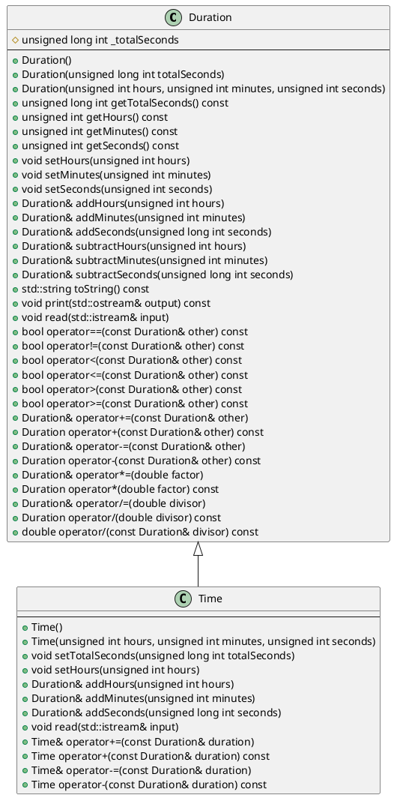

# Laboratoire 05

## Objectif

* Mettre en pratique l'héritage et le polymorphisme
* S'introduire au concept de refactorisation

## Introduction: La refactorisation

En programmation, la **refactorisation** (parfois appelée **réusinage** en français) consiste à modifier le code d'un programme sans changer son comportement externe. Autrement dit, le code du programme, une fois refactorisé, produit exactement le même résultat qu'auparavant (autrement il ne s'agit pas de refactorisation). Elle vise à améliorer le code, par exemple pour le rendre plus lisible ou plus facile à maintenir.

Dans les deux premières parties de laboratoire, vous effectuerez des refactorisations dans votre code du Laboratoire 04 afin d'y introduire les concepts d'héritage et de polymorphisme. Cela permettra bien entendu d'ajouter davantage de...


## Parties

Ce laboratoire comprend trois parties:

* **Laboratoire 05-A**: Refactorisation des classes `Time` et `Duration`
* **Laboratoire 04-B**: Introduction du polymorphisme et refactorisation de la classe `Date`
* **Laboratoire 04-C**: Création d'un programme utilisant une classe abstraite

## Laboratoire 05-A - Refactorisation de la classe `Time`

Pour cette partie, reprenez votre programme du Laboratoire 04-C. Pour rappel, voici son diagramme de classes:

```plantuml
@startuml

class Date {
    - unsigned int _year
    - unsigned int _month
    - unsigned int _day
    --
    + Date()
    + Date(unsigned int year, unsigned int month, unsigned int day)
    + unsigned int getYear() const
    + unsigned int getMonth() const
    + unsigned int getDay() const
    + void setValue(unsigned int year, unsigned int month, unsigned int day)
    + std::string toString() const
    + void print(std::ostream& output) const
    + void read(std::istream& input)
    + bool operator==(const Date& other) const
    + bool operator!=(const Date& other) const
    + bool operator<(const Date& other) const
    + bool operator<=(const Date& other) const
    + bool operator>(const Date& other) const
    + bool operator>=(const Date& other) const
    + friend std::ostream& operator<<(std::ostream& output, const Date& date)
    + friend std::istream& operator>>(std::istream& input, Date& date)
}

class Time {
    - unsigned int _hours
    - unsigned int _minutes
    - unsigned int _seconds
    --
    + Time()
    + Time(unsigned int hours, unsigned int minutes, unsigned int seconds)
    + void setHours(unsigned int hours)
    + void setMinutes(unsigned int minutes)
    + void setSeconds(unsigned int seconds)
    + unsigned int getHours() const
    + unsigned int getMinutes() const
    + unsigned int getSeconds() const
    + std::string toString() const
    + void print(std::ostream& output) const
    + void read(std::istream& input)
    + bool operator==(const Time& other) const
    + bool operator!=(const Time& other) const
    + bool operator<(const Time& other) const
    + bool operator<=(const Time& other) const
    + bool operator>(const Time& other) const
    + bool operator>=(const Time& other) const
    + Time& operator+=(const Duration& duration)
    + Time operator+(const Duration& duration) const
    + Time& operator-=(const Duration& duration)
    + Time operator-(const Duration& duration) const
    + Duration operator-(const Time& other) const
}

class Duration {
    - unsigned long int _totalSeconds
    --
    + Duration()
    + Duration(unsigned long int totalSeconds)
    + Duration(unsigned int hours, unsigned int minutes, unsigned int seconds)
    + unsigned long int getTotalSeconds() const
    + unsigned int getHours() const
    + unsigned int getMinutes() const
    + unsigned int getSeconds() const
    + Duration& addHours(unsigned int hours)
    + Duration& addMinutes(unsigned int minutes)
    + Duration& addSeconds(unsigned long int seconds)
    + Duration& subtractHours(unsigned int hours)
    + Duration& subtractMinutes(unsigned int minutes)
    + Duration& subtractSeconds(unsigned long int seconds)
    + std::string toString() const
    + void print(std::ostream& output) const
    + void read(std::istream& input)
    + bool operator==(const Duration& other) const
    + bool operator!=(const Duration& other) const
    + bool operator<(const Duration& other) const
    + bool operator<=(const Duration& other) const
    + bool operator>(const Duration& other) const
    + bool operator>=(const Duration& other) const
    + Duration& operator+=(const Duration& other)
    + Duration operator+(const Duration& other) const
    + Duration& operator-=(const Duration& other)
    + Duration operator-(const Duration& other) const
    + Duration& operator*=(double factor)
    + Duration operator*(double factor) const
    + Duration& operator/=(double divisor)
    + Duration operator/(double divisor) const
    + double operator/(const Duration& divisor) const
}

class DateTime {
    - Date _date
    - Time _time
    --
    + DateTime()
    + DateTime(const Date& date, const Time& time)
    + const Date& getDate() const
    + const Time& getTime() const
    + void setDate(const Date& date)
    + void setTime(const Time& time)
    + std::string toString() const
    + void print(std::ostream& output) const
    + void read(std::istream& input)
    + bool operator==(const DateTime& other) const
    + bool operator!=(const DateTime& other) const
    + bool operator<(const DateTime& other) const
    + bool operator<=(const DateTime& other) const
    + bool operator>(const DateTime& other) const
    + bool operator>=(const DateTime& other) const
    + friend std::ostream& operator<<(std::ostream& output, const DateTime& dateTime)
    + friend std::istream& operator>>(std::istream& input, DateTime& dateTime)
}

class TemperatureDatapoint {
    - DateTime _moment
    - double _temperature
    --
    + TemperatureDatapoint()
    + TemperatureDatapoint(const DateTime& datetime, double temperature)
    + const DateTime& getMoment() const
    + double getTemperature() const
    + void setMoment(const DateTime& timestamp)
    + void setTemperature(double temperature)
    + bool operator==(const TemperatureDatapoint& other) const
    + bool operator!=(const TemperatureDatapoint& other) const
    + friend std::ostream& operator<<(std::ostream& output, const TemperatureDatapoint& datapoint)
    + friend std::istream& operator>>(std::istream& input, TemperatureDatapoint& datapoint)
}

class TemperatureHistory {
    - TemperatureDatapoint* _datapoints
    - size_t _size
    - size_t _capacity
    - void increaseCapacity()
    --
    + TemperatureHistory()
    + TemperatureHistory(const TemperatureHistory& other)
    + ~TemperatureHistory()
    + TemperatureHistory& operator=(const TemperatureHistory& other)
    + size_t getSize() const
    + void clear()
    + void addDatapoint(const TemperatureDatapoint& datapoint)
    + void deleteDatapoint(size_t index)
    + void deleteDatapoint(const DateTime& moment)
    + size_t findDatapoint(const DateTime& moment) const
    + void readFromFile(const std::string& filename)
    + TemperatureHistory& operator+=(const TemperatureDatapoint& datapoint)
    + const TemperatureDatapoint& operator[](size_t index) const
    + TemperatureDatapoint& operator[](size_t index)
    + const TemperatureDatapoint& operator[](const DateTime& moment) const
    + TemperatureDatapoint& operator[](const DateTime& moment)
}

TemperatureHistory *-- TemperatureDatapoint
TemperatureDatapoint *-- DateTime
DateTime *-- Date
DateTime *-- Time
Time ..> Duration

@enduml
```



Ce programme utilise notamment une classe `Duration`, permettant de représenter une durée, ainsi qu'une classe `Time`, permettant de représenter une heure de la journée. Mais au fond, **qu'est-ce qu'une heure de la journée si ce n'est la durée écoulée depuis minuit?**

Vous l'aurez deviné, vous allez modifié le programme de façon à ce que la classe `Time` hérite de la classe `Duration`!

Voici le diagramme représentant ces deux classes avec un lien d'héritage:



En observant ce diagramme, vous pouvez remarquer plusieurs choses:

1. L'attribut `_totalSeconds` de la classe `Duration` est maintenant protégé (représenté par un losange) plutôt que privé
2. Des méthodes `setTotalSeconds`, `setHours`, `setMinutes` et `setSeconds` ont été ajoutées dans la classe `Duration`
3. Il n'y a plus d'attributs dans la classe `Time`
4. Plusieurs méthodes de la classe `Time` sont disparues
5. Malgré le lien d'héritage, plusieurs méthodes se trouvent à la fois dans la classe `Duration` et dans la classe `Time`

Pourquoi donc les méthodes `setTotalSeconds`, `setHours`, `addHours`, `addMinutes`, `addSeconds` et `read`, de même que la plupart des opérateurs arithmétiques, sont définis à la fois dans `Duration` et dans `Time`? 🤔 C'est parce que ces méthodes doivent effectuer des validations dans la classe fille `Time` qui ne sont pas effectuées dans la classe mère `Duration`, puisqu'un objet `Time` ne peut représenter une valeur supérieure à `23:59:59`, contrairement à un objet `Duration`. Il faut donc **surcharger** ces méthodes de la classe mère dans la classe fille afin d'en adapter le comportement. De plus, les opérateurs arithmétiques de la classe `Time`doivent retourner des objets `Time`, et non des objets `Duration` comme le font les surcharges d'opérateurs de la classe `Duration`.

***⚠️ N'oubliez pas de tester vos modifications après chaque étape en vérifiant que le programme continue de fonctionner comme avant, ou en ajoutant au besoin du code de test temporaire au début du `main`.***

### Étape 1

Commencez par changer le spécificateur d'accès de l'attribut `_totalSeconds` de la classe `Duration` de `private` à `protected`, puis faites hériter la classe `Time` de la classe `Duration` de manière publique. Vérifiez que le code compile toujours.

### Étape 2

Apportez les modifications suivantes à la classe `Time`. Ces modification doivent être effectuées dans leur entièreté avant que le code compile à nouveau.

1. Retirer les trois attributs (`_hours`, `_minutes` et `_seconds`) de `Time`.
2. Retirer l'implémentation du constructeur avec paramètres du fichier `Time.cpp`, et remplacez sa définition de façon à appeler le constructeur de la classe `Duration` directement dans le fichier `Time.h` avec une implémentation vide (voir l'exemple de constructeur d'une classe fille dans la présentation du chapitre 05-A).
3. Retirer les accesseurs `getHours`, `getMinutes` et `getSeconds`.
4. Retirer aussi les mutateurs (nous allons les réimplémenter dans la classe mère dans une étape ultérieure).
5. Retirer les méthodes `toString` et `print`.
6. Retirer le code qui se trouve dans la méthode `read`, mais conserver la méthode vide. Nous y reviendrons.
7. Retirer tous les opérateurs de comparaison.
8. Mettre en commentaire les opérateurs arithmétiques pour le moment.
9. Retirer la surcharge d'opérateur `<<`, mais conserver `>>`.

### Étape 3

Ajoutez les méthodes `setTotalSeconds`, `setHours`, `setMinutes` et `setSeconds` dans la classe `Duration`. Voici une implémentation possible de la méthode `setHours`, dont vous pouvez vous inspirer pour implémenter les méthodes `setMinutes` et `setSeconds`:

```cpp
void Duration::setHours(unsigned int hours) {
    this->setTotalSeconds(hours * 3600 + this->getMinutes() * 60 + this->getSeconds());
}
```

N'oubliez pas que l'objectif de ces méthodes est de changer uniquement la valeur de l'unité de temps correspondante. Par exemple, si on appelle `setMinutes(22)` sur la durée `07:30:25`, elle doit devenir `07:22:25`.

### Étape 4

Il faut maintenant **surcharger** les méthodes `setTotalSeconds` et `setHours` dans la classe `Time` afin d'ajouter une validation pour s'assurer que le nombre d'heures ne dépasse jamais 23

Lorsqu'on surcharge une méthode de la classe mère, l'idéal est de réutiliser autant que possible l'implémentation existante. Voici donc les implémentations qui vous sont proposées:

```cpp
void Time::setTotalSeconds(unsigned long int totalSeconds) {
    if (totalSeconds >= 24 * 3600) {
        throw std::invalid_argument("Le nombre total de secondes doit être inférieur à 86400 (24 heures).");
    }
    Duration::setTotalSeconds(totalSeconds);
}
```

```cpp
void Time::setHours(unsigned int hours) {
    if (hours >= 24) {
        throw std::invalid_argument("Les heures doivent être comprises entre 0 et 23.");
    }
    Duration::setHours(hours);
}
```

### Étape 5

Il faut aussi surcharger `addHours` pour ajouter la même validation. Voici l'implémentation proposée:

```cpp
Time& Time::addHours(unsigned int hours) {
    // Faire une sauvegarde de la valeur actuelle de `_totalSeconds`
    unsigned int previousTotalSeconds = this->getTotalSeconds();

    // Appeler la méthode `addHours` de la classe mère, qui modifie `_totalSeconds`
    Duration::addHours(hours);

    if (this->getTotalSeconds() >= 24 * 3600) { // Si la nouvelle valeur est invalide
        // Annuler le changement
        this->setTotalSeconds(previousTotalSeconds);

        // Lancer une exception.
        throw std::overflow_error("Heure dépassant la valeur maximale de 23:59:59.");
    }

    return *this;
}
```

Vérifiez que votre validation fonctionne en ajoutant du code de test au début du `main`.  Testez ensuite le code suivant:

```cpp
Time t;
t.addMinutes(30).addHours(42);
std::cout << t << std::endl;
```

Vous remarquerez que la valeur qui s'affiche est `42:30:00`. La valeur `42` pour les heures ne respecte pourtant pas la condition de validation. C'est parce que la méthode `addMinutes`, implémentée uniquement dans `Duration`, retourne l'objet (`*this`) en tant que `Duration` et non en tant que `Time`. C'est donc la version de `Time` de la méthode `addHours` qui est ensuite appelée!

Surchargez maintenant les méthodes `addMinutes` et `addSeconds` en incluant la même validation que dans la méthode `addHours` (puisque l'ajout de minutes ou de secondes à un `Duration` peut le faire dépasser la valeur `23:59:59`, ce qui n'est pas permis dans un `Time`). Assurez-vous de retourner un objet `Time` et non un objet `Duration`.

### Étape 6

Ré-ajoutez du code dans la méthode `read`. Celle-ci doit réutiliser la méthode de la classe parente tout en y ajoutant une validation, comme vous l'avez fait pour les méthodes précédentes.

Vous constaterez que l'opérateur `<<` fonctionne comme avant. C'est parce qu'il appelait déjà votre méthode `read`, dont vous avez maintenant changé l'implémentation.

----

Étapes à inclure dans le lab 05-A:


Surcharges d'opérateurs arithmétiques. Les étapes suivantes doivent être effectuées au complet pour que ça compile:

18 - Décommenter les surcharges
19 - Adapter += pour appeler la méthode parente et faire la validation (réparer l'objet en cas d'erreur comme dans addHours, etc)
20 - Adapter -= pour retourner bon type d'objet, aucune validation supplémentaire
21 - constater qu'opérateurs + et -(duration) sont encore bons
22 - retirer operator- puisque celui de la classe mère fait la job
23 - Ajouter des définitions avec `= delete` pour les opérateurs de Duration qui ne font pas de sens pour Time
