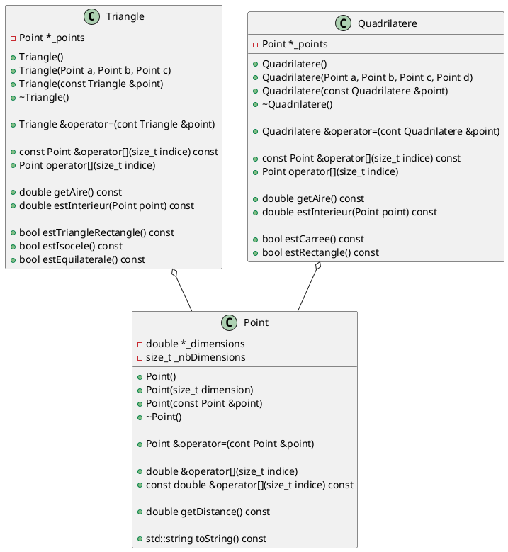
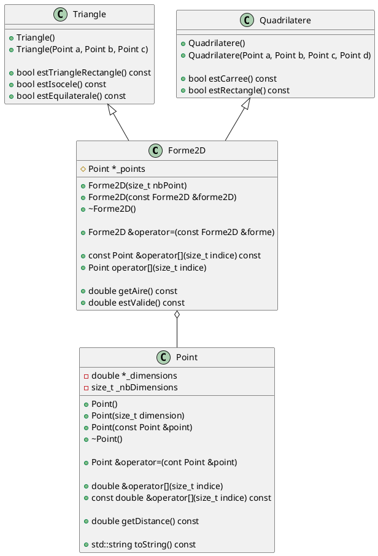
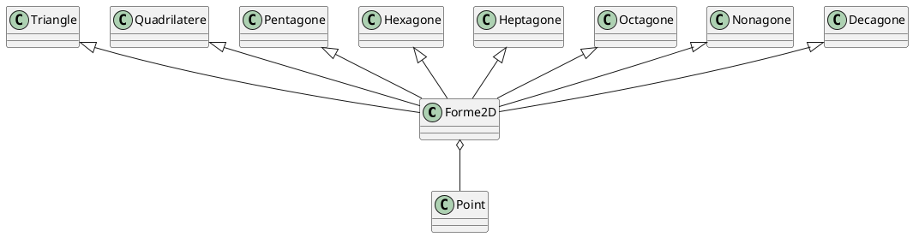

# Laboratoire 05-A

## Objectif

Introduire les concepts d'héritage et de polymorphisme pour optimiser la réutilisation de code. L'héritage est un outil qui s'ajoute à la composition et l'aggrégation que nous avons vue dans les chapitres précédents. Nous allons également voir que le polymorphisme permet d'utiliser nos classes mères de manière efficace.

## Beaucoup de code dupliqué

Regardons les classes que nous avons fait dans le laboratoire 4.



Que remarque-t-on ? Les deux classes `Triangle` et `Quadrilatere` ont plusieurs points en commun :

* un pointeur de `Point` comme attribut privée
* surcharge d'opérateur `[]` qui retourne des `Point`
* deux méthodes publiques communes : `getAire` et `estInterieur`.

Si l'on creuse un peu, on remarque que les deux constructeurs font la même chose : allouer la mémoire au pointeur de `Point`. La seule différence est le nombre de point squi diffère. Même les destructeurs sont identiques. Serait-il agréable d'avoir une manière de définir le tout plus efficacement.

Bien sur, il s'agit du concept d'héritage. La première étape à faire lorsque nous avons une situation ou une ou plusieurs classes partagent du code similaire est de d'identifier le concept les unissants. Dans notre cas, `Triangle` et `Quadrilatere` sont tous deux des formes en 2 dimensions. Nous pouvons donc commencer par créer une classe `Forme2D` et y transférer les membres communs.



On peut déjà remarquer la puissance de l'héritage a ce point. Nos classe `Triangle` et `Quadrilatere` on seulement besoins de définir que quelques membres. Les classes sont tellement simplifié qu'elle n'ont même pas d'attributs.

> Note : Vous avez probablement remarqué que l'attribut `_points` a une icone différentes qu'à l'habitude. Le losange signifie que l'attribut est protégé, (`protected`). En effet, un membre `private` ne peut pas être atteint par une classe fille.

Donc pour créer notre classe mère `Forme2D`, ce n'est pas différent de nos classes habituelle.

```cpp
#ifndef __FORME2D_H
#define __FORME2D_H

#include "Point.h"

class Forme2D {
protected:
    Point *_point;
public:
    // ...
};

#endif
```

Pour faire en sorte que la classe `Triangle` hérite de la classe `Forme2D`, nous devons simplement ajouter :

```cpp
#ifndef __TRIANGLE_H
#define __TRIANGLE_H

#include "Forme2D.h"

class Triangle : public Forme2D {
    // ...
}

#endif
```

À ce point, on dira alors que `Triangle` est une instance de `Forme2D` spécialisé. Ainsi, on réduit considérablement la duplication de notre code et on peut facilement réaliser que le gain devient de plus en plus considérable quand le nombre de classes filles augmentent - on peut facilement imaginer faire une classe for `Pentagone`, `Hexagone`, `Heptagone`, `Octagone`, `Nonagone` et `Decagone` et encore plus. Chacune de ses classes pourraient avoir une seule méthode permettant de confirmé si elle sont régulière ou non.



## Définir les responsabilités

Nous nous souvenons qu'une classe qui définit un pointeur doit définir au minimum 3 membres :

* Un constructeur de copie;
* Un destructeur;
* Une surcharge d'opérateur `=`.

Maintenant que nous avons une classe mère `Forme2D`, qui de `Forme2D` ou `Triangle` est responsable de s'occuper du pointeur? La réponse est simple : la classe qui définit le pointeur doit gérer le pointeur.

Ainsi, voici une implémentation possible pour le constructeur de `Forme2D` (pas le constructeur de copie) :

```cpp
Forme2D::Forme2D(size_t nbPoints) {
    this->_nbPoints = nbPoints;
    this->_points = new Point[this->_nbPoints];
}
```

Mais pourquoi pas de constructeur par défaut ? Que se passe-t-il si nous voulons avoir un tableau ? Pour l'instant, on peut simplement implémenter un constructeur par défaut dans `Triangle` tel que :

```cpp
Triangle::Triangle() : Forme2D(3) { }
```

Un constructeur de copie sera de la responsabilité de notre classe `Forme2D` :

```cpp
Forme2D::Forme2D(const Forme2D &forme2d) : Forme2D(forme2d._nbPoints) {
    for (size_t i = 0; i < this->_nbPoints; i++) {
        this->_points[i] = forme2d._points[i];
    }
}
```

Nous aurons toutefois un problème. Comme `Triangle` et `Quadrilatere` sont tous deux des `Forme2D`, quelqu'un de sournoi pourrait instancier un `Triangle` et lui passer un `Quadrilatere`, et aucune erreur serait détecter par le compilateur. Nous allons voir à la deuxième partie du chapitre 5 comment on peut régler ce problème avec les **fonctions virtuelles pûre**.

## Polymorphisme

Au laboratoire 4, comment aurions-nous été en mesure d'avoir un ensemble de `Triangle` et `Quadrilatere` et de calculer l'aire total ? Nous aurions été obliger de faire deux tableaux, un pour les `Triangle` et un pour les `Quadrilatere`.

```cpp

int main() {
    Triangle mesTriangles[10];
    size_t nombreTriangles = 0;
    // ... Remplir le tableau de triangles

    Quadrilatere mesQuadrilatere[10];
    size_t nombreQuadrilatere = 0;
    // ... Remplir le tableau de quadrilatères

    double aireTotal = 0.0;
    for (size_t i = 0; i < nombreTriangles; i++) {
        aireTotal += mesTriangles[i];
    }

    for (size_t i = 0; i < nombreQuadrilatere; i++) {
        aireTotal += nombreQuadrilatere[i];
    }
    std::cout << "Aire total : " << aireTotal << " m2" << std::endl;

    return 0;
}
```

Maintenant, notre code peut utiliser le type générique et bénéficier du fait que `getAire()` est disponible à ce niveau. Nous allons cependant avoir notre problème que notre classe `Forme2D` n'a pas de constructeur par défaut. Il faudra alors le définir pour l'instant.

```cpp

int main() {
    Forme2D mesFormes[20];
    size_t nombreFormes = 0;
    // ... Remplir le tableau de formes

    double aireTotal = 0.0;
    for (size_t i = 0; i < nombreFormes; i++) {
        aireTotal += mesFormes[i];
    }
    std::cout << "Aire total : " << aireTotal << " m2" << std::endl;

    return 0;
}
```

Nous allons approfondir la puissance du concept de polymorphisme avec la notion de **fonctions virtuelles pures**.

## Tâche

Vous devez modifier votre laboratoire 4 pour avoir la classe `Forme2D` et les classes `Triangle` et `Quadrilatere` doivent devenir des classes filles.