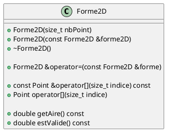
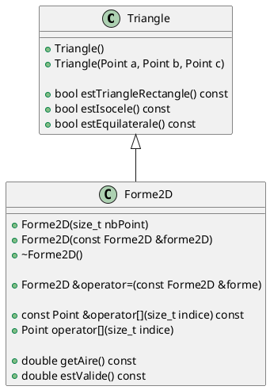
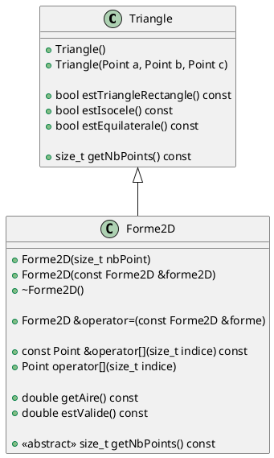

# Laboratoire 05-B

## Objectif

On poursuit notre quête d'héritage et de polymophisme en ajoutant les concepts surcharge de méthode et méthode abstraite.

## Problème avec `Forme2D`

Récapitulons la situation. Nous avons deux classes filles `Triangle` et `Quadrilatere` qui hérite de `Forme2D`. Prenons le code suivant :

```cpp
Forme2D &Forme2D::operator=(const Forme2D &forme) {
    if (this == &forme) {
        return *this;
    }

    delete this->_points;
    this->_nbPoints = forme._nbPoints;
    for (size_t i = 0; i < this->_nbPoints) {
        this->_points[i] = forme._points[i];
    }

    return *this;
}
```

Nous pourrions avoir dans notre `main` :

```cpp

void assigner(Forme2D &cible, const Forme2D &source) {
    cible = source;
}

int main() {
    Triangle a;
    Quadrilatere b;

    assigner(a, b);

    std::cout << "Nombre de points : " << a.getNbPoint() << std::endl;

    return 0;
}
```

Ce code compilera sans problème. Toutefois, sémantiquement notre instance `a`, qui est un `Triangle`, contient 4 points et une nombre de points à 4. Cela pourra occasionné des problèmes logiques car `Triangle` n'a pas accès au méthodes `estCarré` et `estRectangle`.

Plusieurs approchent sont possible, mais nous allons utiliser le concept de méthode virtuelle pure.

## Méthode virtuelle pure, ou méthode **abstraite**

Le concept de méthode **abstraite** peut-être un peu complexe à comprendre, alors nous allons nous poser quelques questions.

Nous allons reprendre la classe `Forme2D` et ignorer les attributs pour l'instant.



Nous savons ici que l'ensemble des membres présentés dans cette classe seront commune à toutes les classes filles. Lorsqu'une méthode est particulière à une classe fille, nous allons mettre la méthode dans la classe fille.



On voit que `estTriangleRectangle`, `estIsocele` et `estEquilaterale` sont uniquement pertinent dans la classe `Triangle`.

Donc on peut dire :

* une méthode dans une classe mère sera partagé par toutes les classes filles qui en hérite;
* une méthode va dans la classe fille quand cette méthode.

Mais nous avons été chanceux, car `getAire` peut se calculer pour n'importe quelle nombre arbitraire de points en utilisant l'algorithme du *shoelace*, ce qui rend cette méthode parfaite pour la classe mère.

Maintenant, nous aimerions forcer les classes filles a définir une méthode nommé `getNbPoints`. L'objectif est de ne pas avoir d'attribut `nbPoints`.



Pour définir `getNbPoints` dans `Forme2D`, il faut décrire ceci dans le fichier `Forme2D.h`:

```cpp

class Forme2D {
private:
    // ...
public:
    // ...
    virtual size_t getNbPoints() const = 0;
};
```

À partir de ce moment, il est important de savoir qu'il ne nous sera plus possible d'instancier une instance de `Forme2D` directement car la classe devient elle-même abstraite, c'est-à-dire quelle contients une ou des méthodes qui ne sont pas implémenté. Pour être en mesure d'instancier une `Forme2D`, on devra le faire via une class fille. Voici un exemple pour `Triangle`.

Voici le fichier `Triangle.cpp` :
