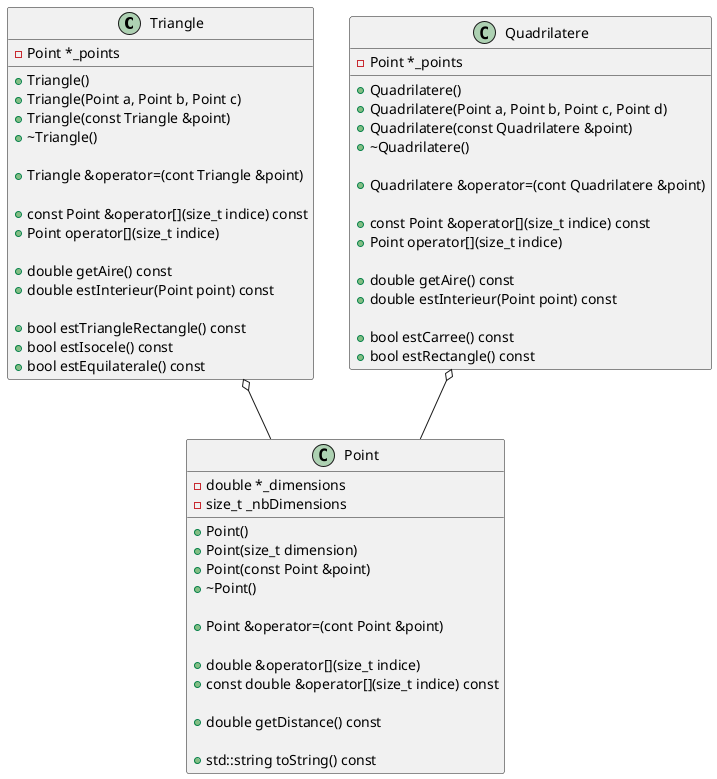
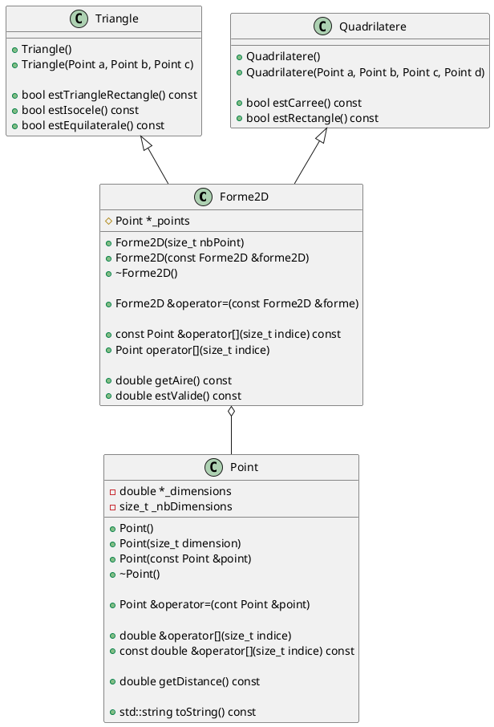
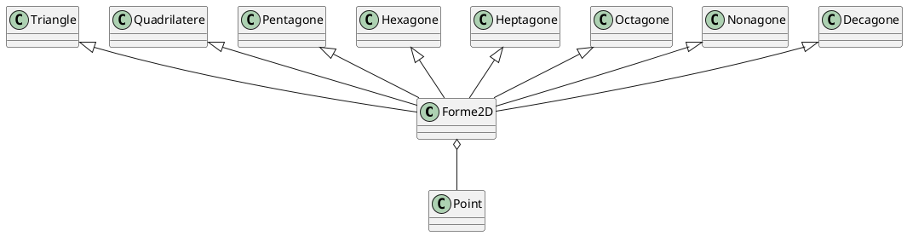

# Laboratoire 05-A

## Objectif

Introduire les concepts d'héritage et de polymorphisme pour optimiser la réutilisation de code. L'héritage est un outil qui s'ajoute à la composition et l'aggrégation que nous avons vues dans les chapitres précédents. Nous allons également voir que le polymorphisme permet d'utiliser nos classes mères de manière efficace.

## Beaucoup de code dupliqué

Regardons les classes que nous avons créées dans le laboratoire 4.



Que remarque-t-on ? Les deux classes `Triangle` et `Quadrilatere` ont plusieurs points en commun :

* un pointeur de `Point` comme attribut privé
* surcharge d'opérateur `[]` qui retourne des `Point`
* deux méthodes publiques communes : `getAire` et `estInterieur`.

Si l'on creuse un peu, on remarque que les deux constructeurs font la même chose : allouer la mémoire au pointeur de `Point`. La seule différence est le nombre de points dans le tableau. Même les destructeurs sont identiques. Y aurait-il un moyen de définir le tout de manière plus efficace?

Bien sur! Il s'agit du concept d'héritage. La première chose à faire lorsque nous sommes dans une situation où une ou plusieurs classes partagent du code similaire est d'identifier le concept qui les unit. Dans notre cas, `Triangle` et `Quadrilatere` sont tous les deux des formes en 2 dimensions. Nous pouvons donc commencer par créer une classe `Forme2D` et y transférer les membres communs.



On peut déjà remarquer la puissance de l'héritage à ce stade-ci. Nos classes `Triangle` et `Quadrilatere` n'ont besoin de définir que quelques membres. Les classes sont tellement simplifiées qu'elle n'ont même plus d'attributs.

> Note : Vous avez probablement remarqué que l'attribut `_points` a une icone différente qu'à l'habitude. Le losange signifie que l'attribut est protégé, (`protected`). En effet, un membre `private` ne peut pas être accédé par une classe fille.

On peut créer notre classe mère `Forme2D`. La création n'est pas différente de celle de nos classes habituelles (sauf pour le `protected` au lieu de `private`).

```cpp
#ifndef __FORME2D_H
#define __FORME2D_H

#include "Point.h"

class Forme2D {
protected:
    Point *_point;
public:
    // ...
};

#endif
```

Pour faire en sorte que la classe `Triangle` hérite de la classe `Forme2D`, nous devons simplement ajouter :

```cpp
#ifndef __TRIANGLE_H
#define __TRIANGLE_H

#include "Forme2D.h"

class Triangle : public Forme2D {
    // ...
}

#endif
```

À ce stade, on dira alors qu'un `Triangle` est une instance de `Forme2D` spécialisée. Ainsi, on réduit considérablement la duplication de notre code et on peut facilement réaliser que le gain devient de plus en plus considérable quand le nombre de classes filles augmentent - on peut facilement imaginer l'ajout de classes `Pentagone`, `Hexagone`, `Heptagone`, `Octagone`, `Nonagone`, `Decagone`, et encore plus. Toutes ces classes pourraient partager une même méthode permettant de savoir si le polygone est régulier ou irrégulier.



## Définir les responsabilités

Nous nous souvenons qu'une classe qui définit un pointeur doit définir au minimum 3 membres :

* Un constructeur de copie;
* Un destructeur;
* Une surcharge d'opérateur `=`.

Maintenant que nous avons une classe mère `Forme2D`, qui de `Forme2D` ou `Triangle` est responsable de s'occuper du pointeur? La réponse est simple : la classe qui définit le pointeur doit gérer le pointeur.

Ainsi, voici une implémentation possible pour le constructeur de `Forme2D` (pas le constructeur de copie) :

```cpp
Forme2D::Forme2D(size_t nbPoints) {
    this->_nbPoints = nbPoints;
    this->_points = new Point[this->_nbPoints];
}
```

Mais pourquoi ne crée-t-on pas de constructeur par défaut ? Que se passe-t-il si nous voulons créer un tableau de Forme2D? Pour l'instant, on peut simplement implémenter un constructeur par défaut dans `Triangle` tel que :

```cpp
Triangle::Triangle() : Forme2D(3) { }
```

Le constructeur de copie sera sous la responsabilité de notre classe `Forme2D` :

```cpp
Forme2D::Forme2D(const Forme2D &forme2d) : Forme2D(forme2d._nbPoints) {
    for (size_t i = 0; i < this->_nbPoints; i++) {
        this->_points[i] = forme2d._points[i];
    }
}
```

## Polymorphisme

Au laboratoire 4, comment aurions-nous été en mesure d'avoir un ensemble de `Triangle` et `Quadrilatere` et d'en calculer l'aire totale ? Nous aurions été contraints de créer deux tableaux, un pour les `Triangle` et un pour les `Quadrilatere`.

```cpp

int main() {
    Triangle mesTriangles[10];
    size_t nombreTriangles = 0;
    // ... Remplir le tableau de triangles

    Quadrilatere mesQuadrilatere[10];
    size_t nombreQuadrilatere = 0;
    // ... Remplir le tableau de quadrilatères

    double aireTotal = 0.0;
    for (size_t i = 0; i < nombreTriangles; i++) {
        aireTotal += mesTriangles[i];
    }

    for (size_t i = 0; i < nombreQuadrilatere; i++) {
        aireTotal += nombreQuadrilatere[i];
    }
    std::cout << "Aire totale : " << aireTotal << " m2" << std::endl;

    return 0;
}
```

Maintenant, notre code peut utiliser le type générique et bénéficier du fait que `getAire()` est disponible à ce niveau. Nous allons cependant rencontrer un problème dû au fait que notre classe `Forme2D` n'a pas de constructeur par défaut. Il faudra donc pour le moment en définir un.

```cpp

int main() {
    Forme2D *mesFormes[20];
    size_t nombreFormes = 0;
    mesFormes[0] = new Triangle(...)
    mesFormes[1] = new Quadrilatere(...)
    // ... Remplir le tableau de formes

    double aireTotal = 0.0;
    for (size_t i = 0; i < nombreFormes; i++) {
        aireTotal += mesFormes[i]->getAire();
        delete mesFormes[i];
    }
    std::cout << "Aire total : " << aireTotal << " m2" << std::endl;

    return 0;
}
```

Nous allons approfondir la puissance du concept de polymorphisme avec la notion de **méthodes virtuelles pures** dans la partie B du présent laboratoire.

## Attraper une exception

Nous introduisons le concept d'intercepter (ou attraper) une exception. On se souvient que `throw` permet d'arrêter l'exécution avec un message plus facile à lire. Toutefois, les applications que nous utilisons aujourd'hui n'arrêtent pas constamment chaque fois qu'une personne saisit une mauvaise information. C++ nous offre une structure de contrôle, `try-catch`, qui permet d'intercepter une erreur et agir dessus. Voici une méthode qui lance une exception :

```cpp
Point &Forme2D::operator[](size_t index) {
    if (index < this->_nbPoints) {
        return this->_points[index];
    } else {
        throw std::out_of_range("Out of range");
    }
}
```

Nous pouvons attraper cette exception de cette manière :

```cpp
    try {
        monTriangle[6] = 1.77;
        // ...
    } catch (const std::out_of_range &ex) {
        std::cout << "Erreur d'accès : " << ex.what() << std::endl;
    } catch (const std::invalid_argument &ex) {
        std::cout << "Erreur d'argument : " << ex.what() << std::endl;
    }
```

Cette structure va exécuter le code à l'intérieur du `try`, et si une des instructions à l'intérieur lance une exception, elle sera attrapée selon le type qui a été lancé. Dnas notre exemple, `monTriangle[6] = 1.77;` peut lancer une exception `out_of_range` qui sera attrapée dans le `catch` associé. Cette exception est placée dans la variable `ex` qui pourra être utilisée pour afficher le message que nous avons mis lors de son lancement.

Dans notre exemple, on peut assumer qu'une autre instruction (dans les `...`) pourrait lancer un `invalid_argument` qui serait géré par ce `catch`.

> Note : Si vous pouvez éviter d'utiliser un `try`, ce sera toujours plus performant que d'utilier le `try`. En effet, tester si l'indice demandé (`6`) est plus petit que le nombre de points serait préférable car un `if` sera 100 à 1000 fois plus rapide que la gestion d'un `try` dans le cas d'une erreur.

## Tâche

Vous devez modifier votre laboratoire 4 pour ajouter la classe `Forme2D`. Les classes `Triangle` et `Quadrilatere` doivent devenir des classes filles de la nouvelle classe.
