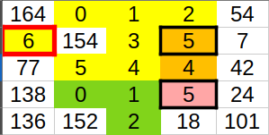
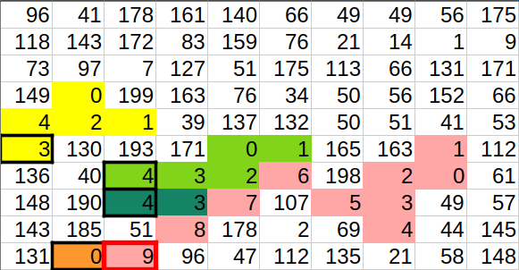

## Laboratoire 06-B - Algorithmes de tri et de recherche

(extraits rapatriés de la partie 1 de 2025)

Maintenant que vous comprenez comment interpréter un fichier CSV, voyons à quoi ressemblera le programme que vous devez créer. On veut d'abord afficher le menu suivant:

```
Tableau périodique

1 Charger le tableau périodique
2 Afficher les éléments
3 Trier les éléments par nom
4 Trier les éléments par numéro atomique
5 Rechercher un élément
6 Quitter

Choisir une option:
```

Créez donc un projet de base avec un `main` contenant une boucle qui affiche ce menu et lit l'option saisie. Ajoutez la structure de base pour traiter les options, et faites fonctionner l'option 6.

> 🤔 Pourriez-vous réutiliser une classe d'un laboratoire précédent pour faire cela?

---

### Affichage des éléments

Implémentez maintenant la méthode `afficher`. Celle-ci doit afficher chacun des éléments du vecteur à l'aide de la méthode `toString` déjà existante dans la classe `Element`.

Vous avez maintenant ce qu'il faut pour faire fonctionner les options 1 et 2 du menu du programme. Testez le tout rigoureusement.

### Tri à bulles

Vous allez maintenant implémenter la méthode `trierParNom`, qui, comme son nom l'indique, doit ordonner les `Element` du vecteur en ordre alphabétique de nom. Pour ce faire, vous allez utiliser l'algorithme du [Tri à bulles](https://fr.wikipedia.org/wiki/Tri_%C3%A0_bulles) ([vidéo explicative](https://www.youtube.com/embed/LTN97u8rSY0?si=H-FMr9doEaZ3CT1A)).

Voici du pseudocode décrivant le tri à bulles (tiré de Wikipédia):

```
tri_à_bulles(Tableau T)
   pour i allant de (taille de T)-1 à 1
       pour j allant de 0 à i-1
           si T[j+1] < T[j]
               (T[j+1], T[j]) ← (T[j], T[j+1])
```

Utilisez votre méthode pour implémenter l'option 3 du menu. Validez que votre tri fonctionne correctement avant de continuer.

> ℹ️ Le tri à bulles n'est pas un algorithme de tri particulièrement efficace. On dit que sa **complexité en temps** est en moyenne $ O(n^2) $, c'est-à-dire que le temps d'exécution est proportionnel au carré du nombre d'éléments en entrée. C'est souvent le cas des algorithmes basés sur deux boucles *for* imbriquées.

### Tri par insertion

Vous allez maintenant implémenter la méthode `trierParNumeroAtomique`. Cette fois-ci, vous allez utiliser l'algorithme du [Tri par insertion](https://fr.wikipedia.org/wiki/Tri_par_insertion) ([vidéo explicative](https://www.youtube.com/watch?v=bRPHvWgc6YM)).

Voici du pseudocode décrivant le tri par insertion (tiré de Wikipédia):

```
tri_insertion(Tableau T)

    pour i de 1 à taille(T) - 1

        # mémoriser T[i] dans x
        x ← T[i]

        # décaler les éléments T[0]..T[i-1] qui sont plus grands que x, en partant de T[i-1]
        j ← i
        tant que j > 0 et T[j - 1] > x
            T[j] ← T[j - 1]
            j ← j - 1

        # placer x dans le "trou" laissé par le décalage
        T[j] ← x

```

Utilisez votre méthode pour implémenter l'option 4 du menu. Validez que votre tri fonctionne correctement avant de continuer.

> ℹ️ Le tri par insertion est celui que la plupart des gens appliquent instinctivement pour trier des cartes à jouer qu'ils tiennent dans leurs mains. Comme pour le tri à bulles, sa complexité en temps est $ O(n^2) $ en moyenne, mais peut être $ O(n) $ sur des tableaux de petite taille ou qui sont presque triés. Il existe des algorithmes de tri plus efficaces dans le cas général, tels que le [Tri rapide](https://fr.wikipedia.org/wiki/Tri_rapide) et le [Tri fusion](https://fr.wikipedia.org/wiki/Tri_fusion), mais nous ne les implémenterons pas dans ce laboratoire.

### Recherche séquentielle et dichotomique

Vous allez maintenant implémenter la méthode `getElementParNom`. Il s'agit d'une méthode de recherche, qui trouve dans le vecteur d'`Element` correspondant au nom reçu en paramètre, puis le retourne.

L'algorithme de recherche le plus simple est la [recherche séquentielle](https://fr.wikipedia.org/wiki/Recherche_s%C3%A9quentielle) ou linéaire. Elle consiste simplement à itérer sur les éléments du tableau jusqu'à ce qu'on ait trouvé celui qui correspond à l'objet recherché. Vous avez déjà utilisé cet algorithme à plusieurs reprises sans le savoir, notamment dans la méthode `getColumnIndex` de votre classe `CSVParser`. Sa complexité en temps est $ O(n) $.

Dans le cas où le tableau est trié, on peut utiliser un algorithme de recherche plus efficace, soit la [recherche dichotomique](https://fr.wikipedia.org/wiki/Recherche_dichotomique), avec une complexité de $ O(\log n) $. Le principe de cet algorithme est de vérifier d'abord si l'item recherché se trouve au milieu du tableau, puis, si ce n'est pas le cas, de vérifier le milieu de la première ou la deuxième moitié du tableau selon que l'item est plus petit ou plus grand que celui qu'on vient d'observer, et ainsi de suite. C'est l'algorithme qu'on applique instinctivement lorsqu'on cherche un mot dans un dictionnaire.

> NOTE: quand on parle d'une complexité de $ O(\log n) $, on fait généralement référence à un logarithme en base 2. On trouve cette complexité dans les algorithmes de type **Diviser pour mieux régner**, qui découpent l'entrée en plusieurs parties de manière successive.

Remarquez que la classe `TableauPeriodique` possède un attribut booléen `_estTrieParNom`. Si ce n'est pas déjà fait, ajoutez le code nécessaire pour mettre à jour cet attribut aux endroits appropriés.

L'algorithme de haut niveau de la méthode `getElementParNom` sera le suivant:

```
Si le tableau est trié par nom:
    Utiliser la recherche dichotomique
Sinon:
    Utiliser la recherche séquentielle
```

La méthode retourne un `const Element*`. Souvenez-vous qu'on peut utiliser l'opérateur `&` pour obtenir l'adresse d'une variable. Dans le cas où l'élément recherché est absent du tableau, retournez `nullptr`.

Voici du pseudocode pour la recherche dichotomique (tiré de Wikipédia):

```
//déclarations
 début, fin, val, mil, N : Entiers
 t : Tableau [0..N] d'entiers classé
 trouvé : Booléen

//initialisation
 N = taille(t)-1
 début ← 0
 fin ← N
 trouvé ← faux
 Saisir val

//Boucle de recherche
 // La condition début inférieur ou égal à fin permet d'éviter de faire
 // une boucle infinie si 'val' n'existe pas dans le tableau.
  Tant que trouvé != vrai et début <= fin:
      mil ← partie entière((début + fin)/2)
      si t[mil] == val:
         trouvé ← vrai
      sinon:
         si val > t[mil]:
            début ← mil+1
         sinon:
            fin ← mil-1
```

Utilisez votre méthode pour implémenter l'option 5 du menu. Validez que votre tri fonctionne correctement avant de continuer.

## Laboratoire 06-C - Carte topographique

La [Sépaq](https://www.sepaq.com/organisation/) fait appel à vos compétences en algorithmie pour l'assister dans la création d'un nouveau parc national. À l'aide d'une [carte topographique](https://fr.wikipedia.org/wiki/Carte_topographique) d'un terrain montagneux, elle vous demande d'identifier l'emplacement de fin d'un futur sentier pédestre. La carte topographique est représentée par une matrice d'entiers dont chaque valeur représente une altitude. On vous demande de trouver **l'altitude du plus haut sommet pouvant être atteint par une pente graduelle à partir d'un point d'altitude 0**. On vous précise que par « pente graduelle », on entend un trajet dont l'altitude de chaque point est **exactement 1 de plus** que celle du point précédent. Chaque point $ p + 1 $ du trajet est adjacent à un point $ p $ soit horizontalement, verticalement ou en diagonal.

Par exemple, voici les trajets possibles dans une carte de 5 x 5:



Sur cette carte, on trouve 3 trajets possibles, et l'altitude du plus haut sommet d'un trajet est 6. Le trajet en jaune est en partie compris dans les trajets orange et rose, et il y a plusieurs trajets possibles qui mènent aux sommets de ces derniers.

Voici un deuxième exemple, cette fois-ci avec une carte de 10 x 10:



Afin de vous aider à concevoir votre programme, la Sépaq vous a fourni plusieurs cartes, que vous trouverez sur Moodle. Les cartes 1 et 2 sont celles des exemples ci-desssus, et les cartes 3 à 5 sont d'autres cartes pour lesquelles les résultats sont déjà connus. La carte 6 est celle du nouveau parc national pour laquelle vous devez trouver l'altitude du plus haut sommet d'un trajet correspondant à la demande.

Voici les résultats pour les cartes 1 à 5:

| Carte        | Altitude du plus haut sommet d'un trajet |
|:------------:|:----------------------------------------:|
| `carte1.txt` | 10                                       |
| `carte2.txt` | 22                                       |
| `carte3.txt` | 140                                      |
| `carte4.txt` | 221                                      |
| `carte5.txt` | 416                                      |

### *Parsing* des cartes topographiques

La première chose que vous devez faire, c'est d'implémenter un nouveau *parser* pour convertir les fichiers de cartes en matrices d'entiers. Vous nommerez votre nouvelle classe `IntegerMatrixParser`. Voici sa définition:

```
class IntegerMatrixParser : public Parser
{
private:
	char _delimiter;
	std::vector<std::vector<int>> _data;
public:
	IntegerMatrixParser(char delimiter=' ');

	char getDelimiter() const;
	void setDelimiter(char delimiter);
	const std::vector<std::vector<int>>& getData() const;

	void parse(std::istream& in) override;
};
```

Testez votre classe rigoureusement avant de continuer.

> 🤔 Trouvez-vous qu'il y a des similarités entre votre `IntegerMatrixParser` et votre `CSVParser` de la partie 1? Ne serait-il pas pratique de pouvoir créer une seule classe pour « parser » des matrices de n'importe quel type? Cela est possible en C++ à l'aide des **modèles de classe** (***class templates***), dont nous allons voir l'utilisation dans un prochain laboratoire.

### Trouver le plus haut sommet d'un trajet

Une façon de résoudre le problème qui vous est confié est à l'aide d'un **algorithme récursif**, c'est-à-dire un algorithme utilisant une fonction qui s'appelle elle-même. Voici le pseudocode d'une solution possible:

```
Fonction trouverSommet(position):
    max ← altitude(position)
    Pour chaque position adjacente à position:
        Si altitude(position adjacente) = altitude(pos) + 1:
            Si trouverSommet(position adjacente) > max:
                max ← altitude(position adjacente)
    Retourner max

Fonction trouverPlusHautSommet:
    max ← 0
    Pour chaque position d'altitude 0:
        altitude ← trouverSommet(position)
        Si altitude > max:
            max ← altitude
    Retourner max
```

Toute fonction récursive doit avoir une condition d'arrêt pour éviter une récursion à l'infini. Si on observe le pseudocode de la fonction `trouverSommet` plus attentivement, on peut voir que la récursion s'arrête lorsqu'une position n'a aucune position adjacente satisfaisant la demande.

Complétez le programme de la partie 2 en implémentant l'algorithme correspondant au pseudocode ci-dessus dans des méthodes d'une classe `Solutionneur`. À vous de déterminer quels devraient être les autres membres de la classe!

Testez votre programme avec toutes les cartes fournies, et vérifiez que vous arrivez aux bons résultats pour les cartes 1 à 5. Validez ensuite votre résultat pour la carte 6 auprès de l'enseignant.

🎉 Félicitations, vous avez terminé le laboratoire!

À moins que...

### Bonus

Votre mission, si vous l'acceptez, est d'ajouter une méthode qui, au lieu de retourner seulement l'altitude du sommet ateignable depuis une position donnée, retourne le chemin complet pour se rendre à ce sommet. Pourquoi ne pas réutiliser pour cela votre classe `Point` des laboratoires précédents?

La signature de cette méthode pourrait être la suivante:

```cpp
std::vector<Point> trouverChemin(const Point& depart);
```