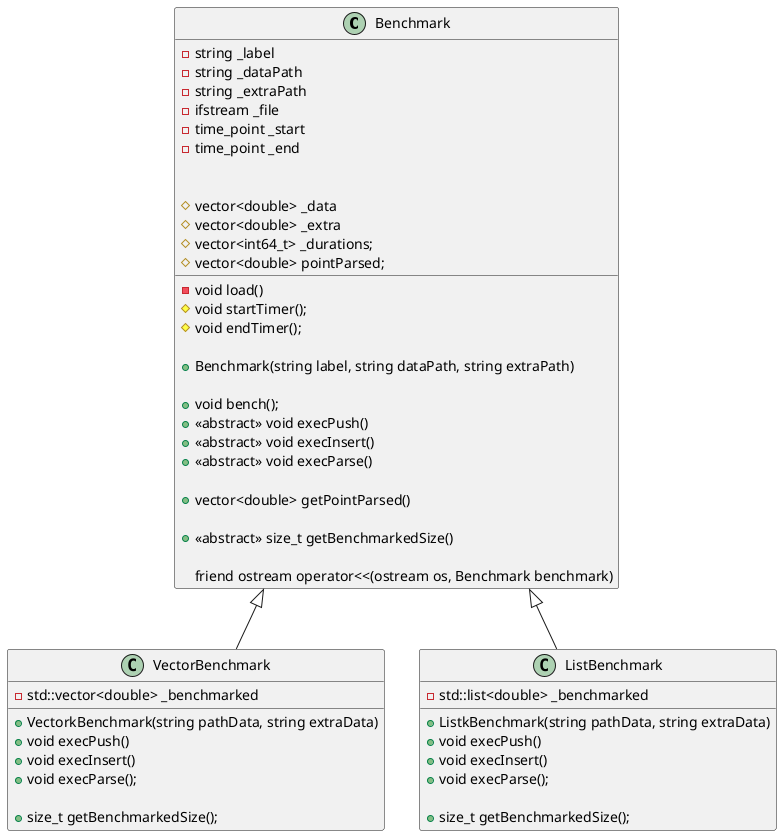

# Laboratoire 07

## Objectifs

* Comprendre les listes chaînées
* Implémenter une liste chaînée

## Partie A - Liste de la STL

Nous allons vouloir comparer le temps d'exécution pour traiter une grande quantité de données. Pour ce faire, nous allons créer des **benchmarks** qui mesurent le temps nécessaire pour accomplir certaines tâches. Voici la classe mère et les classes filles que nous allons implémenter.



Voici ce que vous devez implémenter. N'oubliez pas de faire des *baby steps*.

* Le `_label` représente le titre du test et sera affiché lorsque l'opérateur `<<` sera utilisé.
* Le `_dataPath` représente le chemin vers un fichier contenant des valeurs réelles, 2 millions pour être précis dans notre cas.
* Le `_extraPath` représente le chemin vers un fichier de données qui sera utilisé pour insérer des nombres au milieu de notre élément en test.
* Le `_file` sert à ouvrir et lire le contenu d'un fichier.
* `_start` et `_end` sont de type `std::chrono::system_clock::time_point` de la librairie `<chrono>` et permettent de mesurer le temps entre deux événements.
* La méthode privée `load` doit ouvrir les deux fichiers et charger les données dans `_data` et `_extra`.
* Les attributs `_data` et `_extra` vont contenir les valeurs dans les fichiers situés à `_dataPath` et `_extraPath`, respectivement.
* L'attribut `_durations` sera utilisé pour garder les temps mesurés pour chaque test effectué (`execPush`, `execInsert` et `execParse`).
* La méthode protégée `startTimer()` utilise la fonction `now` située dans `std::chrono::high_resolution_clock::now` pour enregistrer le début d'un test (`_start`).
* La méthode protégée `endTimer` utilise la même fonction que `startTimer()`, mais doit ajouter dans `_durations` la différence entre `_end` et `_start`, que l'on calcule comme ceci :
  * `std::chrono::duration_cast<std::chrono::milliseconds>(this->_end - this->_start).count()`
  * Je sais, très convivial ;)
* L'attribut `pointParsed` servira à sauvegarder les valeurs lors de `execParse`, qui représente un algorithme de recherche.
* Le constructeur construit ;)
* La méthode `bench` va, pour chacune des `exec*` (`Push`, `Insert` et `Parse`) :
  * démarrer le chronomètre
  * appeler l'exécution (dans l'ordre présenté)
  * arrêter le chronomètre
* `getPointParsed` retourne les points parsés par `execParse`.
* `getBenchmarkedSize` retourne la taille du nombre d'éléments dans le conteneur testé (la `list` dans `ListBenchmark` et le `vector` dans `VectorBenchmark`).
* L'opérateur `<<` devra générer la sortie suivante :
```
Nom                               PB       Ins        Pa                 Pts          QD          QE          QB
Vector benchmark                  41 ms     69645 ms        82 ms             1803055     2000000      100000     2100000
List benchmark                   154 ms        11 ms       131 ms             1803055     2000000      100000     2100000
```

Pour expliquer le tableau, voici les informations pertinentes :
* Nom : le `_label` du test
* PB : Le temps nécessaire pour exécuter `execPush`
* Ins : Le temps nécessaire pour exécuter `execInsert`
* Pa : Le temps nécessaire pour exécuter `execParse`
* Pts : Le nombre de points dans le tableau `pointParsed`
* QD : Le nombre de données présentes dans le tableau `_data`
* QE : Le nombre de données présentes dans le tableau `_extra`
* QB : Le nombre de données dans `_benchmarked` (`list` ou `vector`)