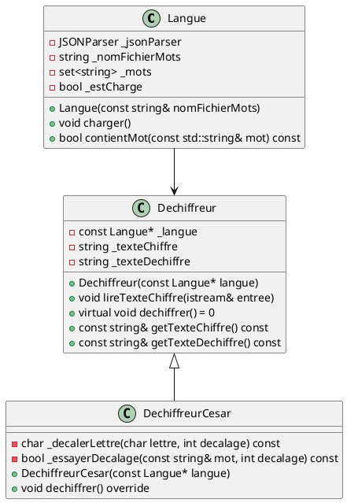
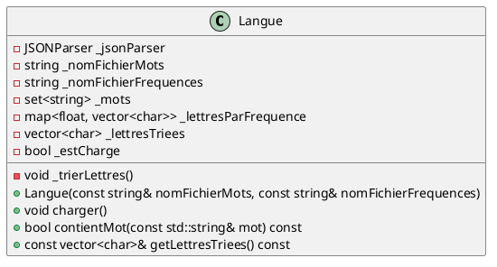
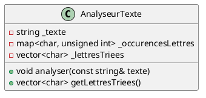
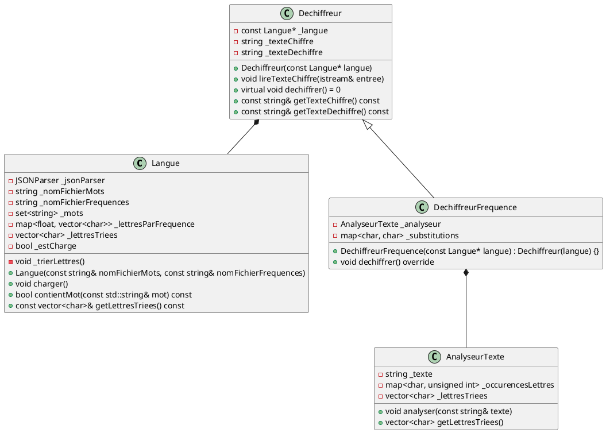

# Laboratoire 08-A

## Objectifs

* Se familiariser avec l'utilisation des ensembles (*set*) et des dictionnaires (*map*).
* Utiliser le format de données *JSON*.
* Mobiliser toutes les notions vues depuis le début de la session.

## Format de données JSON

[JSON](https://fr.wikipedia.org/wiki/JavaScript_Object_Notation), pour *JavaScript Object Notation*, est un format de données textuel permettant de représenter des listes, des dictionnaires et des types scalaires. Voici à quoi ressemble ce format (exemple tiré de Wikipédia):

```json
{
    "menu": {
        "id": "file",
        "value": "File",
        "popup": {
            "menuitem": [
                { "value": "New", "onclick": "CreateNewDoc()" },
                { "value": "Open", "onclick": "OpenDoc()" },
                { "value": "Close", "onclick": "CloseDoc()" }
            ]
        }
    }
}
```

Dans cet exemple, on trouve un dictionnaire avec une clé `menu` contenant elle-même un dictionnaire avec les clés `id`, `value` et `popup`. La clé `popup` contient un autre dictionnaire, dont la clé `menuItem` contient une liste (ou tableau) de trois autres dictionnaires.

Comme son nom l'indique, le format JSON est basé sur la façon dont sont représentés les objets dans le langage [JavaScript](https://fr.wikipedia.org/wiki/JavaScript). Les éléments qu'on a appelés « dictionnaires » dans les explications ci-dessus sont en fait des objets du point de vue de JavaScript. Ils deviendront cependant des dictionnaires (*map*) lorsqu'on importera des données JSON en C++.

Quand on y pense, les objets et les dictionnaires sont des structures qui se ressemblent: les deux associent des clés (attributs dans le contexte des objets) à des valeurs. Dans un langage à typage statique comme C++, la principale différence entre un objet et un dictionnaire est qu'on ne peut pas ajouter dynamiquement d'attributs à un objet (dont les attributs sont définis dans une classe) durant l'exécution du programme, alors qu'on peut dynamiquement ajouter des clés à un dictionnaire. Dans des langages plus dynamiques comme JavaScript, la différence entre un objet et un dictionnaire est plus subtile.

## *Parser* JSON

Allez-y, codez un *parser* JSON!

Mais non, c'est une blague!

Vous trouverez un fichier « Parser JSON.zip » sur Moodle. Vous devez le télécharger et placer les fichiers C++ qu'il contient dans votre projet. Les fichiers `JSONParser.h` et `JSONParser.cpp` vous permettent d'utiliser un *parser* JSON qui hérite de la classe *Parser* du laboratoire 6. Si vous ouvrez ces fichiers, vous constaterez qu'ils ne font pas grand-chose. Ils utilisent en fait une bibliothèque (fichier `json.h`) dont la documentation se trouve [ici](https://github.com/nlohmann/json). C'est elle qui fait tout le travail.

La méthode `getData` de `JSONParser` retourne un objet de type `json`. Cette classe provient de la bibliothèque et n'est donc pas un type natif de C++. Elle permet d'extraire les données « parsées » sous forme de conteneurs de la STL.

Supposons que nous avons le fichier JSON suivant:

```json
[
    "ceci",
    "est",
    "un",
    "tableau"
]
```

On peut voir que nous sommes en présence d'un tableau ou d'une liste de chaîne de caractères. Voici comment on s'y prendrait pour « parser » ces données et les convertir en vecteur de *string*:

```cpp
// `flux` est un flux de fichier (ifstream)
// `parser` est une instance de JSONParser
parser.parse(flux); 
vector<string> vecteur = parser.getData().template get<vector<string>>();
```

Si on voulait, on pourrait aussi extraire les données sous forme de `list<string>` plutôt que de `vector<string>`:

```cpp
list<string> liste = parser.getData().template get<list<string>>();
```

On pourrait même extraire les données dans un `set<string>`:

```cpp
set<string> ensemble = parser.getData().template get<set<string>>();
```

Supposons maintenant que nous avons un fichier JSON contenant un dictionnaire:

```json
{
    "201-SF3-RE": "Calcul intégral",
    "203-SF1-RE": "Mécanique",
    "202-SF1-RE": "Chimie générale",
    "420-SF2-RE": "Structure de données et programmation orientée objet"
}
```

En C++, cette structure de données correspond à un `map<string, string>`. On extrairait donc les données de cette façon:

```cpp
map<string, string> dictionnaire = parser.getData().template get<map<string, string>>();
```

## Le chiffre de César

Le [chiffre de César](https://fr.wikipedia.org/wiki/Chiffrement_par_d%C3%A9calage) est une méthode de chiffrement primitive qui consiste à décaler d'une même valeur chacune des lettres de l'alphabet. La clé de chiffrement est la valeur du décalage. Par exemple, avec une clé de 3, la lettre `A` devient `D`, la lettre `B` devient `E`, et ainsi de suite. Les lettres `X`, `Y` et `Z`, pour leur part, deviennent respectivement `A`, `B` et `C`.

Cette méthode de chiffrement est facile à casser en utilisant une [attaque par force brute](https://fr.wikipedia.org/wiki/Attaque_par_force_brute). Un algorithme de force brute consiste à tester successivement toutes les solutions possibles à un problème jusqu'à ce qu'une solution valide soit trouvée. Une méthode de chiffrement réellement sécuritaire n'est pas vulnérable aux attaques par force brute, car le nombre de clés de chiffrement à tester est trop élevé. Dans le cas du chiffre de César, il n'y a que 25 clés possibles.

Vous allez écrire un programme qui utilise une attaque par force brute pour casser le chiffrement d'un texte chiffré avec le chiffre de César. Vous avez probablement déjà une bonne idée de comment vous allez vous y prendre pour tester les 25 décalages possibles. Mais comment votre programme va-t-il déterminer qu'une clé testée est la bonne? 🤔 Une façon de faire est d'utiliser une liste de mots de la langue d'origine du texte pour vérifier quelle clé produit le maximum de mots valides dans le texte déchiffré.

Vous trouverez donc, sur Moodle, un fichier nommé `mots.json`. Ce fichier contient plus de **366 000** mots de la langue française. Afin d'accélérer la recherche de mots, vous allez extraire cette liste dans un `set<string>`.

Vous trouverez aussi un fichier `texte1.txt` qui contient le texte à déchiffrer. Celui-ci a été rédigé en français, puis chiffré avec la méthode du chiffre de César. Le chiffrement a préservé la casse des lettres (majuscule/minuscule). De plus, seuls les caractères de `'A'`  à `'Z'` et de `'a`' à `'z'` ont été chiffrés. Les lettres accentuées et les symboles de ponctuation sont demeurés tels quels.

Voici les classes que vous devez implémenter:



Voici des explications supplémentaires pour quelques-unes des méthodes:

**Classe `Langue`**

* La méthode `charger` charge le contenu du fichier JSON dans `_mots`.
* La méthode `contientMot` vérifie si le mot reçu en paramètre est présent dans `mots`. Elle doit lancer une exception si les mots n'ont pas encore été chargés.

**Classe `DechiffreurCesar`**

* La méthode privée `_decalerLettre` prend en paramètre un caractère et un décalage et retourne la lettre décalée. Si le caractère reçu en paramètre n'est pas une lettre ou est une lettre accentuée, elle le retourne tel quel.
* La méthode privée `_essayerDecalage` prend en paramètre un mot et un décalage, décale toutes les lettres du mot, puis vérifie si le mot existe dans `_langue`.
* La méthode `dechiffrer` essaie tous les décalages possibles du texte chiffré, puis retient celui qui produit le maximum de mots valides. Elle met à jour `_texteDechiffre` en conséquence.

N'hésitez pas à ajouter d'autres attributs ou méthodes privées si cela vous paraît utile.

Le `main` doit utiliser la classe `DechiffreurCesar` pour déchiffrer `texte1.txt` et afficher son contenu déchiffré à l'écran. Il doit aussi écrire le texte déchiffré dans un fichier `sortie-cesar.txt`.

## Le chiffrement par substitution

Le fichier `texte2.txt` contient un texte en français qui a été chiffré à l'aide d'une méthode légèrement meilleure que le chiffre de César. Chaque lettre de l'alphabet a été substituée par une autre lettre. Contrairement au chiffre de César, le décalage diffère pour chaque lettre. Il y a donc **26!** clés possibles, ou **4,03 × 10<sup>26</sup>**. Si on suppose que votre ordinateur peut tester un million de clés par seconde, il vous faudra environ **12,8 trillions d'années** pour déchiffrer ce texte par force brute.

Vous aurez donc compris qu'il nous faudra une autre méthode pour déchiffrer ce texte. Une façon de faire est d'utiliser une **analyse de fréquences**, c'est-à-dire qu'on peut deviner les lettres d'origine selon la fréquence d'apparition des lettres dans le texte chiffré. Par exemple, puisque la lettre **e** est la plus fréquente dans la langue française, il est probable que la lettre la plus fréquente dans le texte chiffré soit la substitution du **e**.

Il y a cependant un risque que le texte d'origine contienne une distribution biaisée des lettres de l'alphabet. Par exemple, il est probable qu'un article traitant des zébus contienne une quantité anormalement élevée de **Z**. Une solution possible à ce problème est d'ignorer les mots qui apparaissent trop souvent. On ne veut cependant pas ignorer les articles tels que « **de** », « **la** », « **le** » ou « **des** », puisque ceux-ci contribuent certainement à la grande fréquence des lettres telles que **e** et **a** dans la langue française. Nous allons donc ignorer **tous les mots de plus de 3 lettres dont le nombre d'occurences correspond à plus de 5% des mots du texte**.

Sur Moodle, vous trouverez un fichier `frequences_lettres.json` qui contient un classement des lettres de l'alphabet par fréquence d'apparition des lettres [dans le corpus de Wikipédia en français](https://fr.wikipedia.org/wiki/Fr%C3%A9quence_d%27apparition_des_lettres). Voici le contenu du fichier:

```json
{
    "0.121": ["e"],
    "0.0711": ["a"],
    "0.0659": ["i"],
    "0.0651": ["s"],
    "0.0639": ["n"],
    "0.0607": ["r"],
    "0.0592": ["t"],
    "0.0502": ["o"],
    "0.0496": ["l"],
    "0.0449": ["u"],
    "0.0367": ["d"],
    "0.0318": ["c"],
    "0.0262": ["m"],
    "0.0249": ["p"],
    "0.0123": ["g"],
    "0.0114": ["b"],
    "0.0111": ["v", "h", "f"],
    "0.0065": ["q"],
    "0.0046": ["y"],
    "0.0038": ["x"],
    "0.0034": ["j"],
    "0.0031": ["k"],
    "0.0017": ["w"],
    "0.0015": ["z"]
}
```

Remarquez que les clés correspondent aux fréquences, et que les valeurs sont des tableaux contenant les lettres associées à ces fréquences.

Commencez par modifier votre classe `Langue` pour les nouveaux besoins:



Dans la méthode `charger`, ajoutez le code nécessaire pour charger le dictionnaire JSON dans `_lettresParFrequence`.

> **NOTE**: La bibliothèque JSON ne permet pas d'extraire un `map<float, vector<char>>` directement. Vous devrez donc extraire un `map<string, vector<string>>`, puis le convertir à l'aide d'une boucle.

La méthode `charger` doit aussi appeler la méthode privée `_trierLettres`, qui copie les lettres vers `_lettresTriees` en ordre de fréquence. Une façon d'effectuer ce tri est d'itérer sur toutes les clés de `_lettresParFrequence` (qui, par nature du `map`, sont triées) et de les ajouter à la fin du vecteur. Les lettres qui partagent la même fréquence peuvent simplement être ajoutées les unes à la suite de l'autre dans le tableau.

Testez bien votre classe `Langue` mise à jour avant de continuer.

Vous allez ensuite créer une classe `AnalyseurTexte` qui sera utilisée par votre déchiffreur:



Cette classe doit permettre d'obtenir un vecteur des lettres triées par nombre d'occurences dans le texte. N'oubliez pas de respecter la règle énoncée plus haut pour éviter que les statistiques soient biaisées par les mots trop fréquents! N'oubliez pas non plus qu'un mot n'est pas nécessairement entouré d'espaces. Par exemple, dans la phrase « L'été est la plus belle saison. », les mots « été » et « saison » sont adjacents à des symboles de ponctuation. Pour vous aider, voici le code d'une méthode privée pour retirer tous les symboles de ponctuation et les sauts de ligne dans le texte:

```cpp
void AnalyseurTexte::_preparerTexte() {
    set<char> ponctuation = {'.', ',', ';', ':', '!', '?',
                            '-', '_', '(', ')', '[', ']',
                            '{', '}', '\'', '"', '\n',
                            '\r', '\t'};
    for (auto& caractere : _texte) {
        if (ponctuation.contains(caractere)) {
            caractere = ' ';
        }
    }
}
```

N'hésitez pas à ajouter d'autres méthodes privées si cela vous paraît pertinent!

Encore une fois, sachez que les caractères accentués et les symboles de ponctuation n'ont pas été chiffrés. Il n'est donc pas nécessaire de les inclure dans votre analyse.

Vous pouvez enfin implémenter votre classe `DechiffreurFrequence`:



Votre classe `DechiffreurFrequence` doit construire le dictionnaire `_substitutions` en associant ensemble les lettres qui se trouvent à la même position dans les tableaux de lettres triées des classes `Langue`  et `AnalyseurTexte`. Le résultat ne sera sans doute pas parfait (d'autant plus que certaines lettres partageaient la même fréquence dans le fichier JSON) mais avec un peu de chance, suffisamment de substitutions seront correctes pour que nous puissions deviner les substitutions restantes.

Une fois le dictionnaire de substitutions construit, la méthode `dechiffrer` sera en mesure de déchiffrer le texte. Pour vous simplifier la vie, vous n'avez pas à conserver la casse des lettres (tout le texte déchiffré peut être en minuscules).

Faites l'essai de votre déchiffreur dans le `main`. Si vous l'avez implémenté correctement, vous devriez voir un texte encore partiellement incorrect, mais avec suffisamment de caractères substitués correctement pour vous permettre de deviner certains mots. La dernière étape est donc de permettre à l'utilisateur de changer manuellement certaines substitutions. Pour ce faire, ajoutez à votre déchiffreur la méthode suivante:

```cpp
void changerSubstitution(char ancien, char nouveau);
```

Cette méthode reçoit une lettre de substitution actuelle, et la remplace par une nouvelle lettre de substitution avant de re-substituer toutes les lettres dans le texte. Pensez bien à la modification que vous devez apporter à `_substitutions` (indice: il ne s'agit PAS de `_substitutions[ancien] = nouveau`).

Voici du code à utiliser dans votre `main` pour afficher le texte déchiffré ligne par ligne et permettre à l'utilisateur de changer des substitutions:

```cpp
// Substitutions manuelles
vector<string> lignesTexteDechiffre = split(dechiffreurFrequence.getTexteDechiffre(), '\n');
char ancien, nouveau;
for (int i = 0; i < lignesTexteDechiffre.size(); i++) {
    while (lignesTexteDechiffre[i] != "" && ancien != '.' && ancien != '!') {
        cout << lignesTexteDechiffre[i] << endl;
        cout << ">>> Entrer une nouvelle substitution (ancien nouveau), ou « . » pour passer à la ligne suivante, ou « ! » pour terminer." << endl;
        cin >> ancien;
        if (ancien != '.' && ancien != '!') {
            cin >> nouveau;
            dechiffreurFrequence.changerSubstitution(ancien, nouveau);
            lignesTexteDechiffre = split(dechiffreurFrequence.getTexteDechiffre(), '\n');
        }
    } if (ancien == '!') {
        break;
    }
    ancien = '\0';
}
cout << "Texte déchiffré:" << endl << dechiffreurFrequence.getTexteDechiffre() << endl;
```

Testez le tout. Si vous remarquez des problèmes dans votre implémentation de `changerSubstitutions`, trouvez des solutions et corrigez-les.

À la fin de votre `main`, ajouter le code nécessaire pour écrire le texte déchiffré dans un fichier `sortie-frequence.txt`.
