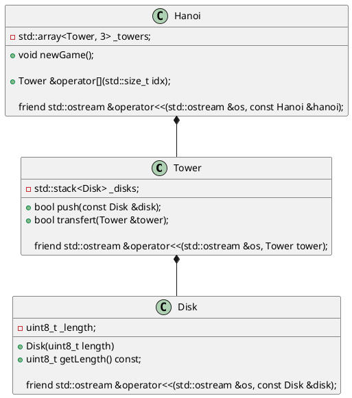

# Laboratoire 8-B

## Objectifs

* Utiliser le conteneur pile (**stack**) dans un contexte ludique.
* Mobiliser toutes les notions vues depuis le début de la session.

## Les tours d'Hanoi

Nous allons programmer un petit jeu en console, *les tours d'Hanoi*, dans lequel nous devons transférer des disques sur une autre tige.

```
Lab 8

                  ░▓░                                      ░▓░                                       ░▓░
                  ░▓░                                      ░▓░                                       ░▓░
                  ░▓░                                      ░▓░                                       ░▓░
                 ▐░▓░▌                                     ░▓░                                       ░▓░
                ▐█░▓░█▌                                    ░▓░                                       ░▓░
               ▐██░▓░██▌                                   ░▓░                                       ░▓░
              ▐███░▓░███▌                                  ░▓░                                       ░▓░
             ▐████░▓░████▌                                 ░▓░                                       ░▓░
            ▐█████░▓░█████▌                                ░▓░                                       ░▓░
           ▐██████░▓░██████▌                               ░▓░                                       ░▓░
          ▐███████░▓░███████▌                              ░▓░                                       ░▓░
▛▚▚▚▚▚▚▚▚▚▚▚▚░▓░▞▞▞▞▞▞▞▞▞▞▞▞▜  ▛▚▚▚▚▚▚▚▚▚▚▚▚░▓░▞▞▞▞▞▞▞▞▞▞▞▞▜  ▛▚▚▚▚▚▚▚▚▚▚▚▚░▓░▞▞▞▞▞▞▞▞▞▞▞▞▜
              [1]                            [2]                            [3]
```

Cette interface représente trois tours, dont une qui contient 8 disques et deux tours vides.

A chaque tour, nous demandons à l'utilisateur de sélectionner une tour de provenance (c'est-à-dire, la tour de laquelle nous allons enlever un disque) et une tour cible (c'est-à-dire, la tour à laquelle nous allons ajouter le disque). La règle est simple : on ne peut pas empiler un nouveau disque plus grand dans une tour. Si le disque de longueur 1 est au sommet de la tour 2, on ne peut pas mettre un disque de longueur 2 par-dessus.

Voici donc à quoi ressemble l'exécution de chaque tour:

```
Sélectionner la tour de provenance: 1
Sélectionner la tour cible: 2
Déplacement valide
Voulez-vous continuer ? [o|n]: y

                  ░▓░                                      ░▓░                                       ░▓░
                  ░▓░                                      ░▓░                                       ░▓░
                  ░▓░                                      ░▓░                                       ░▓░
                  ░▓░                                      ░▓░                                       ░▓░
                ▐█░▓░█▌                                    ░▓░                                       ░▓░
               ▐██░▓░██▌                                   ░▓░                                       ░▓░
              ▐███░▓░███▌                                  ░▓░                                       ░▓░
             ▐████░▓░████▌                                 ░▓░                                       ░▓░
            ▐█████░▓░█████▌                                ░▓░                                       ░▓░
           ▐██████░▓░██████▌                               ░▓░                                       ░▓░
          ▐███████░▓░███████▌                             ▐░▓░▌                                      ░▓░
▛▚▚▚▚▚▚▚▚▚▚▚▚░▓░▞▞▞▞▞▞▞▞▞▞▞▞▜  ▛▚▚▚▚▚▚▚▚▚▚▚▚░▓░▞▞▞▞▞▞▞▞▞▞▞▞▜  ▛▚▚▚▚▚▚▚▚▚▚▚▚░▓░▞▞▞▞▞▞▞▞▞▞▞▞▜
                  [1]                                      [2]                                       [3]
```

On voit (subtilement) que la tour 2 à reçu le disque 1. Si on essaie de mettre encore le sommet de 1 dans 2, on aura ceci :

```
Sélectionner la tour de provenance: 1
Sélectionner la tour cible: 2
ERREUR: Déplacement invalide
Voulez-vous continuer ? [o|n]: y

                  ░▓░                                      ░▓░                                       ░▓░
                  ░▓░                                      ░▓░                                       ░▓░
                  ░▓░                                      ░▓░                                       ░▓░
                  ░▓░                                      ░▓░                                       ░▓░
                ▐█░▓░█▌                                    ░▓░                                       ░▓░
               ▐██░▓░██▌                                   ░▓░                                       ░▓░
              ▐███░▓░███▌                                  ░▓░                                       ░▓░
             ▐████░▓░████▌                                 ░▓░                                       ░▓░
            ▐█████░▓░█████▌                                ░▓░                                       ░▓░
           ▐██████░▓░██████▌                               ░▓░                                       ░▓░
          ▐███████░▓░███████▌                             ▐░▓░▌                                      ░▓░
▛▚▚▚▚▚▚▚▚▚▚▚▚░▓░▞▞▞▞▞▞▞▞▞▞▞▞▜  ▛▚▚▚▚▚▚▚▚▚▚▚▚░▓░▞▞▞▞▞▞▞▞▞▞▞▞▜  ▛▚▚▚▚▚▚▚▚▚▚▚▚░▓░▞▞▞▞▞▞▞▞▞▞▞▞▜
                  [1]                                      [2]                                       [3]
```

On vous donne le `main.cpp` ainsi que la fonction amie `operator<<` de la classe `Hanoi`. Voici ce que vous devez implémenter. Fiez-vous au code déjà fourni pour comprendre ce que les fonctions devraient faire.


