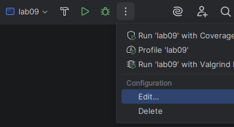
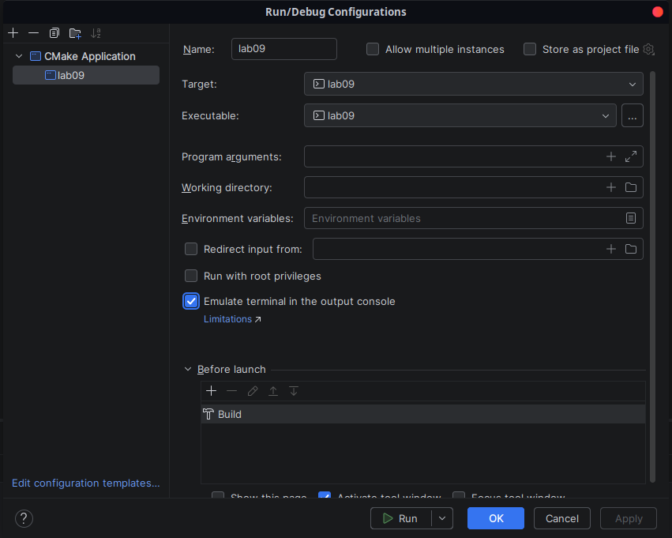
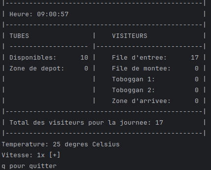
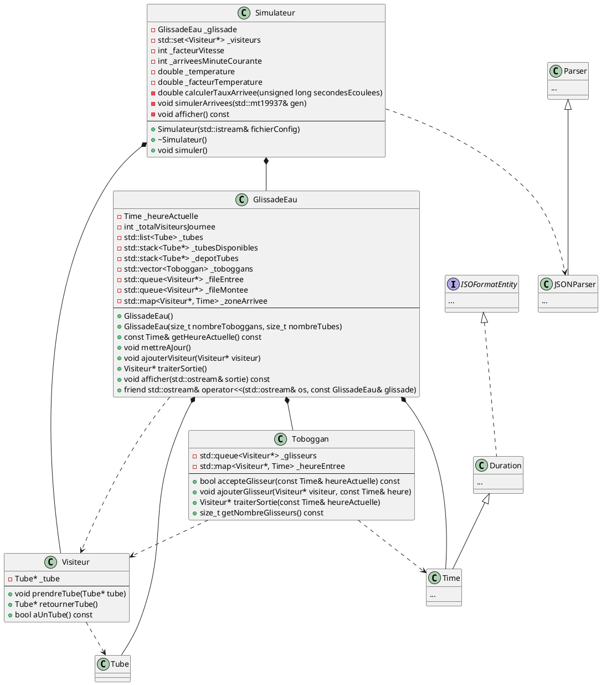

# Laboratoire 09

## Objectif

Mettre en pratique l'utilisation de toutes les structures de données vues dans le cours, et plus particulièrement des files et des piles.

## Mise en situation

L'été approche, et le Cégep a décidé d'installer des glissades d'eau dans la colline près du pavillon 4 afin de rentabiliser ses espaces durant la saison estivale! Le fonctionnement prévu des glissades d'eau est le suivant:

- Les visiteurs accèdent tous aux glissades d'eau par la même **file d'entrée** au bas de la colline.
- À l'avant de la file d'entrée se trouve la **pile des tubes disponibles**. Un visiteur arrivant à l'avant de la file prend un tube, puis entre dans la **file de montée** permettant d'avancer vers le haut de la colline.
- Une fois en haut de la colline, le visiteur entre dans un des **toboggans**. Il faut cependant laisser s'écouler 10 secondes entre chaque glisseur dans un même toboggan.
- Tous les toboggans mènent à la même **zone d'arrivée** au bas de la colline. On estime qu'il faut 30 secondes à un glisseur pour atteindre le bas de la colline.
- Une fois un glisseur rendu à la zone d'arrivée, il dépose son tube dans une **pile de dépôt**. On estime qu'il faut en moyenne 15 secondes avant qu'un glisseur arrivé en bas de la colline dépose son tube puis quitte la zone d'arrivée.
- Chaque fois que la **pile des tubes disponibles** est vide, un employé y transfère tous les tubes se trouvant dans la **pile de dépôt**.

Les responsables du projet de glissades d'eau se demandent cependant combien il faut prévoir de toboggans et de tubes pour que le tout soit fluide. Ils font donc appel à vous pour simuler le tout à l'aide d'un programme en C++!

## Démarrage

Récupérez les fichiers de départ sur Moodle, puis ajoutez-les à votre projet.

**IMPORTANT:** Avant de lancer le programme, vous devez modifier les options d'exécution dans CLion. Cliquez sur l'icône représentant trois points verticaux près du bouton `Run`, puis cliquez sur `Edit`.

Dans la fenêtre `Run/Debug Configurations`, cochez `Emulate terminal in the output console`. Faites ensuite `Apply` puis `OK`.

Si vous exécutez ensuite le projet, vous devriez voir quelque chose de semblable à ceci dans la console (ignorez les rectangles verts qui apparaissent dans l'image):

La touche `+` du clavier vous permet d'augmenter la vitesse de la simulation. Comme vous pouvez le constater, des visiteurs arrivent au fil du temps, mais n'entrent présentement jamais dans la file d'entrée. La simulation s'arrête à 17h00.

Le fichier `configuration.json` vous permet de changer le nombre de toboggans, le nombre de tubes, de même que la température. Plus la température est élevée, plus il y a de visiteurs dans la journée.

## Implémentation

Voici le diagramme de classes du projet:

La classe `Simulateur` est déjà implémentée. C'est elle qui simule l'arrivée des visiteurs au fil du temps et qui adapte celle-ci à la température.

La classe `GlissadeEau` contient les `Toboggan`, et gère la file d'entrée, la file de montée, la zone d'arrivée et les piles de tube.

La classe `Toboggan` représente bien entendu un toboggan et gère le temps nécessaire à la descente.

La classe `Visiteur` représente bien sûr un visiteur, qui peut ou non avoir un `Tube` en sa possession.

Vous remarquerez la présence de plusieurs classes des laboratoires précédents.

Votre mission, si vous l'acceptez (et je vous recommande fortement de l'accepter étant donné l'examen qui s'en vient), est de compléter le programme pour rendre fonctionnelle la simulation. Pour ce faire, vous devez modifier **uniquement** les classes `Toboggan` et `GlissadeEau`. Dans ces classes, complétez les méthodes contenant un commentaire `/***À COMPLÉTER***/` en faisant les ajouts décrits par les commentaires.

Bonne chance!

> **Psssst!** La classe `std::map` n'a pas d'opérateur `[]` constant, donc si jamais vous rencontrez une erreur `"No viable function"` en lien avec ça, il faut utiliser la méthode `at()` à la place.
