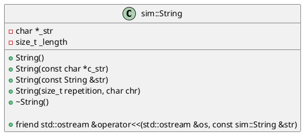

# Laboratoire de préparation d'examen

Durant votre parcours en *SIM*, vous avez eu la chance de programmer en **C++** et d'utiliser la classe `std::string`. Sans le savoir, vous utilisiez la *POO* avec des objets d'instance `std::string`, les construisiez (constructeur), les concaténiez (`+`), les assigniez (`=`), les affichiez (`<<`), etc. Vous vous doutez bien que la classe `std::string` utilise un tableau de caractères (`char`) et doit suivre les mêmes règles que nous avons vues en classe.

Pour votre préparation à l'examen, on vous demande de faire une classe `String` dans votre propre `namespace` que l'on nommera `sim`. Cette classe devra offrir quelques éléments de base importants calqués sur le comportement de `std::string`. On peut enfin avoir une idée de son fonctionnement interne.

## Étape 1 : Créer son propre `namespace`

Cette étape est raisonnablement triviale, il faut simplement entourer, dans notre `string.h` et `string.cpp`, nos déclarations de classes et implémentations de nos différentes méthodes et fonctions amies. Voici un exemple.

```cpp
// Fichier maclasse.h
#ifndef __MACLASSE_H
#define __MACLASSE_H

namespace sim {

    class MaClasse {
    // ...
    };

}

#endif

// Fichier maclasse.cpp
#include "maclasse.h"

namespace sim {

    MaClasse::MaClasse() {
        // ...
    }

}
```

Et voilà, si vous utilisez `using namespace std` dans votre code, vous pouvez toujours faire référence à notre classe à nous en instanciant notre objet avec `sim::String maString;`.

## Étape 2 - Règles à suivre pour notre classe

Voici une liste de règles à garder en mémoire lors de l'élaboration de notre classe `String`. Nous allons y référer tout au long du laboratoire, il est donc important de vous y familiariser.

1. Une chaîne de caractères doit se terminer par le caractère nul (`'\0'`). Cela signifie que, pour la chaîne `"Allo"`, notre tableau de caractères doit avoir 5 cases : `['A', 'l', 'l', 'o', '\0']`.
1. On ne va pas gérer de capacité. Cela signifie que la majorité des interactions nécessitent de créer un nouveau tableau et de détruire l'ancien.
1. On ne peut pas changer un caractère individuellement. Cela implique de réfléchir aux accès de chaque caractère.
1. On doit supporter les `char *` et les `sim::String`. Cela signifie que plusieurs membres (constructeur, surcharge d'opérateur) devront être doublés.
1. On ne doit pas faire un tableau de caractères si la chaîne est vide. Cela signifie que l'on doit porter une attention particulière lors de l'allocation du pointeur et de sa désallocation.

> Prenez note qu'une seule règle n'est plus respectée dans la classe `std::string`, mais pour vous donner un défi intéressant, elle a été conservée. Pouvez-vous identifier laquelle ?

## Étape 3 - Les attributs et les constructeurs

Nous allons commencer tranquillement et implémenter la classe avec les membres suivants :



L'objectif est de s'assurer que nos constructeurs fonctionnent adéquatement avant de passer à autre chose. Nous pouvons tester de cette manière :

```cpp
// main.cpp
#include <iostream>
#include "string.h"

int main () {
    sim::String emptyString;

    // devrait afficher 'Chaine vide : '
    std::cout << "Chaine vide : " << emptyString << std::endl;

    sim::String myString("Bien le bonjour SIM.");

    // devrait afficher 'Ma chaine : Bien le bonjour SIM.'
    std::cout << "Ma chaine : " << myString << std::endl;   

    sim::String myCopy(myString);

    // devrait afficher 'Ma chaine : Bien le bonjour SIM.'
    std::cout << "Ma chaine : " << myCopy << std::endl;

    sim::String myDashes(15, '-');

    // devrait afficher 'Ma chaine : ---------------'
    std::cout << "Ma chaine : " << myDashes << std::endl;

    return 0;
}
```

On s'attend à la sortie suivante :

```
Chaine vide :
Ma chaine : Bien le bonjour SIM.
Ma chaine : Bien le bonjour SIM.
Ma chaine : ---------------
```

## Étape 4 - Ajout du membre manquant lors de la manipulation de pointeur dans une classe

Nous savons que l'élaboration d'une classe qui possède un pointeur à l'intérieur requiert minimalement trois éléments : la définition d'un *constructeur de copie* et d'un *destructeur*. Quel est le troisième membre manquant ? N'oubliez pas de respecter la règle #4.

## Étape 5 - Rendre l'attribut `_length` accessible en lecture seulement.

Il est très pertinent, dans une application utilisant des chaînes, d'avoir besoin d'en connaître la taille. Il faut donc permettre sa lecture.

## Étape 6 - Opérateur d'indexation

Nous aimerions être en mesure de regarder les caractères un à un. Pour ce faire, il faut surcharger l'opérateur `operator[]` de manière adéquate tout en respectant la règle #3.

## Étape 7 - Concaténation de chaîne

Une des actions les plus triviales est de concaténer deux chaînes ensemble, par exemple un `prénom` et un `nom`. Il faut surcharger les opérateurs `+=` et `+` en tenant compte des règles #2 et #4.

## Étape 8 - (Extra) L'opérateur d'égalité

Implémentez l'opérateur d'égalité. Vous pouvez commencer par tester si les `_length` sont les mêmes, puis si ce n'est pas le cas, faire le nécessaire pour s'assurer que chaque caractère est identique. Une fois l'opérateur d'égalité fait, il est trivial de faire l'opérateur d'inégalité.

## Étape 9 - (Extra) Amélioration du code

Il y a de bonnes chances que votre code ait plusieurs composantes utilisant les mêmes bouts de code, par exemple la gestion de la désallocation (règle #2). En plus de cette dernière, vous devriez être en mesure d'en identifier deux autres. Laboratoire de préparation d'examen

Durant votre parcours en *SIM*, vous avez eu la chance de programmer en **C++** et utiliser la classe `std::string`. Sans le savoir, vous utilisiez la *POO* avec des objets d'instance `std::string`, les construisaient (constructeur), les concaténaient (`+`), les assignaient (`=`), les affichaient (`<<`), etc. Vous vous doutez bien que la classe `std::string` utilise un tableau de charactère (`char`) et doit suivre les mêmes règles que nous avons vue en classe.

Pour votre préparation à l'examen, on vous demande de faire une classe `String` dans votre propre `namespace` que l'on nomera `sim`. Cette classe devra offrir quelques éléments de base important calqué du comportement de `std::string`. On peut enfin avoir une idée de son fonctionnement interne.

