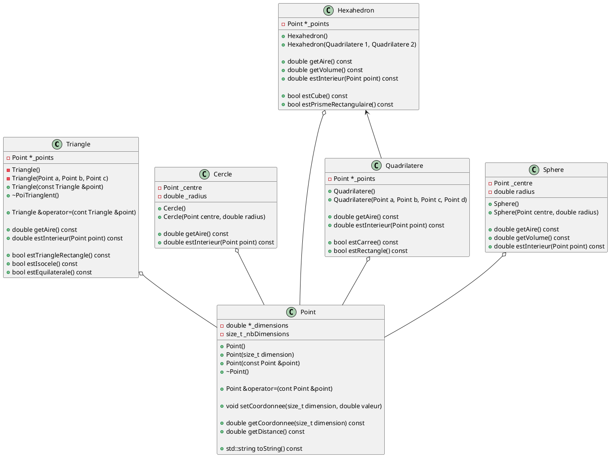

# Test


Lorem ipsum dolor sit amet, consectetur adipiscing elit. Nam lacinia vehicula pulvinar. Integer in quam nec magna imperdiet porttitor. Vivamus a justo efficitur, consequat odio a, sagittis tortor. Proin sed tincidunt massa. Maecenas ultricies ex dapibus dui blandit, eget gravida risus pharetra. In sodales tortor quis dignissim viverra. Vestibulum pellentesque ac metus sit amet elementum.

Curabitur aliquam velit sapien, eget mollis purus ultricies in. Nulla non nulla odio. Sed ac lorem vel sapien ultrices imperdiet. Pellentesque habitant morbi tristique senectus et netus et malesuada fames ac turpis egestas. Etiam eu varius lacus. Phasellus sollicitudin egestas ex, vitae ullamcorper metus ultricies at. Suspendisse ac tincidunt felis. Nulla aliquam, ante vitae fermentum facilisis, nisl felis egestas velit, at ullamcorper augue neque nec libero. Vivamus sed eleifend tortor, at commodo mauris. Cras eu ex placerat nisl ultricies bibendum.

Pellentesque id bibendum sem, et pretium ligula. Ut eu mi vitae enim mattis tempor vel dapibus ipsum. Quisque eget sodales urna, consectetur sollicitudin quam. Sed eget imperdiet mauris, et viverra massa. Nullam non accumsan augue, in mattis augue. Nunc elit dolor, suscipit vel hendrerit at, viverra et eros. Donec sem ligula, aliquet non turpis et, posuere commodo dui. Praesent lacus risus, sagittis quis est in, accumsan rutrum lectus. Sed suscipit, risus quis varius ultrices, tortor nibh tempus ligula, at interdum magna velit id elit. In scelerisque auctor est, a aliquam velit mattis vitae. Sed id scelerisque justo. Ut eget eros consectetur, viverra dolor at, sodales lectus. Mauris fringilla odio a ligula tempus bibendum. Morbi non tellus commodo, iaculis orci ac, imperdiet lectus. Cras sagittis nunc et dolor vestibulum finibus.

Duis eget venenatis massa. Praesent ac nisl mollis, interdum nibh id, gravida sem. Curabitur enim erat, faucibus in volutpat et, varius sit amet lacus. Nullam commodo pharetra tempor. Integer lectus sapien, maximus at nunc vitae, faucibus pellentesque purus. Praesent ut ullamcorper nibh. Cras pulvinar pharetra lectus vitae consectetur. Sed vel nisi eget risus volutpat hendrerit. Duis efficitur pharetra laoreet.

Sed et vestibulum lacus. Curabitur suscipit metus aliquam mauris tempus, ut ullamcorper mauris pretium. Class aptent taciti sociosqu ad litora torquent per conubia nostra, per inceptos himenaeos. Pellentesque id ipsum mollis, volutpat nunc ac, condimentum tortor. Vivamus dictum elit nec diam ultrices, eget vestibulum ipsum egestas. Etiam feugiat, nibh vel tempus vehicula, risus sem volutpat lacus, in dictum augue diam sit amet diam. Vestibulum tincidunt ligula non orci vehicula, id pharetra purus viverra. Curabitur ac efficitur nisi. 

$$
e^{i\pi} + 1 = 0
$$

```cpp
int a = 0;
int b = 0;
int c = a + b;

cout << c;
```



