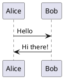

# Sample Test Document

This is a test document to verify the build workflow.

## Section 1

Some sample text with **bold** and *italic* formatting.

### Code Example

```python
def hello_world():
    print("Hello, World!")
```

## PlantUML Diagram



## Conclusion

This document tests the complete markdown build pipeline.
